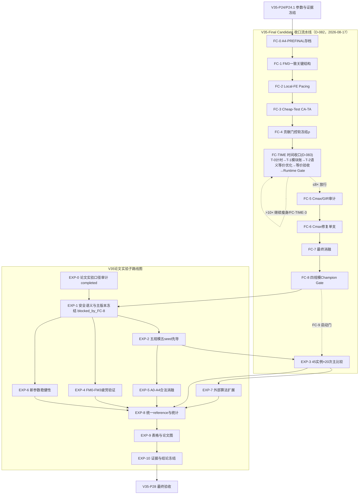

# 张博改进 Java/jMetal 总路线图

版本：`4.0-v3.5-mainline`  
建立日期：`2026-08-07`  
修订日期：`2026-08-07`——按用户决定取消 jMetal 7.5/JDK 21 迁移，后续继续复用作者 jMetal 5.8 与 Java 8 兼容配置。  
修订日期：`2026-08-07`——完成五份Markdown语义审计：原HMOPSO-QGS完整基线前置于疲劳；补齐Algorithm 2与图5/图6来源门；将CFVF、个人档案、Qp、双Q及CA-TA拆为独立子工作包；固定完整执行顺序、诊断指标和消融矩阵。  
修订日期：`2026-08-08`——完成P1：建立作者当前工作树的只读jMetal 5.8基线与工作副本，消除Maven循环和绝对路径，完成Java 8目标构建并固化来源、差异和测试限制证据。  
修订日期：`2026-08-08`——用户已批准实施P2，开始固化第四章论文黄金算例、四向量编码契约及图5/图6算子夹具。  
修订日期：`2026-08-08`——完成P2：固化ESWA表4/表5/Fig.3黄金实例、Algorithm 2逐行语义、Fig.5/Fig.6结构化夹具和Java 8四向量契约；10项新增测试通过且原回归无新增失败。  
修订日期：`2026-08-08`——用户批准实施P3，开始原始解码、微调、右移、三目标与三语义隔离验收。  
修订日期：`2026-08-08`——完成P3：冻结Fig.3三阶段20工序轨迹，实现双随机模式、微调、右移、三目标、约束报告和作者实际诊断；P4成为下一允许工作包但未开始。  
修订日期：`2026-08-08`——用户批准实施P4，开始整理原始四向量算子、四子群、PDDR-FF、Q-gbest、O1–O9及完整HMOPSO-QGS三目标闭环。  
修订日期：`2026-08-08`——完成P4：Fig.5/Fig.6算子、四子群、三目标PDDR-FF、原Q-gbest、关键工厂搜索、O1–O9和完整2000 FE闭环通过固定种子验收；P5成为下一允许工作包但未开始。  
修订日期：`2026-08-08`——用户确认李明哲当前Java工程为完整实验代码，创新生产主线改为直接派生`MOHPSOQ + EDHHFSPW`；P2–P4论文重建成果降为独立论文验证线。  
修订日期：`2026-08-08`——用户批准实施P4.1，开始冻结作者源码并建立零创新直接派生调用链。  
修订日期：`2026-08-08`——完成P4.1：四个作者源保持不变，四个张博派生类规范化差异为0，原/张博双Runner通过同配置烟测；P5成为下一允许工作包但未开始。  
修订日期：`2026-08-08`——用户批准实施P5，采用作者兼容/疲劳改进双路径硬门，并固定标准化疲劳场景参数与`r`优先表述。  
修订日期：`2026-08-08`——完成P5：冻结45份确定性参数清单，在作者直接派生问题类中接入双路径疲劳评价、完整轨迹与诊断指标，并通过零影响硬门、100次一致性和Runner链路验收。  
修订日期：`2026-08-08`——完成P6.0与P6.1：先以独立开关恢复原Q-gbest，再接入按工件身份对齐的CFVF；固定事件组件测试和`20_2_3_1`的2000 FE链路验收通过。  
修订日期：`2026-08-08`——用户批准P6.1.1与P6.2：先独立校正PDDR评价时序和返回种群应用，再实现容量6的谱系个人档案影子模式。  
修订日期：`2026-08-09`——完成P6.1.1与P6.2：评价后PDDR真正替换种群与历史，容量6谱系档案以影子模式接入并通过B2P/B3等价、2000 FE及回归验收。  
修订日期：`2026-08-09`——用户批准实施P6.3：在B3基础上接入四动作Q-pbest，同步保留原Qg学习；固定`tauQ=0.15`及奖励权重`2.0/1.0/0.5/0.25`，分块冻结继续留待P6.4。  
修订日期：`2026-08-09`——完成P6.3：四动作Q-pbest、16状态、动作掩码、谱系个人领导、局部搜索前奖励和冻结批量TD更新接入作者派生主线；2000 FE、固定显式初始种群三次重放及回归验收通过。  
修订日期：`2026-08-09`——用户批准实施P6.4：前10% FE按完整代向上取整预热，随后以`B=5`执行P/G-block；冻结控制器仅冻结Q值，环境状态继续刷新。  
修订日期：`2026-08-09`——完成P6.4：10% FE整代预热、`B=5`的P/G-block、冻结贪婪执行及状态刷新接入生产主线；2000 FE阶段计数、冻结表哈希、三次重放、Java 8构建和回归验收通过。  
修订日期：`2026-08-09`——用户批准在P7.1前新增P5.1校正门：45实例固化独立SUT、非零疲劳路径分解PT/SET并接入第一阶段显式MA；随后独立实现O10–O13，不接入主循环。  
修订日期：`2026-08-09`——完成P5.1：45份实例级SUT扩展、统一PT/SET疲劳时长分解和第一阶段显式MA通过验收；P6.4的2000 FE阶段/动作/TD计数保持闭合。  
修订日期：`2026-08-09`——完成P7.1：O1–O13独立邻域、关键DAG、SUT/疲劳工人预测、MA-WA联合预测和FMAX/FE自然恢复窗口通过黄金实例与`20_2_3_1`审计；未接入主循环。  
修订日期：`2026-08-09`——完成P6.5：统一四子群语义为`G1_CMAX/G2_TEC/G3_TWC/G4_BALANCED`，保留作者物理槽位不重排，并重验P6.0–P6.4及P7.1；迁移前子群感知结果隔离为`legacy_pre_subgroup_migration`。  
修订日期：`2026-08-09`——完成P7.2：六类瓶颈上下文、80/20工厂选择、等评价预算Test-and-Apply、局部候选预评价标记及PDDR/谱系接入通过工程验收。  
修订日期：`2026-08-09`——用户批准实施P8；建立34标签的严格消融注册表、共同初始种群、工程参考前沿与证据输出。`20_2_3_1`上16个真实暴露条目完成三seed工程运行；18个独立开关尚未暴露，第四章黄金夹具无作者兼容输入，均显式保持`NOT_EXPOSED`，P8不得提前完成。  
修订日期：`2026-08-09`——P1–P8概念复核确认P7.2存在Test完整性、Apply预算和逐后代接入偏差；`ca_ta_scheme_aligned`暂时撤回。旧P8结果隔离为`legacy_pre_ablation_switches`，开始实施34个正式消融开关、4个归因控制点和第四章黄金实例作者兼容桥。  
修订日期：`2026-08-09`——完成P7.2校正与P8工程验收：CA-TA改为逐全局后代执行，Test覆盖完整合法掩码，Apply预算按`K×nTest×multiplier`闭合；34个正式标签与4个控制点在2实例、3种子、2000 FE边界形成228条完成记录。  
修订日期：`2026-08-10`——用户批准P8.1：深度审计后将作者缺陷路径隔离为`A0_AUTHOR_DIAGNOSTIC`，正式B0/FM0改为规范确定性HMOPSO-QGS；开始修复生产解码、解对象、CA-TA空路径、双Q区块时序、O13恢复门和消融元数据，并重跑34标签×2实例×3种子的204条P8-v3工程记录。  
修订日期：`2026-08-10`——完成P8.1：规范生产链不再使用作者缺陷解码、默认Solution或巨型更新器；46项问题测试、30项核心定向测试、15项Runner测试及六模块打包通过，P8-v3的204条记录全部完成。  
修订日期：`2026-08-10`——完成P9前小规模趋势预检：复用P8-v3中同初群、2实例、3种子、2000 FE的B链记录，确认三个创新点均产生真实机制差异；CA-TA显示最稳定的正向趋势，FAT上下文效果仍依赖实例。该预检不改变P9的`deferred`状态。  
修订日期：`2026-08-10`——用户批准在SSH训练机上开始实验；P9进入`in_progress`，先完成`B0/B1/B5/FULL×2实例×3种子×20000 FE`的24次机制贯通先导。训练机退出码0，24/24完成，非法解和异常repair均为0；该结果不等于正式矩阵或论文复现验收。  
修订日期：`2026-08-10`——停止训练机上的旧Python任务，完成最新版ESWA正式实验矩阵复核并建立`docs/P9_FORMAL_EXPERIMENT_PLAN.md`。正式规模锁定为45实例、30次独立运行、100种群和500000 FE；本次只形成计划，尚未启动正式运行。  
修订日期：`2026-08-10`——按用户决定调整P9顺序：先完成`ZHANGBO-FULL`正式矩阵，再进行论文算法适配与主对比，34项消融最后执行。`QMOEA`来源缺口不再阻塞张博FULL，但仍是论文主对比的硬门。  
修订日期：`2026-08-10`——进一步收缩P9：最高优先级改为在`20_2_3_1`、seed`20260808`和500000 FE下先跑一次`ZHANGBO-FULL`，再以完全相同输入跑一次`HMOPSO-QGS-F`；先看差距再决定是否扩大。最终正式重复次数由30改为20，其他论文算法按需选择，34项消融最后考虑。  
修订日期：`2026-08-10`——用户批准实施P9两算法单次500000 FE比较：先建立并以2000 FE验收独立正式Runner，随后在训练机顺序执行`ZHANGBO-FULL`、硬门检查、`HMOPSO-QGS-F`和单次诊断报告；不启动其他算法、其他seed、消融或正式20次矩阵。  
修订日期：`2026-08-10`——P9两算法单次比较完成：FULL为499952 FE、HMOPSO-QGS-F为500000 FE，共同初始种群哈希一致，非法解与异常repair均为0，诊断信号为`PROMISING_SIGNAL`。证据已下载至`docs/evidence/P9-single-500k-20260810`；未启动20次矩阵或消融。  
修订日期：`2026-08-10`——用户批准在同一`20_2_3_1`设置下新增5个seed复核信号稳定性；固定为`20260809..20260813`，每个seed仍按FULL硬门后再跑HMOPSO-QGS-F。可在训练机使用5组互不重叠CPU核并行seed任务，但同一seed内两算法必须串行；不启动其他实例、20次矩阵或消融。  
修订日期：`2026-08-10`——完成新增5-seed的500000 FE配对运行并与既有seed`20260808`合并。六个seed全部为`PROMISING_SIGNAL`，FULL在Cmax/TEC/TWC最小值上均6/6胜出；中位相对变化为`-10.723%/-4.335%/-1.144%`，但wall-clock中位约为基线`39.15×`，且疲劳指标并非每个seed都同时改善。  
修订日期：`2026-08-10`——完成P8.2：冻结ESWA第四章I1/X0为全文唯一运行示例；FM3/FM0各20道工序由独立Python人工重建，1400个工序字段和22个目标/诊断字段在`1e-9`门内通过；10粒子/5000 FE解释运行真实触发Qg、Qp、CFVF、档案、CA-TA和PDDR，并完成论文图与证据锁定。实施中补正规范MA指纹及“实际越过预热FE的外层代锚点”，连续100次解释运行的9份核心文件哈希一致。  
修订日期：`2026-08-10`——用户批准P8.3按“先纠错、再优化”实施。根因复现确认CA-TA把完整Apply预算一次性用于同一父粒子和同一请求，重复完整评价相同候选；现有代价排序也未实现总体v2的等权归一化`Cost`。旧P9结果隔离为`legacy_pre_cata_apply_fix`，先修正语义并冻结新基线，再执行行为哈希不变的性能优化。  
修订日期：`2026-08-10`——完成P8.3：Apply改为跨父粒子调用持续执行并保证每次最多一个候选，代价信用改为总体v2的归一化平均代价；I1纠错后机制链和图7–11重新冻结，正式日志改为有界流式哈希，100k FULL/BASE中位时间比为`5.042241×`并通过6倍门。  
修订日期：`2026-08-10`——用户批准P8.4：把论文微调/右移扩展为疲劳一致FCLS/FCRS，B0、FM0–FM3、HMOPSO-QGS-F与FULL共享`LEFT_RIGHT`；当前P8.3/P9证据转为移位前历史，本阶段只做I1、5000 FE解释运行和20000 FE烟测。  
修订日期：`2026-08-10`——P8.4首次I1/X0硬门实测：FCLS为`0/14`接受、FCRS为`4/44`接受；基础图重传播、确定性及二次refine通过，但I1缺少可诚实展示的左移接受事件，因此P8.4继续`in_progress`，不得伪造左移图例或恢复正式实验。  
修订日期：`2026-08-10`——按导师“由作者本人手算小例子”的要求新增I0辅助验收门：I0固定为5工件×2工厂×2阶段，只先发布输入、规则和空白表；用户手算副本冻结且P8.4解码语义冻结后，才允许生成程序答案并逐项比较。I0取代I1的论文读者讲解角色，I1继续保留为10工件工程黄金回归实例。  
修订日期：`2026-08-10`——按用户提醒重做I0粒子：旧I0 v1仅覆盖基础FM0/FM3，现标记为移位前草案；新版X0在`fatigue-shift-v1/LEFT_RIGHT`严格规则下通过双方向图例门，固定为1次FCLS接受和1次FCRS接受。新版空白表改为`S0→S1→S2`完整重传播手算链，仍不发布任何程序时间、目标或甘特答案。  
修订日期：`2026-08-11`——完成P8.5全链路算法审计与阻断修复：正式B0/B1绑定Table 9运行时参数和结构化Fig.5/Fig.6算子，严格PDDR、CFVF 0.6系数、语义标签、影子档案隔离及CA-TA状态机通过回归；34标签开关审计、I1 5000 FE解释链和`20_2_3_1`的FULL/B1各20000 FE烟测通过。旧P9结果隔离为`legacy_pre_full_algorithm_audit`。  
修订日期：`2026-08-11`——P8.6共同空档移位升级已经完成：`fatigue-shift-v2-common-gap`采用同源工序状态内核、最多8个FCLS共同空档候选、冻结全局Cmax*和最多10次FCRS有界回退；I1/X0实测FCLS与FCRS均有真实接受事件。为满足本人手算要求，I0已确定性重筛并冻结新粒子，FCLS接受`1/6`、FCRS接受`1/41`、内部完整传播`42`次；程序时间和目标继续保密，等待用户提交手算表后再逐项核对。  
修订日期：`2026-08-11`——用户批准P9当前语义单实例单seed正式对照，并要求先给规范Decoder增加分阶段累计计时。计时必须覆盖全部完整FE，分别记录基础解码、FCLS、FCRS、Decoder总时间、`algorithm.run()`时间及左右移完整重传播次数；2000 FE贯通和行为隔离门通过后，才允许在`20_2_3_1/20260808/500000 FE`下顺序运行FULL与校正HMOPSO-QGS-F。  
修订日期：`2026-08-11`——按用户授权重做I0粒子：固定seed筛选仅输出四向量和图例门，不输出任何时间/目标答案；新版1基X0为`JS=[3,1,2,4,5]`、`FA=[1,2,2,1,1]`、`MA=[1,1,1,1,2]`、`WA=[1,1,1,2,2]`。在`fatigue-shift-v2-common-gap`下固定为FCLS `1/6`接受、FCRS `1/41`接受、内部完整传播42次，条件跳过已改成严格断言；新版空白手算表只要求本人重建S0、一个接受FCLS后的S1和一个接受FCRS后的S2。  
修订日期：`2026-08-12`——完成P9当前语义单实例单seed正式对照与Decoder分阶段计时：FULL和校正HMOPSO-QGS-F均完成500000 FE，成功Decoder调用与FE逐项闭合，非法解和异常repair均为0，初始种群及Shift配置哈希一致；远端与本地证据清单全部通过SHA-256及字节数复核。FULL的HV/IGD、TEC/TWC和覆盖关系表现出正向诊断信号，但最优Cmax由基线领先；该结果仍仅是单实例单seed诊断。  
修订日期：`2026-08-12`——完成P9.1只观察Cmax生命周期审计：`20_2_3_1/20260808/FULL/20000 FE`共产生10条搜索新纪录，全部进入候选集、被PDDR保留、进入个人档案且下一轮仍存活；最后纪录在6750 FE，此后未再生成更低Cmax。教师指纹复跑进一步确认，该201.279纪录只作为G1个人老师教过15个粒子/9代，从未成为G1社会老师，且13224 FE后不再实际教学；Qg反而让205.902纪录作为统一社会老师持续34代。
修订日期：`2026-08-12`——完成v3.5公平机制闭环烟测与自验收：新增每子群DSCR社会教师缓存及生命周期事件，新增独立N1–N5 `V35MacroCandidateGateway`（不再映射历史O10–O13），新增固定初始种群哈希的`V35FairRunner`；修复正式结构化基线误用全局`JMetalRandom`造成的同seed不可重放问题，并移除DSCR教师重复刷新；jmetal-problem 67项、算法定向95项及jmetal-exec打包通过。当前达到`engineering_smoke_validated/mechanism_chain_validated/formal_comparison_engineering_validated`，仅允许诊断性对照，不代表正式复现。  
修订日期：`2026-08-13`——完成v3.5运行时深审计和100k重验：修复事件总数口径、正式随机流、分角色DSCR、CA-TA-Lite永久Test、正式FULL/基线外循环不一致、预评价标记漏计FE、谱系初始化及局部候选映射；19项V35回归通过。当前100k只显示TEC/TWC及前沿规模信号，Cmax仍略差。
修订日期：`2026-08-15`——建立`docs/V35_FORMAL_EXPERIMENT_ROADMAP.md`作为V35-P25–P28唯一实验子路线图：学习ESWA论文45实例、参数主效应、消融、统一reference和50%达到面结构；正式重复固定为20次，当前安全语义固定BAL全开放、压力分类仅诊断、A4为主版本候选、A5教师池默认关闭。该修订只建立协议，不启动正式矩阵。
当前阶段：`P8.5_completed；P8.6_completed；P9_decoder_timing_single_pair_completed；P9_1_cmax_audit_20k_completed；I0_v2_input_only_waiting_user_manual_submission；V35-T0_completed；V35-P0_completed；V35-P1-P4_completed；V35-P5/P7/P8_completed_engineering_revalidated；V35-P9_completed_engineering_diagnostic；V35-P10_completed；V35-P10.1_completed；V35-P11_completed；V35-P12_completed；V35-P13-P16_completed；V35-P17/P18_completed；V35-P19_completed；V35-P21_completed；V35-P22_completed；V35-P23_completed；V35-P24.1_completed；V35-P25B_completed_threshold_rejected；V35-P25C_completed_engineering_diagnostic；V35-EXPERIMENT-PROTOCOL_documented`  
辅助验收门：`I0_v2_common_gap_particle_frozen_waiting_user_manual_submission`  
当前在途工作：V35-FC-0..FC-5 工程实施已完成（2026-08-17，训练机关机期间只做代码与测试：A4-PREFINAL存档+20000FE×3重放门；N3/N4接FM3真实关键结构（复用O10分析器，只读零Shift，null逐字节回退）；localFeBudget动态预算（null=存档语义，哈希钉子+20000FE集成对照）；Cheap-Test（Top-2加探+20%Test份额硬门，默认关闭）；贡献门控软冻结（softFreezeRho默认0=硬冻结，I_contrib复用gbestInherited/pbestInherited，冻结哈希守卫按ρ放宽）；GIR审计（Kind×Source交叉计数+V35CfvfGirAudit纯观察器，重放逐位一致）。证据：`docs/evidence/V35-P26/FC_ENGINEERING_REPORT.md`；V35-P24.1冻结物按当前源码树重建（P24.2先例）。FC-1..FC-5的实验运行（screening/校准/审计母表）与FC-6..FC-9待服务器恢复后按方案执行，`formal_matrix_started=false`。前置诊断链已收口：P25E忠实适配（A4相对QGS 50k HV+38.6%/IGD−35.7%，5/5 seed）、预算节奏（LS=30吞79% FE；LS 30→2使HV+16~18%、5/5 seed）、500k对照（A4与QGS HV均势、IGD/TEC 4/4领先）、P24.2 dualQ校准（gb15多实例验证100-job明显退化HV−11.4%/IGD+32.1%，不转正，维持gb5）。流水线完整定义见[`V35_P26_FINAL_CANDIDATE_PLAN.md`](V35_P26_FINAL_CANDIDATE_PLAN.md)；单变量顺序、100-job一票否决与禁区清单见D-082。`formal_matrix_started=false`。

2026-08-18 更新：FC-4 20-job 九条已实测（HV/Cmax/QgTD 改善、IGD 9/9 退化，默认 ρ=0）；时间收口阶段通过 D-083 插入 FC-4 与 FC-5 之间（下一可申请工作包 `V35-FC-T-0` 正式计时，方案见[`V35_FC_TIME_PLAN.md`](V35_FC_TIME_PLAN.md)）；100-job 九条重跑进行中，完成后作 soft-freeze 旁证。

## 1. 路线图目标

本路线图用于指导在李明哲第四章 HMOPSO-QGS 基础上完成以下三个创新点：

1. 疲劳累积—自然恢复—加工时间反馈的一体化解码；
2. 覆盖 `JS/FA/MA/WA` 的 CFVF 与认知—社会双 Q 引导；
3. 面向序列、机器、工人、设置、疲劳和平衡瓶颈的 CA-TA-VNS。

实现采用 Java、作者现有 jMetal 5.8 和 Maven，保持 Java 8 编译目标；不升级到 jMetal 7.x，也不强制使用 JDK 21。所有开发活动必须遵守项目根目录 `AGENTS.md`。

本路线图优先解决编码与解码，特别是以第四章论文 2 工厂、10 工件、2 阶段示例建立可核对的黄金夹具。原始解码没有通过之前，不允许叠加三个创新点。

## 2. 当前范围

初始`v1.0`治理建立阶段只完成项目治理。P0–P8的历史工程成果均保留；P8.1已将作者缺陷路径隔离为A0诊断，建立不依赖作者缺陷的规范生产基线，并完成34项正式消融的P8-v3重新验收。P9继续后置。

初始治理阶段完成了：

- 建立 `AGENTS.md`；
- 建立本路线图；
- 锁定资料优先级、技术栈、写入边界、语义标签和验收顺序。

初始治理阶段当时明确不执行：

- 复制或修改李明哲 Java；
- 创建 Java/Maven 工程；
- 安装、升级或调整 jMetal/JDK；
- 编写编码、解码、算子或算法代码；
- 运行构建、测试或实验。

## 3. 固定资料与语义决策

### 3.1 创新方案优先级

```text
综合改进方案 v2
> 疲劳、Qp、VNS 三份细节方案
> 编解码优先实施路线
```

### 3.2 原算法优先级

```text
第四章 ESWA 期刊版
> 学位论文第四章
> 作者当前 Java 实际行为
```

第三章 JMS 期刊版只作演进参考，不覆盖第四章定义。

### 3.3 固定语义标签

| 标签 | 含义 | 主要用途 |
|---|---|---|
| `published_baseline` | 按第四章公开论文规则重建 | 论文基线与黄金测试 |
| `author_actual` | 当前作者 Java 实际行为 | 差异诊断与来源追溯 |
| `deterministic_canonical` | 稳定破平、受控随机的可重复语义 | 论文验证线的可重复默认 |
| `fatigue_improved` | 加入总体 v2 疲劳机制 | 创新算法评价 |
| `paper_verification_baseline` | P2–P4按论文重建的独立验证实现 | 黄金测试、公式与算子审计；非生产入口 |

## 4. 状态与验收标志

### 4.1 工作包状态

| 状态 | 定义 |
|---|---|
| `pending` | 尚未开始，或前置工作包未完成 |
| `in_progress` | 已开始，但尚未满足全部验收条件 |
| `blocked` | 存在需要用户决定或外部证据的阻塞 |
| `completed` | 交付物、测试、证据和路线图更新全部完成 |
| `deferred` | 用户明确后置，当前不得执行 |

### 4.2 全局验收标志

初始值：

```text
engineering_validated=false
algorithm_aligned=false
sampled_reproduction_accepted=false
full_reproduction_accepted=false
decoder_engineering_validated=true
decoder_algorithm_aligned=true
baseline_engineering_validated=true
baseline_algorithm_aligned=true
author_direct_derivation_validated=true
fatigue_model_engineering_validated=true
fatigue_model_scheme_aligned=true
qg_restoration_engineering_validated=true
cfvf_engineering_validated=true
cfvf_scheme_aligned=true
evaluated_pddr_engineering_validated=true
lineage_archive_engineering_validated=true
lineage_archive_scheme_aligned=true
qpbest_engineering_validated=true
qpbest_scheme_aligned=true
dual_q_block_freeze_engineering_validated=true
dual_q_block_freeze_scheme_aligned=true
sut_instance_extension_engineering_validated=true
fatigue_duration_decomposition_validated=true
first_stage_ma_evaluation_validated=true
o10_o13_engineering_validated=true
o10_o13_scheme_aligned=true
subswarm_semantics_migration_validated=true
ca_ta_engineering_validated=true
ca_ta_scheme_aligned=true
integration_engineering_validated=true
ablation_engineering_validated=true
canonical_production_baseline_validated=true
canonical_running_example_frozen=true
manual_decoder_validation_passed=true
objective_reconstruction_passed=true
fm0_fm3_regression_documented=true
single_lineage_evolution_trace_validated=true
paper_figures_source_locked=true
cata_apply_semantics_validated=true
cata_cost_credit_v2_aligned=true
performance_optimization_behavior_preserved=true
runtime_100k_gate_cata_apply_v2_pre_shift=true
runtime_100k_gate_current_semantics=false
fatigue_consistent_left_shift_validated=false
fatigue_consistent_right_shift_validated=false
shift_decoder_idempotence_validated=false
shared_shift_decoder_fairness_validated=false
shift_i1_evidence_locked=false
formal_baseline_runtime_matches_configuration=true
strict_pddr_validated=true
decoder_identity_and_formula_validation=true
fatigue_shift_idempotence_validated=true
cfvf_and_dual_q_scheme_aligned=true
ca_ta_state_machine_validated=true
shadow_archive_isolation_validated=true
all_34_ablation_switches_exposed=true
20k_full_and_baseline_smoke_passed=true
```

`fatigue_shift_idempotence_validated=true`只表示P8.5代码级二次refine/FE边界通过；P8.4的`shift_decoder_idempotence_validated=false`继续表示I0本人手算与完整移位证据包尚未验收，两者不得合并解读。

这些标志相互独立。低层标志为真不能自动推导高层标志为真。

## 5. 工作包依赖


v3.5当前正式实验不再沿用上图的历史P9节点，改由第12.6节的实验子图承接；完整协议见[`V35_FORMAL_EXPERIMENT_ROADMAP.md`](V35_FORMAL_EXPERIMENT_ROADMAP.md)。

## 6. 工作包总览

| ID | 工作包 | 状态 | 前置 | 核心验收门 |
|---|---|---|---|---|
| P0 | 项目治理 | `completed` | 无 | 两份治理文档存在且范围锁定 |
| P1 | 原始代码快照与工作副本建立 | `completed` | P0 | 快照可追溯，jMetal 5.8工作副本可构建 |
| P2 | 论文算例与编码契约 | `completed` | P1 | 黄金四向量和约束测试通过 |
| P3 | 原始解码优先验收 | `completed` | P2 | 完整轨迹、三目标、约束和双模式通过 |
| P4 | 原始算子与完整HMOPSO-QGS基线 | `completed` | P3 | 图5/图6算子和完整基线可重复 |
| P4.1 | 作者代码直接派生校正 | `completed` | P4 | 四类机械派生、零创新入口和来源差异通过 |
| P5 | 疲劳解码创新 | `completed` | P4.1 | 双路径硬门、疲劳公式、参数清单和诊断验收通过 |
| P5.1 | 生产疲劳解码SUT/MA校正 | `completed` | P6.4 | 45份SUT、PT/SET分解、第一阶段MA及全链路重验通过 |
| P6.0 | 原Q-gbest生产接入校正 | `completed` | P5 | Qg独立开关、三动作、两状态、四群奖励与预算闭合 |
| P6.1 | CFVF全向量离散飞行 | `completed` | P6.0 | 原pbest+Qg条件下CFVF独立有效 |
| P6.1.1 | 评价后PDDR环境选择校正 | `completed` | P6.1 | 已评价候选选择生效、历史映射和预算闭合 |
| P6.2 | 谱系化个人非支配档案 | `completed` | P6.1.1 | 档案更新、截断、谱系规则与影子等价通过 |
| P6.3 | Q-pbest单控制器 | `completed` | P6.2 | 四动作、16状态、奖励和批更新通过 |
| P6.4 | Qp/Qg分块冻结双控制器 | `completed` | P6.3 | 预热及P/G-block可重放 |
| P7.1 | O10–O13新邻域 | `completed` | P5.1 | O1–O13独立、合法、成本可审计且未接入主循环 |
| P6.5 | 子群语义迁移 | `completed` | P7.1 | 单一语义源、物理槽位不变及P6–P7.1重验通过 |
| P7.2 | CA-TA选择与信用 | `completed` | P6.5 | 校正后逐后代执行、完整掩码Test、K倍Apply预算和信用隔离通过重验 |
| P8 | 集成、固定消融与验收 | `completed` | P7.2 | 34个正式标签、4个控制点、2实例×3种子共228条工程记录全部完成 |
| P8.1 | 规范生产基线校正与重新验收 | `completed` | P8、用户批准 | 作者缺陷隔离、规范B0/FM0、三创新点校正及204条P8-v3记录通过 |
| P8.2 | I1工程黄金示例与独立公式重建 | `completed` | P8.1、用户批准 | I1/X0工程重建—程序一致、同谱系机制链和工程图全部锁定 |
| P8.3 | CA-TA语义纠错、时间优化与系统复核 | `completed` | P8.2、用户批准 | 跨调用Apply、v2代价信用、纠错后行为冻结及100k性能门通过 |
| P8.4 | 疲劳一致左移/右移与统一解码语义 | `superseded_completed_by_P8.6` | P8.3、用户批准 | v1历史实现由P8.6共同空档语义覆盖 |
| P8.5 | 全链路算法审计、阻断缺陷修复与20k重验 | `completed` | P8.4代码线、用户批准 | 正式基线参数闭环、严格PDDR、三创新链、34开关、I1解释链和20k双路径通过 |
| P8.6 | 疲劳一致共同空档左移/右移升级 | `completed` | P8.5、用户批准 | common-gap FCLS、冻结Cmax* FCRS、共享解码、公平性、I1/I0及20k重验 |
| P9 | 旧正式实验与论文证据线 | `superseded_by_v3.5` | P8.1、用户批准 | 既有结果保留为历史诊断，不进入v3.5正式reference |

## 7. 历史P0–P9工作包详细记录

本节及其后原P0–P9详细内容是历史实施记录，不是v3.5当前执行顺序。当前开发必须以第12节的`V35-T0/V35-P0–P28`为唯一准据；其中出现的`LEFT_RIGHT`、O10–O13、144上下文或旧实验参数只能按历史语义解释。

### P0：项目治理

状态：`completed`

目标：建立后续所有任务必须遵循的唯一治理规则和主路线图。

交付物：

- `AGENTS.md`
- `docs/ROADMAP.md`

验收：

- 两个文件位于 `张博改进` 隔离目录；
- 明确原资料只读、本目录写入；
- 明确方案和论文优先级；
- 明确 Java/jMetal 5.8/Java 8兼容技术栈；
- 明确 P1–P9 顺序、状态、验收门和停止条件。

### P1：原始代码快照与工作副本建立

状态：`completed`

前置：P0 完成；用户明确要求开始 P1。

目标：在不修改李明哲原目录的前提下，建立可追溯的作者代码基线和继续使用 jMetal 5.8 的独立工作副本。

工作：

1. 以第四章当前工作区为源建立净化快照；
2. 保留 Java、POM、资源和必要数据，排除 `.git`、`.idea`、`target`、日志及历史输出；
3. 生成文件清单、SHA-256 和来源说明；
4. 将净化快照标记为只读基线；
5. 从该快照复制生成独立 jMetal 5.8 工作工程；
6. 保持原工程 Java 8 编译目标和 jMetal 5.8 API；
7. 仅在工作副本中消除模块循环依赖和作者机器绝对路径；
8. 兼容整理阶段不改变算法语义。

计划交付：

- `baseline-li-jmetal58/`
- `java-jmetal58/`
- 来源与哈希清单
- 构建兼容报告

验收门：

- 原目录哈希和内容未被修改；
- 快照文件均可追溯到当前作者工作区；
- jMetal 5.8工作工程使用原Java 8编译目标完成Maven构建；
- 无 `jmetal-algorithm ↔ jmetal-exec` 循环依赖；
- 无作者机器硬编码运行路径；
- 尚未加入任何创新点。

完成记录（2026-08-08）：

- 当前dirty working tree、45个有效实例及未跟踪源码共同形成1806文件基线；
- 来源—基线—初始工作副本逐文件SHA-256差异为0，来源实施前后差异为0；
- 基线1806/1806文件只读；最终非生成内容仅有2个POM和4个路径兼容Java文件不同；
- `mvn -DskipTests validate`与设置现有JDK目录后的 `mvn -DskipTests package` 成功，六模块均通过，638个主class均为Java 8 major version 52；
- 默认实例路径和可配置输出路径烟测通过，`E:/DHFSP-4`活跃路径命中为0；
- 原完整测试在JDK 17兼容参数下执行651项，642项通过、6项跳过、3项因作者现有 `DefaultIntegerPermutationSolution` 对通用mock问题要求正工厂数而报错；未改算法掩盖该问题；
- 证据总入口：`docs/evidence/P1/P1_REPORT.md`；
- 四个全局验收标志保持 `false`。

### P2：论文算例与编码契约

状态：`completed`

前置：P1 完成。

目标：把第四章论文示例转成唯一、可执行、可追溯的编码规格。

工作：

1. 转录论文表4-1的标准加工时间和设置时间；
2. 转录表4-2的工厂、阶段、机器和工人参数；
3. 固化图4-2四向量：
   - `JS=[6,10,5,4,7,2,8,3,1,9]`
   - `FA=[2,1,2,1,1,1,2,2,2,1]`
   - `MA=[2,2,2,1,1,3,1,1,2,2]`
   - `WA=[2,2,1,2,1,2,1,2,2,1]`
4. 明确四向量按位置对齐、`MA/WA`只编码第一阶段；
5. 建立 `JS` 位置与工件身份的双向映射；
6. 逐行整理第四章Algorithm 2的阶段循环、排序、机器选择、工人选择和破平分支；
7. 固化图5的JS交换父本、交换对和预期子代；
8. 固化图6的FA/MA/WA交叉、变异、联动合法性检查和预期子代；
9. 定义合法性校验、复制、序列化和固定输入输出测试；
10. 无法唯一确认的值标记 `TODO_SOURCE_CONFIRMATION`，不得填默认值。

计划交付：

- 论文黄金实例数据
- 四向量 Solution 类型及契约
- 来源元数据和转录复核表
- Algorithm 2逐行语义说明
- 图5/图6原始算子黄金夹具
- 编码合法性与逆映射测试

验收门：

- 表格与图中数据逐项复核；
- `JS` 是完整排列；
- `FA/MA/WA` 长度、取值域和工厂资源约束正确；
- 复制与序列化不共享可变状态；
- Algorithm 2、图5和图6的每个值及分支均可追溯到论文页面；
- 不存在用默认值掩盖的来源缺口；
- 不混入第三章的机器—工人映射语义。

完成记录（2026-08-08）：

- ESWA表4、表5、Fig.3与学位论文可见页面逐值复核一致；学位论文隐藏文本层的额外数字已登记为抽取伪影；
- 建立1基论文资源、0基Java运行态、四向量位置对齐和工件身份逆映射契约；
- Fig.5八位置示例与Fig.6六个五位置操作均已结构化，Fig.6专用工人约束与完整实例分离；
- 新增10项JUnit测试全部通过，Java字节码major version为52；
- 完整核心回归仍为651项、0 failures、3个P1已知errors、6 skipped，没有新增失败；
- 证据：`docs/evidence/P2/P2_REPORT.md`。

### P3：原始解码优先验收

状态：`completed`

前置：P2 完成。

目标：完成可解释、可复现的第四章原始解码器，并把它作为后续全部创新的共同基线。

工作：

1. 第一阶段按 `JS/FA/MA/WA` 直接调度；
2. 后续阶段实现 `ECT → FIFO → FAM`；
3. 实现工人可用性分配、微调和右移；
4. 实现并明确映射三条语义：`PUBLISHED_STOCHASTIC`遵循论文随机分支并注入种子，`AUTHOR_ACTUAL`保留作者源码实际行为用于诊断，`DETERMINISTIC_CANONICAL`使用稳定破平作为改进算法默认；
5. 输出逐工序操作记录、设置/加工区间、资源时间线和决策轨迹；
6. 计算 `Cmax/TEC/TWC`；
7. 检查阶段优先、工厂一致、机器/工人互斥、工件完整性和资源合法性；
8. 对比 `published_baseline` 与 `author_actual`，登记所有差异。

验收门：

- 黄金实例能够输出完整、可读、可追溯的调度轨迹；
- 确定性模式同一输入连续100次一致；
- 论文随机模式同种子完全重放；作者实际模式中不可控随机点必须列明；
- 无工件丢失、重复或资源时间重叠；
- 三目标和评价次数可审计；
- 微调与右移前后结果分别留证；
- 未通过本门槛前，P4及后续工作包不得开始。

完成记录（2026-08-08）：

- 建立`PUBLISHED_STOCHASTIC`、`DETERMINISTIC_CANONICAL`和诊断专用`AUTHOR_ACTUAL`三条隔离语义；确定性模式作为生产默认；
- 第一阶段严格按工件身份逆映射读取FA/MA/WA；后续阶段实现ETC/FIFO/FAM、首轮工人无放回和后续最早可用工人，并显式记录随机及破平事件；
- 冻结Fig.3初始、微调、右移三份20工序CSV；最终`Cmax=60.68870523415978`、`TEC=2011.4325892962256`、`TWC=2602.9254079254083`；
- 右移保持各工厂Cmax、资源顺序和TWC不变，TEC相对微调非增；Fig.4因工件集合与Fig.3不同，仅作结构示意；
- 两种生产模式各连续100次完整重放一致；P3定向10项及`jmetal-problem`全部21项测试通过；
- Java 8目标打包成功，27个decoder class均为major version 52；根回归仍只有P1登记的3个既有错误，未新增失败；
- 只读基线1806文件SHA-256差异为0，可写文件为0；范围扫描未发现交叉、变异、粒子、疲劳、CFVF、Qp、VNS或HMOPSO机制；
- 组件状态为`decoder_engineering_validated=true`、`decoder_algorithm_aligned=true`；四个全局验收标志继续为`false`；
- 证据总入口：`docs/evidence/P3/P3_REPORT.md`。

### P4：原始算子与完整 HMOPSO-QGS 基线

状态：`completed`

前置：P3 完成。

目标：先证明原始搜索机制可重复，再叠加全向量双 Q 和 VNS 创新。

工作：

1. 按论文图5实现并测试 `JS` 交换序列；
2. 按论文图6实现并测试 `FA/MA/WA` 交叉和变异；
3. 实现资源合法性联动检查和最小修复；
4. 从作者jMetal 5.8代码恢复并整理三组边界子群和一组中心子群；
5. 从作者代码恢复并整理 PDDR-FF、原 Q-gbest、工厂间局部搜索和 O1–O9；
6. 保持原更新器、原VNS和原解码器在工作工程中可独立运行；
7. 统一随机源和完整评价计数；
8. 保存黄金实例和至少一个真实小实例的固定种子基线结果与日志。

验收门：

- 图5、图6固定父本的每一步结果与论文一致；
- 四向量始终合法；
- 固定种子重复运行一致；
- 四子群、PDDR-FF和Q-gbest行为有组件测试；
- 原始基线能够在黄金实例和至少一个真实小实例运行；
- 原版解码器、更新器、工厂间搜索、VNS和PDDR-FF能够组成完整基线闭环；
- 结果只标记工程或算法对齐，不标记论文复现完成。

完成记录（2026-08-08）：

- 在P1复制出的jMetal 5.8工作工程中新建隔离`published_baseline`包，原`MOHPSOQ/EDHHFSPW`未被覆盖；
- Fig.5及Fig.6六类操作、M3四子群、三目标严格PDDR-FF、三动作Q-gbest、关键工厂搜索和总体v2编号O1–O9均有固定测试；
- P4新增问题测试1项、算法测试10项全部通过；Java 8目标打包成功；完整旧回归仍只有P1登记的3个既有错误；
- 黄金实例和`20_2_3_1`各以seed`20260808`执行3次2000 FE，轨迹、结果和最终Q表字节级一致，两个实例均精确停在2000 FE；
- Table 9的500000 FE配置只构建和序列化，未运行；
- 只读基线1806个文件哈希差异0、可写文件0；创新机制扫描命中0；
- 组件状态为`baseline_engineering_validated=true`、`baseline_algorithm_aligned=true`；正式复现标志继续为false；
- 证据总入口：`docs/evidence/P4/P4_REPORT.md`。

### P4.1：作者代码直接派生校正

状态：`completed`

前置：P4完成；用户确认作者当前Java工程是完整实验代码。

目标：冻结一条直接从作者`MOHPSOQ + EDHHFSPW`派生的张博生产母线，使所有创新关闭时严格回到`author_actual`，同时保留P2–P4论文验证线。

生产调用链：

```text
ZhangBoMOHPSOQRun
→ ZhangBoMOHPSOQBuilder
→ ZhangBoMOHPSOQ
→ ZhangBoEDHHFSPW
```

工作：

1. 冻结作者`EDHHFSPW/MOHPSOQ/Builder/Runner`实施前SHA-256；
2. 在原包内逐字复制四个源文件，仅进行类名、构造器名和相应类型引用重命名；
3. Runner只额外隔离算法名和输出标识，不接入`ALLAlgorithmRun`；
4. 生成作者源到张博派生源映射、规范化差异和源码哈希清单；
5. 分别执行作者原入口与张博零创新入口的小规模烟测，记录配置、结构、异常和日志；
6. 冻结后续创新边界：P5只改张博问题路径，P6只改张博算法/Builder路径，P7只改张博搜索路径。

验收门：

- 四个作者源文件实施前后SHA-256完全不变；
- 算法、问题和Builder规范化后除批准重命名外差异为0；Runner仅额外允许独立算法名/输出隔离；
- 原入口与张博入口在同配置小规模烟测中均可独立运行，编码、目标槽位、结果结构和评价流程一致；
- P2、P3、P4定向测试继续通过，Java 8字节码打包成功，旧回归不新增P1以外的错误；
- 张博派生类不含疲劳、CFVF、Q-pbest、双Q、O10–O13或CA-TA实现；
- 证据总入口为`docs/evidence/P4.1/P4_1_REPORT.md`；完成后设置`author_direct_derivation_validated=true`。

边界：

- 原作者类、只读基线和P2–P4代码全部保留，不删除、不覆盖；
- 不以继承替代逐字派生；
- 不控制或修复作者现有随机性，不借此制造数值一致；
- 不实现三个创新点，不执行500000 FE正式实验。

完成记录（2026-08-08）：

- 从P1工作副本逐字派生`ZhangBoEDHHFSPW/ZhangBoMOHPSOQ/ZhangBoMOHPSOQBuilder/ZhangBoMOHPSOQRun`，原四个作者源实施前后SHA-256不变；
- 撤销批准的类名、构造器名、类型引用和Runner算法名隔离后，四组规范化源码逐字符一致；
- 原Runner与张博Runner以同一`20_2_3_1`、100粒子和100次初始评价配置独立运行，均生成作者七目标与四向量输出；未控制作者内部随机性；
- P2–P4问题模块22项、P4算法10项、P4.1三项测试全部通过；Java 8五模块打包成功；
- 完整旧回归仍为651项、0 failures、3个P1既有errors、6 skipped；只读基线1806文件哈希差异0且可写文件0；
- 派生代码的疲劳、CFVF、Q-pbest、双Q、O10–O13和CA-TA扫描命中0；未运行500000 FE；
- 设置`author_direct_derivation_validated=true`；证据总入口：`docs/evidence/P4.1/P4_1_REPORT.md`。

### P5：疲劳解码创新

状态：`completed`

前置：P4.1完成并冻结作者Java直接派生基线。

目标：在不覆盖原作者评价体的前提下，直接在张博派生问题路径中实现总体v2动态疲劳机制；全部创新关闭时严格回到P4.1冻结行为。

工作：

1. 默认或所有`r_k=0`时机械执行原作者评价体；疲劳显式启用时继承作者活动基础时间`AT0=(ST+0.1ST)/(MS×WE)`；
2. 实现疲劳指数累积、自然空闲指数恢复和以最大疲劳工时增幅`r`公开表达的对数时长反馈；
3. 严格执行“最早开始→恢复→修正时长→完工→累积→更新资源”的事件顺序；
4. 后续阶段按疲劳修正后的最小预计完成时间选择工人；
5. 输出每次操作的疲劳前值、恢复量、疲劳增量和疲劳后值；
6. 计算 `Fmax/Favg/FE`、工人疲劳方差、高疲劳比例、最长连续工作时长和自然恢复总时长；
7. 为45个有效实例用键控SHA-256一次性生成并物化`λ/μ/r/δ/Fwarn/Fsafe`，评价只读；
8. 保持作者七目标槽结构，其中`0=Cmax`、`1=TEC`、`6=TWC`，`2–5`仍为作者工厂索引语义；
9. `Fsafe`只记录诊断，不插入休息、不惩罚、不修复。

边界：

- 不增加第五染色体或全阶段显式MA/WA；
- 不增加第四目标；
- 不加入主动休息或休息基因；
- 不加入多技能；
- 不增加新的种群级外部档案；
- 不加入LLM在线邻域设计或深度网络控制器。
- 不把标准化参数表述为真实工人的精确生理参数。

验收门：

- 累积、恢复和时长反馈具有解析单元测试；
- 疲劳值始终位于 `[0,1)`；
- 默认或`r=0`时与P4.1冻结的作者直接派生基线在同一输入和受控事件下逐项一致；
- 相同实例、染色体、模式和种子映射到唯一调度；
- 原始和疲劳解码器均可独立运行；
- 所有算法模块在同一实验语义下调用同一疲劳解码器和参数对象。

完成记录（2026-08-08）：

- `ZhangBoEDHHFSPW`保留原构造器和作者评价体；新增显式参数构造器，仅在任一`r_k>0`时进入`ZhangBoFatigueEvaluator`；
- 45份`EADHFSP`参数文件及总manifest已物化到`java-jmetal58/fatigue-parameters/v1`，严格校验实例哈希、配置哈希、维度、重复字段、有限数值和派生`δ`；
- 疲劳轨迹包含工件/阶段/工厂/机器/工人、三类可用时间、恢复、基础/实际时长、倍率、疲劳前后、能耗和成本；完成全部七项诊断指标；
- `r=0`与作者评价体七目标及时间/能耗/成本矩阵逐项完全相等；疲劳评价同染色体和参数连续100次字节级一致；
- `20_2_3_1`以100粒子、100次初始评价通过`ZhangBoMOHPSOQRun → Builder → Algorithm → ZhangBoEDHHFSPW`链路烟测；
- 设置`fatigue_model_engineering_validated=true`、`fatigue_model_scheme_aligned=true`；正式复现标志继续为false；
- 证据总入口：`docs/evidence/P5/P5_REPORT.md`。

### P5.1：生产疲劳解码SUT/MA校正

状态：`completed`

前置：P5–P6.4已完成；本校正完成前P7.1阻塞。

目标：保留默认/零影响作者硬门，同时把非零疲劳生产路径统一到总体v2的实例级SUT、PT/SET分解和第一阶段显式MA语义。

完成记录（2026-08-09）：

1. 以`instance SHA-256 + 20260808 + SUT + job + stage`执行SHA-256拒绝采样，为45个EADHFSP实例物化`DU{1,...,9}`的严格UTF-8扩展清单；配置入口为`dhfsp.instance.extension.dir`，默认`instance-extensions/v1`；
2. 扩展文件校验schema、语义标签、实例哈希、维度、分布、SUT矩阵、配置哈希、重复及未知字段；评价只读，100次评价不改写清单；
3. 非零疲劳路径统一使用`PT0=ST/(MS×WE)`、`SET0=SUT/WE`、`AT0=PT0+SET0`，同一疲劳倍率分别作用于加工和设置并在轨迹中保存六项分量；
4. 第一阶段按工件身份读取显式MA/WA，后续阶段继续保留作者FAM机器和疲劳ECT工人选择；非法MA/WA、SUT缺失和扩展哈希不符直接拒绝；
5. P4 canonical加载器复用同一SUT生成器；`20_2_3_1`逐工件逐阶段SUT与生产扩展完全一致；
6. 默认构造器和`r=0`仍直接执行P4.1作者体；P6.4的100粒子/2000 FE重验继续得到1个预热代、10个P-block代、8个G-block代，Qg 76动作/36 TD、Qp 1800动作/1000训练转移和最终2000 FE；
7. 设置`sut_instance_extension_engineering_validated=true`、`fatigue_duration_decomposition_validated=true`、`first_stage_ma_evaluation_validated=true`；正式复现标志保持false；
8. 证据总入口：`docs/evidence/P5.1/P5_1_REPORT.md`。
9. 非零疲劳初始化及作者更新候选在完整评价前执行确定性MA/WA合法域闭合，评价器继续严格拒绝非法资源；该闭合不作用于默认/`r=0`作者路径。

### P6.0：原Q-gbest生产接入校正

状态：`completed`

前置：P5 完成。

目标：把作者源码中存在但未进入P4.1活动主循环的原Q-gbest作为独立开关接通，形成可单独归因的`B1Q=疲劳+恢复的原Qg`对照。

固定模式：

- `AUTHOR_ACTIVE + AUTHOR_UPDATE`：默认P4.1/P5兼容路径，不创建Q表、不消耗P6随机事件；
- `ORIGINAL_QG + AUTHOR_UPDATE`：P6.0独立对照；
- `ORIGINAL_QG + CFVF`：P6.1工程版本。

完成记录（2026-08-08）：

- 每个子群建立独立`2×3`Q表，三动作固定为上一轮领导、本群历史最优领导和全局非支配集合种子化二元锦标赛；
- `epsilon=0.8`、`alpha=1.0`、`gamma=0.8`，Q并列按小动作编号破平；边界群和中心群奖励分别按目标平均改善和三目标相对改善率和计算；
- 领导在粒子更新前选择，奖励在本轮唯一完整评价后、历史更新前结算，不为动作比较增加评价；
- 显式P6入口拒绝未启用或`r=0`的疲劳问题；默认Builder/Runner签名和关闭行为保持不变；
- 对作者固定`150_8_5_1`造成的8块WA与当前2阶段差异，只在显式P6模式下限制作者工厂交叉/变异及工人变异访问当前真实阶段，默认作者路径不变；
- 组件测试覆盖三动作、两状态、四群奖励、Q更新、稳定破平和固定事件重放；`20_2_3_1`以100粒子、200 FE完成独立Qg+作者更新链路；
- 证据总入口：`docs/evidence/P6.0/P6_0_REPORT.md`。

### P6.1：CFVF全向量离散飞行

状态：`completed`

前置：P6.0 完成。

目标：先只替换粒子更新器，用原始pbest和原Q-gbest独立证明全向量信息传递有效。

工作：

1. `JS` 使用交换序列更新；
2. 通过 `JS` 逆映射，以工件身份而非数组位置对齐资源块；
3. `FA/MA/WA` 实现 `FMW/MW/M/W` 层级耦合动作及优先级；
4. 同时保留当前值的资源惯性、pbest引导、gbest引导和合法随机探索；
5. 探索率限制在 `[0.02,0.10]`；
6. pbest/gbest冲突按总体方案规定的概率规则消解，不设置固定覆盖偏置；
7. 合法域构造作为主机制，修复仅作安全网并记录修复率；
8. 原始粒子更新器继续可独立运行，供 `FV0` 和基线回归使用。

验收门：

- CFVF确实影响 `JS/FA/MA/WA` 四向量；
- 不同 `JS` 下资源块仍按同一工件正确对齐；
- 不对类别编码做数值减法或连续速度运算；
- 冲突消解没有固定偏向pbest或gbest；
- 大多数后代由构造直接合法，修复率和修复原因可审计；
- 在原始pbest和原Q-gbest下可固定种子重放，且不依赖P6.2–P6.4。

完成记录（2026-08-08）：

- 新增不可变全局搜索配置、`FMW/MW/M/W`资源动作、历史速度、合法域、更新结果和诊断类型；工程默认固定`c1R=c2R=0.4`、`ωR=0.5`、`pExplore=0.05`、seed`20260808`；
- JS采用一次探索交换及按同一认知/社会抽样系数截取的差分交换；资源差分在JS更新后通过逆映射按工件身份生成并应用；
- 惯性、认知、社会动作分别伯努利保留；同工件按`FMW>MW>M/W`，同粒度按权重概率且零权重为50/50；每个后代最多一个未占用工件的合法探索动作；
- 仅更新第一阶段显式MA/WA，作者扩展WA后续块保持不变；异常repair采用最小合法编号并完整记录；
- 作者Solution固定资源域造成初始MA越界时，仅在显式CFVF初始化边界按当前实例做确定性合法化并记录`initializationCanonicalization`，不计入CFVF后置repair；
- 8项Qg/CFVF组件测试覆盖四类资源动作、JS变化、惯性、探索、双方冲突胜出、零权重冲突、异常repair、输入不变性及100次固定事件重放；
- `20_2_3_1`以100粒子准确运行2000 FE，产生1900个CFVF后代，非法解为0，正常CFVF repair rate为0；
- 证据总入口：`docs/evidence/P6.1/P6_1_REPORT.md`。

### P6.1.1：评价后PDDR环境选择校正

状态：`completed`

前置：P6.1 完成。

目标：修正作者PDDR在后代评价前运行且返回种群未真正生效的问题，并与个人档案贡献隔离。

工作：

1. 保留默认`AUTHOR_PDDR_ACTIVE`，新增显式`EVALUATED_PDDR`；
2. 保存已评价父代和对应作者历史，在CFVF后代完成唯一一次完整评价及Qg奖励结算后运行PDDR；
3. 合并顺序固定为全局后代在前、父代在后，同分保持原候选稳定顺序；
4. 用不可变候选记录保存解、来源、父槽位、评价序号和历史快照；
5. PDDR返回值真正替换主种群及对应历史，父代和比较均不增加FE。

完成记录（2026-08-09）：

- `20_2_3_1`以100粒子、2000 FE运行19代评价后PDDR，1900个后代各消耗1 FE，选择1900个存活槽位；
- 未评价候选拒绝、历史映射、稳定同分和返回种群生效均有固定测试；
- 默认P6.1配置保持旧模式，B2P通过独立工厂显式启用；
- 证据总入口：`docs/evidence/P6.1.1/P6_1_1_REPORT.md`。

### P6.2：谱系化个人非支配档案

状态：`completed`

前置：P6.1.1 完成。

目标：在不改变Q引导的前提下，为每个粒子谱系建立容量 `L=6` 的个人多样化历史记忆。

工作：

1. 仅把本粒子及其谱系后代产生的非支配解写入个人档案，不从全局档案或其他粒子灌入；
2. 实现支配过滤、近重复去重、容量约束和稳定顺序；
3. 截断同时保留子群方向、epsilon收敛、目标空间多样性以及低疲劳偏好；
4. 实现PDDR谱系规则：单分支沿用ID，多分支退休旧ID并稳定分裂，无分支删除，子群迁移不改变谱系归属；
5. 个人档案保持影子模式，原单一pbest继续独立运行且搜索行为不受影响。

验收门：

- 支配、去重、容量6和各截断分支均有固定数值测试；
- 同一输入顺序变化不改变最终档案语义；
- PDDR保留、复制、删除和子群迁移的档案行为均可重放；
- 全局档案或其他粒子的解不会进入个人档案；
- 关闭个人档案后恢复原始pbest行为。

完成记录（2026-08-09）：

- 固定容量6、归一化常数`1e-12`、近重复阈值`1e-4`、`kappa=0.05`和等权`Fmax/FE`风险；
- 14项组件测试覆盖严格支配、近重复连通分量、容量1/6、四群方向锚点、epsilon锚点、最远点、疲劳近似破平、顺序稳定及谱系继承/分裂/删除/迁移；
- B2P与B3在同一显式初始种群和受控作者随机状态下，种群、最终非支配集、Qg、CFVF、PDDR及FE逐项一致；
- 2000 FE烟测活动谱系100，最终档案大小分布`{2=5,3=14,4=21,5=35,6=25}`，非法解和CFVF后置repair均为0；
- 证据总入口：`docs/evidence/P6.2/P6_2_REPORT.md`。

### P6.3：Q-pbest认知引导

状态：`completed`

前置：P6.2 完成。

目标：在个人档案上实现可解释的四动作Q-pbest，同时保持原Q-gbest按P6.0机制正常学习，作为同步学习消融；信用隔离留到P6.4。

工作：

1. 四个动作固定为：保持、子群方向、epsilon收敛、认知—社会互补；
2. 互补动作只从满足 `φg(p)≤φbest+τq` 的候选中选择；
3. 状态固定为 `(Eg,Hi,Ri)`，共 `4×2×2=16` 个状态，每个子群共享一张 `16×4` Qp表；
4. 对档案为空、候选不足等情况生成动作掩码，无效动作不参与选择或失败计数；
5. 奖励由Pareto支配、子群方向改善、档案贡献和疲劳风险四部分组成；
6. 奖励必须在任何局部搜索之前计算；局部搜索后代可进入个人档案，但不得给当次Qp记功；
7. Q更新采用批内冻结旧表、批末集中提交，使结果不依赖粒子遍历顺序；
8. 动作选择不得通过额外完整解码逐一试算候选。

验收门：

- 四动作选择、16状态映射、动作掩码和回退路径均有固定测试；
- epsilon指标方向、奖励分解和Q更新公式通过数值测试；
- 批更新结果不依赖粒子遍历顺序；
- Qp奖励时间点早于所有局部搜索，且局部搜索收益不会回流到Qp；
- Qp不引入额外完整目标评价；
- 关闭Qp后可回到P6.2固定方向pbest或原始pbest。

完成记录（2026-08-09）：

- 新增四张`16×4`零初始化Qp表，固定`alphaP=0.30`、`gammaP=0.80`、探索率`0.30→0.05`、`tauQ=0.15`及奖励权重`2.0/1.0/0.5/0.25`；
- KEEP、DIRECTIONAL、EPSILON、COMPLEMENTARY四动作、重复动作去重、质量阈值、零方向屏蔽、失效领导回退及四子群方向映射均通过定向测试；
- Qp在CFVF前按谱系档案恢复个人领导，在后代唯一一次疲劳评价后、PDDR和任何局部搜索前计算奖励；档案贡献采用无副作用预演；
- 按稳定分支ID聚合冻结批量TD目标；随机打乱同批转移100次结果不变，四张Q表相互隔离；
- `20_2_3_1`的100粒子、2000 FE烟测精确闭合，四类动作全部实际触发、非法解0、CFVF后置repair为0；固定显式初始种群连续3次的Qp事件、最终Q表和结果字节级一致，不同Qp seed产生可定位差异；
- 六模块Java 8构建通过，完整旧回归保持651项、0 failures、3个P1既有errors、6 skipped；
- 证据总入口：`docs/evidence/P6.3/P6_3_REPORT.md`。

### P6.4：分块冻结的Qp/Qg双Q协同

状态：`completed`

前置：P6.3 完成。

目标：保留原Q-gbest，以交替冻结方式形成认知—社会双引导，并降低双控制器同步变化造成的非平稳性；不得表述为完全因果隔离。

工作：

1. 前 `10% MaxFEs` 为预热期，阈值包含初始种群评价并按完整代向上取整：Qg按原机制运行，个人档案正常积累，Qp不产生动作或转移，pbest确定性使用当前子群方向锚点；
2. 预热后使用 `B=5` 代的P-block/G-block交替：P-block只更新Qp、冻结Qg；G-block只更新Qg、冻结Qp；
3. 被冻结方每代按当前状态和冻结Q表贪婪选择，继续执行动作并刷新环境状态，但不累计奖励、不提交TD且Q表哈希不变；
4. 每代执行顺序固定为：冻结边界与阶段 → Qg社会领导 → 预热方向pbest或Qp认知领导 → CFVF → 唯一一次疲劳评价 → 仅更新允许学习的Q表 → 评价后PDDR → 谱系档案及个人领导继承 → 作者历史与全局非支配集合；
5. P6.3同步模式不增加配置字段，原Q-gbest、单Qp同步版本和双Q冻结版本继续可独立运行；
6. 阶段、FE区间、块编号、策略、Q表前后哈希、动作数和TD提交数写入可重放日志；本阶段没有实现O10–O13、CA-TA-VNS或额外中间评价。

验收门：

- 预热边界和每个P/G块边界可按固定评价计数重放；
- 任一块内只有被允许的Q表发生变化；
- 所有Qg/Qp奖励均在原局部搜索和CA-TA-VNS之前冻结；
- VNS或工厂间局部搜索的改进不会记入当代Qg/Qp奖励；
- 原Q-gbest、单Qp和双Q三种模式均可独立运行和对照。

完成证据：

- `20_2_3_1`固定100粒子、2000 FE：初始100 FE计入预热，随后1个预热代、10个P-block代、8个G-block代；1900个CFVF后代各评价一次，最终FE精确为2000；
- Qg共76次群动作、36次TD更新；Qp共1800次动作、1000条训练转移；每个冻结代的对应Q表前后SHA-256完全一致；
- 固定显式初始种群和seed`20260808`连续3次阶段日志、Q表和结果字节级一致；seed`20260809`产生可定位差异；
- P2–P6.4定向回归101项全部通过；六模块Java 8打包通过；旧核心回归仍为651项、0 failures、3个P1既有errors、6 skipped；
- 证据总入口：`docs/evidence/P6.4/P6_4_REPORT.md`。

### P7.1：O10–O13新增邻域

状态：`completed`

前置：P5.1完成并重验P5–P6.4。

目标：在保留并回归O1–O9的基础上，先独立验证四个新增邻域的语义、合法性和代价。

工作：

1. O10基于关键路径/关键块执行 `JS` 迁移；
2. O11按设置时间、疲劳增量和工时综合评分进行工人重分配；
3. O12按时间、能耗、成本和疲劳增量综合评分进行机器—工人联合重分配；
4. O13仅通过 `JS/WA` 调整形成自然恢复窗口，不引入主动休息或休息基因；
5. 每个邻域显式声明适用条件、修改向量、候选规模、完整评价次数和失败原因；
6. O1–O9原实现继续可独立运行，形成 `V0` 对照。

验收门：

- O1–O13均有固定输入、预期修改位置和合法性测试；
- O10能命中关键路径/关键块而非任意位置；
- O11/O12评分分量与资源合法域可审计；
- O13只修改 `JS/WA` 且能够产生可解释的自然恢复间隔；
- 每个邻域的运行时间和完整评价成本分别记录。

完成记录（2026-08-09）：

- 新增不可变请求、结果、诊断、候选上限及计数评价网关；预测、排序和不适用检查不消耗FE，O13即使无恢复增益也如实报告已执行评价；
- O1–O3的JS移动同步搬移FA/MA/WA资源包，O4–O6只改WA，O7–O9只改MA；作者`perturbation()`仍为空，未做主循环接入；
- O10从工件、机器、工人顺序建立DAG，按`1e-9`零时差提取关键工序/关键块，稳定生成最多6个插入/交换候选；
- O11以固定SUT、疲劳增量和实际时长归一化等权预测最多3个工人候选；无SUT外部实例关闭SET并将另两项归一化为0.5/0.5；
- O12按四子群固定权重归一化AT/EC/WC/疲劳增量，联合修改工件身份对应MA/WA并完整评价前三组合；
- O13支持FMAX/FE焦点，识别零间隙高负荷块，仅生成JS/WA候选，过滤未增加目标工人自然恢复的候选，并按恢复增益、疲劳指标、子群方向、指纹破平；
- 论文黄金10工件实例和`20_2_3_1`分别执行四子群O1–O13审计矩阵，单实例完整评价不超过104；固定seed 100次重放一致，异seed产生可定位JS候选差异；
- 两个审计矩阵实际分别消耗76 FE和92 FE；P2–P7.1定向回归102项全部通过，六模块Java 8打包成功；旧核心回归保持651项、0 failures、3个P1既有errors、6 skipped；
- 设置`o10_o13_engineering_validated=true`和`o10_o13_scheme_aligned=true`；正式复现标志保持false；
- 证据总入口：`docs/evidence/P7.1/P7_1_REPORT.md`。

### P6.5：子群语义迁移

状态：`completed`

前置：P7.1完成；P7.2开始前必须完成迁移并重验P6.0–P7.1。

目标：修正张博创新链路中`G2/G3/G4`职责错位，以单一语义源统一分群、领导、奖励、档案、邻域和日志，同时不重排作者四个物理粒子槽位。

统一语义：

| 角色 | 职责 | 作者物理槽位 | Need权重`(C,E,WC,IM,IW,SUT,FRisk)` |
|---|---|---|---|
| `G1_CMAX` | 最小Cmax | `groupU1` | `(2,1,1,1,1,1,1)` |
| `G2_TEC` | 最小TEC | `groupD3` | `(1,2,1,1,1,1,1)` |
| `G3_TWC` | 最小TWC | `groupUNew` | `(1,1,2,1,1,1,1)` |
| `G4_BALANCED` | 三目标平衡/PDDR | `groupC2` | `(1,1,1,1,1,1,1)` |

完成记录（2026-08-09）：

1. 新增`ZhangBoSubSwarmSemantics`作为角色、物理槽位、目标索引、方向标量、Need权重和稳定映射哈希的唯一来源；活动创新代码不再依赖enum ordinal或裸组号推断目标；
2. 物理执行顺序保持`groupU1/groupC2/groupD3/groupUNew`，仅映射为`G1/G4/G2/G3`，因此零创新作者路径的槽位、顺序和结果结构不变；
3. Qg/Qp、CFVF领导、档案锚点、PDDR、O1–O13方向比较、配置及日志全部迁移到新角色；G4使用归一化三目标最大偏差并以PDDR稳定破平；
4. 新Q表按新语义零初始化；迁移前Q表、VNS统计及子群感知结果保留但标记`legacy_pre_subgroup_migration`，不自动转换或冒充当前证据；
5. P6.0–P6.4、P7.1定向回归、2000 FE上限烟测及Java 8六模块构建重新通过；旧核心回归保持651项、0 failures、3个P1既有errors、6 skipped；
6. 设置`subswarm_semantics_migration_validated=true`；证据入口为`docs/evidence/P6.5/P6_5_REPORT.md`。

### P7.2：CA-TA上下文自适应Test-and-Apply

状态：`in_progress`（2026-08-09概念复核后重新验收）

前置：P6.5 完成。

目标：在O1–O13上实现六类瓶颈上下文、等评价预算测试和代价感知应用策略。

工作：

1. 上下文固定为 `(g,p,s,b)`：Early/Middle/Late阶段、进度、停滞状态以及 `SEQ/MAC/WOR/SET/FAT/BAL` 瓶颈；
2. 工厂选择采用80%需求加权、20%随机探索；
3. 每个上下文生成合法动作掩码；不适用邻域不进入Test，也不计为失败；
4. Test阶段为所有合法候选分配相同的完整目标评价预算；
5. Apply阶段集中使用测试最优邻域并保留探索，连续失败达到阈值后重新Test；
6. 信用按成功、子群方向质量、完整评价/运行代价、少用优先进行字典序比较；
7. 首版沿用原局部搜索接受规则，不借CA-TA改变支配或接受语义；
8. 记录每个上下文—邻域的调用数、成功数、改善质量、wall-clock和完整评价次数。

验收门：

- 阶段、停滞和六类瓶颈上下文均可由固定轨迹复现；
- 动作掩码正确，无效动作不消耗预算且不计失败；
- Test候选的完整评价次数严格相同；
- Apply集中、探索和失败重启均有确定性状态机测试；
- 信用字典序和原接受规则有固定数值测试；
- 接受、拒绝、成本和信用更新具有逐步可读轨迹。

完成记录（2026-08-09）：

1. 新增不可变CA-TA配置、上下文、阶段、瓶颈、统计、工厂Need选择、候选网关、接受规则和预评价标签；默认关闭，不改变作者兼容入口；
2. 覆盖`4×3×2×6=144`种上下文；六类瓶颈由已评价疲劳轨迹诊断，工厂按统一Need权重执行80% softmax抽样与20%均匀探索；
3. Test对每个有效邻域稳定取一个候选并恰好完整评价一次，按成功、方向收益、wall-clock、完整评价数、少调用、邻域编号字典序选优；Apply执行胜出邻域并保留10%探索，连续3次失败返回Test；
4. CA-TA在全局后代唯一评价及Qg/Qp奖励结算后运行；局部候选携带`INTRA_FACTORY_VNS`、父槽位和谱系来源，并以`ZhangBoPreEvaluatedTag`阻止外层重复评价；
5. 评价后PDDR同时处理global/local/parent候选，局部后代可以进入谱系档案和个人领导继承，但不会回写本轮Qg/Qp奖励；
6. `20_2_3_1`以100粒子、`MaxFEs=2000`执行工程烟测，预算从未越界且无重复评价；当剩余预算不足一个完整100粒子全局代时在上限前安全停止，不生成半代，因此普通烟测最终FE可低于2000；
7. 固定显式初始种群证明CA-TA自有事件与Qg/Qp表哈希可重复；普通作者Runner仍保留其既有未受控初始化随机性，不宣称整条作者路径完全重放；
8. CA-TA定向/集成测试及张博回归共65项通过，六模块Java 8打包成功；兼容完整回归仍仅保留P1登记的3个既有错误；
9. 设置`ca_ta_engineering_validated=true`和`ca_ta_scheme_aligned=true`；`sampled_reproduction_accepted=false`、`full_reproduction_accepted=false`；证据入口为`docs/evidence/P7.2/P7_2_REPORT.md`。

复核校正记录（2026-08-09）：

- 当前`hasObservation`只要任一合法邻域已有调用即视为Test完成，未保证当前合法掩码内全部邻域完成等预算Test；
- 当前Apply次数未乘当前合法邻域数`K`；
- 当前生产主循环每代仅选每个子群一个代表后代执行CA-TA，与总体v2逐全局后代语义不一致；
- 上述三项已完成校正：Test按当前合法掩码逐邻域达到`nTest`才完成，Apply预算为`K×nTest×applyMultiplier`，CA-TA按稳定顺序处理每个已评价全局后代；旧P7.2证据保留为`legacy_pre_cata_correction`，当前校正证据进入`docs/evidence/P7.2-corrected`和`docs/evidence/P8-v2`。

### P8：集成、消融与验收

状态：`completed`

前置：P7.2 完成。

目标：证明三个创新点能够在同一HMOPSO-QGS主线中正确组合，并区分各模块贡献。

工作：

1. 全向量PSO矩阵固定为 `FV0/FV1/FV2/FV3/FV4/FV5/FV-Full`；
2. 疲劳矩阵固定为 `FM0/FM1/FM2/FM3`；
3. Q-pbest矩阵固定为 `QP0/QP1/QP2/QP3/QP4/QP5/QP6`；
4. VNS矩阵固定为 `V0/V1/V2/V3/V4/V5/V-Full`；
5. 完整组合矩阵固定为 `B0/B1/B2/B3/B4/B5/B6/B7/FULL`；
6. 多目标指标至少记录 `HV/IGD/SP(Spacing)/C-metric/非支配解数量/CPU time/wall-clock`；
7. 人因指标记录 `Fmax/Favg/FE/Var(Fw)`、高疲劳比例、最长连续工作时长、自然恢复总时长和负载不均衡；
8. CFVF诊断记录四向量pbest/gbest继承率、Hamming距离、修复率、动作来源比例和耦合动作收益；
9. Qp诊断记录动作次数/成功率/平均奖励、个人档案容量/更新率、pbest-gbest方向余弦、子群动作分布和P/G块Q值变化；
10. VNS诊断记录13邻域调用/成功率、方向改善、完整解码次数、wall-clock、上下文偏好、FAT触发数和疲劳改善；
11. 审计评价预算、随机种子、非法解、异常修复次数，以及配置、实例、源码和结果哈希；
12. 完成获批范围内的小规模多种子稳定性检查，并输出已证明、未证明和已知限制。

固定消融定义：

| 矩阵 | 版本定义 |
|---|---|
| 全向量PSO | `FV0`原离散PSO+原GA资源操作；`FV1`仅FA领导重分配；`FV2`独立更新FA/MA/WA；`FV3`启用FMW层级耦合；`FV4`从FV3去掉资源惯性；`FV5`从FV3去掉合法随机探索；`FV-Full`为Qp/Qg+JS与Qp/Qg+CFVF |
| 疲劳 | `FM0`原固定工人效率；`FM1`仅疲劳累积；`FM2`累积+自然恢复；`FM3`在FM2上加入疲劳感知后续阶段工人选择 |
| Q-pbest | `QP0`原单一pbest；`QP1`个人档案+固定方向pbest；`QP2`档案+四策略随机选择；`QP3`档案+Q-pbest；`QP4`QP3+Qg同步学习；`QP5`QP3+Qg分块冻结；`QP6`QP5+CFVF |
| VNS | `V0`原9邻域；`V1`原9+新4；`V2`V1+需求感知工厂选择；`V3`V2+无上下文Test-and-Apply；`V4`V3+上下文；`V5`V4+代价信用；`V-Full`V5+FAT疲劳上下文 |
| 完整组合 | `B0`原HMOPSO-QGS；`B1`+疲劳解码；`B2`+CFVF；`B3`+个人档案；`B4`+Q-pbest；`B5`+分块冻结Qp/Qg；`B6`+四个新VNS邻域；`B7`+上下文Test-and-Apply；`FULL`全部模块 |

验收门：

- 所有消融使用相同问题语义和评价口径；
- 无非法解、预算泄漏或不可重放任务；
- 各模块开关只改变目标机制；
- 五组消融矩阵和专项诊断字段完整，不得用临时组合替代命名版本；
- 所有算法按相同完整目标评价次数比较，并同时报告真实运行时间；
- 小规模结果不得直接升级为论文正式复现结论；
- 是否进入P9由用户单独决定。

当前实施记录（2026-08-09）：

- `P8AblationProfile`统一保存解码、随机性、FV、Qg、PDDR、档案、Qp、冻结双Q和VNS机制向量；34个正式标签与`B0R/B0C/B1Q/B2P`四个控制点均为真实开关，没有`NOT_EXPOSED`或近似映射；
- 第四章10工件黄金夹具已无损物化为独立`author_compatibility_bridge`，论文SUT直接使用、不重新采样；论文黄金验证线与作者生产桥运行继续保持语义隔离；
- CA-TA完成逐全局后代校正，Test和Apply评价预算闭合；`B7`屏蔽FAT，`FULL`启用FAT，两者机制向量和运行来源明确不同；
- 2个实例、3个种子、38个标签形成228条标签级记录，其中180次物理运行、48条精确配置复用记录；全部`COMPLETED`，单次FE范围1949–2000，非法解0、异常CFVF repair 0；
- 所有同实例同seed配置共享完全相同的初始种群哈希；工程参考前沿由本轮完成结果合并后冻结，只用于小规模工程比较，不是真实Pareto前沿；
- 证据总入口：`docs/evidence/P8-v2/P8_REPORT.md`。`integration_engineering_validated=true`、`ablation_engineering_validated=true`；两项论文复现标志继续为false。

上述P8记录自2026-08-10起标记为`legacy_pre_canonical_baseline`，仅保留历史追溯价值；当前验收以P8.1/P8-v3为准。

### P8.1：规范生产基线校正与重新验收

状态：`completed`

前置：P8历史证据已冻结；用户批准将作者缺陷路径移出正式消融。

目标：建立不调用作者遗留解码、默认Solution和巨型更新器的规范HMOPSO-QGS生产基线，修复双Q与CA-TA生产接入，并重跑34项正式消融。

固定工作：

1. `A0_AUTHOR_DIAGNOSTIC`只保留作者缺陷复现，不进入正式矩阵或参考前沿；
2. `B0/FM0`统一为`deterministic_canonical`，使用实例SUT、显式第一阶段MA/WA、正确工件身份映射、资源时间线和可注入随机源；
3. 规范B0必须真实包含原Qg、评价后PDDR-FF、原工厂间搜索、O1–O9及`[0,1,6]`三主目标映射；
4. 正式四向量解不得依赖固定8阶段、静态资源域、默认`150_8_5_1.txt`、反射或浅复制属性；
5. 修复普通FULL局部搜索空路径、双Q区块被局部FE推进和固定O13缺少恢复增益门；
6. 参数与实例扩展执行逐值范围、严格UTF-8、实例哈希、目录绑定和语义标签校验；
7. 旧四个控制点归档，不进入当前矩阵；34个正式标签在2实例、3种子、2000 FE下形成204条P8-v3记录；
8. P3继续作为论文公式/黄金轨迹oracle，微调和右移不接入生产疲劳路径。

验收门：

- 四个作者原文件及P1只读基线哈希不变；
- 正式Builder/Profile静态和运行时均不选择`AUTHOR_ACTUAL`、`DefaultIntegerPermutationSolution`或作者巨型更新器；
- 黄金实例验证非标准JS下FA/MA/WA身份、SUT/PT/SET/AT、七槽三主目标映射和完整工序轨迹；
- 普通FULL和P8 FULL均产生非零CA-TA评价/Test/事件；
- 局部FE不改变每5个外层代的P/G区块边界，O13两路径均满足恢复增益硬门；
- 204条记录全部完成，无`NOT_EXPOSED`、非法解、异常repair、重复评价和来源丢失；
- `sampled_reproduction_accepted=false`和`full_reproduction_accepted=false`保持不变。

完成证据：`docs/evidence/P8.1/P8_1_REPORT.md`与`docs/evidence/P8-v3/P8_REPORT.md`。P8-v3共204条记录，全部`COMPLETED`，FE范围1942–2000，非法解0、CFVF异常repair 0；B7/FULL仅在FAT上下文开关上不同。六模块Java 8目标打包成功；正式路径定向测试全部通过。旧jMetal core仍只保留P1登记的3个`DefaultIntegerPermutationSolution`错误；另行全量执行作者algorithm测试暴露NSGA-II默认值与测试期望的既有不一致，源码/测试与只读基线哈希一致且不在规范生产调用链。

### P8.2：I1工程黄金示例与独立公式重建

状态：`completed`

固定ESWA第四章10工件×2工厂×2阶段实例为`Engineering Golden Instance I1`，固定Fig.3四向量为I1的`X0`、seed为`20260808`。生产主解码为FM3，退化对照为FM0；P3只作共同追加式公开语义oracle，微调和右移不接入P8.2历史结果。

完成记录（2026-08-10）：

- 一个显式X0分别生成FM3/FM0的20道工序全精度轨迹、机器甘特数据、工人疲劳轨迹、能耗/成本分解及全部诊断指标；
- 独立Python公式重建只读取冻结输入，不导入或调用Java decoder；1400个工序字段与22个目标/诊断字段全部通过`1e-9`门，最大误差分别为`5.5511151231257827e-17`和`1.3877787807814457e-17`。该证据属于工程交叉验证，不再称为用户本人手算；
- 10粒子、`[2,4,2,2]`物理子群、5000 FE解释运行把X0放入首个G4槽位并从lineage 2追踪其后代；Qg、Qp、CFVF、容量档案、CA-TA Test/Apply和PDDR全部真实触发；谱系最终被PDDR淘汰，作为真实终态保留；
- 修复Qg指纹漏记规范MA的问题；修复双Q预热越界后仍扣除理论全局代数的问题，改为以实际越过10% FE的外层代为锚点，再严格5代P/5代G切换；
- 解释运行使用只影响wall-clock信用证据的注入式单调时钟，连续100次执行的9份核心事件/结果文件SHA-256完全一致；默认生产时钟仍为`System.nanoTime()`；
- 12个图形stem全部由冻结CSV/日志生成，并同时输出SVG/PDF/PNG；`manual_calculation.xlsx`保留逐行公式和全精度母表；
- 问题模块46项、算法定向16项、P8.2/P9执行器7项测试通过，五模块Java 8打包成功，新Runner字节码major version为52；作者四个原文件哈希保持P4.1冻结值；
- 证据入口：`paper_evidence/I1/P8_2_REPORT.md`和`paper_evidence/I1/evidence-sha256.tsv`。

P8.2不启动性能重构、消融或新500000 FE实验；`sampled_reproduction_accepted=false`和`full_reproduction_accepted=false`保持不变。

### I0：用户本人手算辅助验收门

状态：`input_only_p8_4_particle_screened_waiting_user_manual_submission`

I0固定为5工件×2工厂×2阶段的小型解释性实例，用于满足导师要求的“作者本人手算—程序逐项核对”。旧v1粒子已隔离为草案；P8.6新版X0按`fatigue-shift-v2-common-gap/LEFT_RIGHT`仅执行适用性筛选并固定为FCLS `1/6`接受、FCRS `1/41`接受和42次内部完整传播。当前只允许提供冻结输入、移位规则和空白工作簿；筛选不得输出开始/结束时间、目标、疲劳轨迹或甘特答案。

双重解锁条件：

1. 用户完成并提交本人手算副本，提交文件先设为只读并记录SHA-256；
2. P8.6疲劳一致共同空档解码语义冻结（已满足）。

本人提交并冻结SHA-256后，才允许对同一I0/X0运行FM3的`S0→FCLS-S1→FCRS-S2`程序对照，并生成`manual_vs_program`逐字段误差表。I0输入位于`paper_evidence/I0`，空白手算模板位于本次独立`outputs`目录；I0不参加算法性能比较、Pareto前沿或正式统计实验。

### P8.3：CA-TA语义纠错、时间优化与系统复核

状态：`completed`

先修复CA-TA Apply在同一父粒子上重复评价相同候选以及代价信用偏离总体v2的问题；该纠错允许相对P8.2旧解释运行产生一次有意的动作/前沿/评价轨迹变化。纠错通过后建立`algorithmSemanticsVersion=cata-apply-v2`新基线，后续统计、preview、派生量、事件、Pareto历史和复制优化必须保持新基线的`action_trace_hash/front_hash/evaluation_trace_hash/FE`完全一致。

P8.3只运行I1 5000 FE解释回归、`20_2_3_1`的20k/100k性能门和必要JFR；不运行500000 FE、完整消融或正式统计矩阵。证据进入`docs/evidence/P8.3`，旧P9六seed结果保留但标记为`legacy_pre_cata_apply_fix`。

完成记录（2026-08-10）：

- `algorithmSemanticsVersion=cata-apply-v2`；Test覆盖完整合法掩码，Apply预算跨后续父粒子调用执行且每次最多一个候选；
- 代价信用采用平均wall-clock与平均完整评价次数的等权中位数归一化；
- I1在4999 FE真实触发Qg、Qp、CFVF、档案、CA-TA和PDDR，279个Apply决策的一候选约束违规数为0；
- 图1–6和人工解码母表哈希不变，图7–11按纠错后真实机制链重新生成；
- 20k和100k固定CPU环境各重复3次，FULL/BASE中位时间比分别为`3.928934×`和`5.042241×`；
- 正式事件日志改为容量4096的环形缓冲、总计数和全事件流式SHA-256；I1解释运行仍显式保留完整事件；
- JFR中统计快照、preview、事件字符串和Pareto历史合计`19.47%`，深复制`31.79%`为剩余首要热点；
- 证据入口：`docs/evidence/P8.3/P8_3_REPORT.md`。本阶段没有运行500000 FE或正式矩阵。

### P9：正式实验与论文证据

状态：`in_progress`（仅先导实验已完成，正式矩阵未启动）

前置：P8.1完成；用户明确批准实验范围和计算资源。

目标：在用户批准资源与范围后，执行论文级实例、种子、预算、参数敏感性和统计证据矩阵。

用户批准前不得确定或启动：

- 正式实例集合；
- 种子数量；
- `MaxFEs`；
- 疲劳参数标定和敏感性范围；
- 参数调优预算；
- 训练机或本地资源占用；
- 显著性水平、接受阈值及其他未由总体方案锁定的统计细节。

正式实验必须保留总体方案指定的统计报告骨架：两算法比较采用Wilcoxon signed-rank，多算法比较采用Friedman并进行Holm校正，同时报告效应量与置信区间。独立运行次数、具体实例、`MaxFEs`、显著性水平和资源规模仍须用户批准，不能因方案建议值而自动启动。

训练机先导记录（2026-08-10）：

- 用户批准通过SSH训练机启动实验，本轮先执行不用于论文结论的机制贯通先导；
- 配置为`B0/B1/B5/FULL`，实例为第四章10工件桥实例与`20_2_3_1`，种子为`20260808/20260809/20260810`，种群100，单运行上限20000 FE；
- 训练机独立目录为`/home/inspur/aicomp/zhangbo-java-p9-pilot-20260810`，使用CPU 0–3、Java 11运行Java 8兼容产物，未使用GPU且未触碰既有暂停任务；
- 24/24运行完成，实际FE范围19941–20000，总FE 479886，非法解0、CFVF异常repair 0，同实例同seed初始四向量哈希一致；
- 证据入口：`docs/evidence/P9-pilot-remote-20260810/REMOTE_ACCEPTANCE.md`；
- 本轮不设置`sampled_reproduction_accepted`或`full_reproduction_accepted`，也不授权自动扩大到正式矩阵。

正式实验计划记录（2026-08-10）：

- 计划文件：`docs/P9_FORMAL_EXPERIMENT_PLAN.md`；
- 第一决策实验固定为`20_2_3_1`、seed`20260808`、种群100和500000 FE；先单独运行`ZHANGBO-FULL`一次，通过后再单独运行`HMOPSO-QGS-F`一次；
- 两算法共享FM3疲劳问题、实例/SUT/疲劳清单、初始四向量种群、三主目标和FE网关；李明哲基线不包含张博三个创新点；
- 单次结果只用于判断是否值得继续，不做显著性结论；差距接近时先扩到3个seed，明显退化或出现工程异常时停止扩大；
- 若最终批准正式矩阵，只优先运行这两个算法的45实例×20次，共1800条运行；seed固定为`20260808..20260827`；
- MOPSO-F等其他算法改为按论文写作需要选择，不再要求全部先适配；`QMOEA`缺口不阻塞当前两算法比较；
- 34项消融继续保留设计，但必须最后执行；是否跑完整34项、核心B链或不再继续，由两算法结果决定；
- 本次用户“现在开始去做”已同时批准Batch 0通过后启动FULL一次；FULL硬门失败必须停止，FULL通过才允许自动运行HMOPSO-QGS-F与REPORT。

单次比较完成记录（2026-08-10）：

- `ZHANGBO-FULL`完成499952 FE，因剩余预算不足完整下一代而以`BUDGET_BEFORE_PARTIAL_GENERATION`安全停止；
- `HMOPSO-QGS-F`完成500000 FE并以`MAX_FES_REACHED`停止；
- 两次运行的初始四向量种群SHA-256均为`ffca83d43be7a67b8860ad5ccbd5e3d51c2a0f7880509879c59ecbeac0dc9ebe`；
- FULL产生99800个CFVF后代、3992次Qg选择、89800次Qp动作、99800次档案插入、230483次CA-TA Test和169569次Apply；
- 基线产生2168次Qg选择、542次PDDR事件和487137条固定O1–O9事件，Qp、谱系档案及CA-TA Test/Apply均为0；
- 两条路径非法解0、CFVF异常repair 0，最终前沿均非空且有限；
- 单次临时参考集下`C(FULL,BASE)=0.962616822430`、`C(BASE,FULL)=0`，仅登记为`PROMISING_SIGNAL`，不得升级为显著性或论文优越性结论；
- 当前保持`sampled_reproduction_accepted=false`、`full_reproduction_accepted=false`、`formal_20_run_matrix_started=false`、`ablation_started=false`。

新增五seed及六seed汇总记录（2026-08-10）：

- 新增seed固定为`20260809..20260813`；每个seed使用同一`20_2_3_1`、FM3、种群100、500000 FE和配对初始四向量种群，seed内部严格按FULL后基线串行；
- 五个新增seed的FULL与HMOPSO-QGS-F均`COMPLETED`，每条路径均完成500000 FE；非法解和CFVF异常repair均为0，配对初始种群SHA-256逐seed一致；
- 五个新增seed均触发FULL的CFVF、谱系档案、Qg/Qp和CA-TA Test/Apply；基线的Qg、PDDR及固定O1–O9真实执行，且Qp、档案和CA-TA均保持关闭；
- 合并既有seed`20260808`后，六seed信号计数为`PROMISING=6/6`、`INCONCLUSIVE=0`、`REGRESSION=0`；FULL最小Cmax、TEC和TWC均为`6/6`胜出；
- 六seed中位`C(FULL,BASE)=0.966709871069`、`C(BASE,FULL)=0.00163217270677`，FULL相对基线的最小Cmax/TEC/TWC中位变化为`-10.723%/-4.335%/-1.144%`；
- 疲劳超阈积分为`5/6`胜出，高疲劳比例为`4/6`胜出，不能写成疲劳指标在每个seed上均改善；
- FULL wall-clock相对基线的中位倍率为`39.145×`，说明当前信号伴随显著计算成本；
- 新增证据入口：`docs/evidence/P9-additional-five-seed-500k-20260810/P9_ADDITIONAL_FIVE_SEED_ACCEPTANCE.md`与`six-seed-summary/P9_SIX_SEED_STABILITY_REPORT.md`；
- 当前仍保持`sampled_reproduction_accepted=false`、`full_reproduction_accepted=false`、`formal_20_run_matrix_started=false`、`ablation_started=false`。

正式矩阵完成前固定：

```text
sampled_reproduction_accepted=false
full_reproduction_accepted=false
```

## 8. 任务登记模板

后续每次任务必须在开始和结束时按下列结构记录：

```markdown
### 任务

- 路线图ID：
- 当前状态：
- 目标语义：
- 允许写入目录：

### 输入证据

- 总体/细节方案：
- 论文：
- Java：
- 算例或作者结果：

### 本次目标

- ...

### 明确不做

- ...

### 最小验证

- 固定输入：
- 预期输出：
- seed：
- 评价预算：

### 结果与证据

- 构建/测试：
- 差异：
- 日志和manifest：
- 证据路径：

### 结论

- 已证明：
- 未证明：
- 状态变更：
```

## 9. 风险登记

| 风险 | 影响 | 处理 |
|---|---|---|
| 当前作者工程存在未提交内容 | Git HEAD不能代表作者实际源代码 | 复制当前工作区净化快照并生成哈希，不从暂存区机械恢复 |
| 原Maven工程存在模块循环依赖 | 根工程无法直接构建 | 只在jMetal 5.8工作副本中做最小POM兼容修复，基线快照不改 |
| jMetal 5.8工程较旧 | 依赖、插件或JDK兼容性可能导致构建失败 | 保持原API和Java 8目标，逐项修复构建问题并用固定测试防止语义漂移 |
| 论文与Java编码/WA语义不一致 | 可能混淆published与actual | 双线留证；论文验证使用明确标签，创新生产严格从作者Java派生 |
| 作者路径含未受控随机性 | 同配置入口可能产生不同数值结果 | P4.1原样冻结并显式登记；新增随机事件全部可注入，退化验收使用相同受控事件边界 |
| 疲劳参数没有实证默认值 | 参数可能被任意设定 | 强制显式配置，测试值与实验值分离，正式范围由用户批准 |
| 作者Solution固定读取`150_8_5_1`资源域 | 真实小实例初始WA可能越出当前阶段合法域 | 仅在疲劳显式启用的张博`createSolution()`中按当前实例做最小合法域规范化；默认作者路径不变，外部非法WA仍拒绝 |
| 作者Solution固定资源域生成的MA与当前实例不一致 | CFVF合法输入前置检查会拒绝真实小实例初始粒子 | 仅在显式CFVF初始化边界按当前实例确定性规范化并逐项留痕；不计入CFVF后置repair，默认作者路径不变 |
| 作者扩展WA保留固定实例的8阶段块 | P6.0作者工厂/工人变异在2阶段实例访问越界 | 仅在显式P6模式下把相关作者操作限制到当前疲劳实例阶段数；后续WA块不删除、不参与CFVF，默认作者路径不变 |
| CFVF跨粒子位置错配 | 资源动作作用到错误工件 | 使用JS逆映射按工件身份比较资源块 |
| 作者PDDR在评价前运行或忽略返回值 | 未评价目标参与排序且环境选择不生效 | B2P只在后代评价和Qg奖励后运行，并用候选记录同步替换种群与历史 |
| 作者jMetal随机单例跨运行共享状态 | 串行消融对照出现伪差异 | 显式固定初始种群的工程对照在每次运行前重置同一作者seed；普通Runner仍标记不可完整重放 |
| 多个创新模块一次性叠加 | 无法判断收益来自CFVF、档案、Qp、双Q还是VNS | 严格执行P6.1–P7.2逐层硬门和固定消融矩阵，不允许跳包集成 |
| Q奖励被局部搜索污染 | 将工厂间搜索或VNS收益错误归因给Qg/Qp | 在任何局部搜索前冻结奖励，局部后代只允许进入谱系档案，不回写当轮Q信用 |
| PDDR后个人档案失去谱系 | 个人历史被全局解或其他粒子污染 | 对保留、复制、删除和换子群分别测试谱系继承规则 |
| 局部搜索评价漏计 | 算法比较不公平 | 所有完整解码集中计数，Test-and-Apply等预算 |
| 小算例结果被误当正式复现 | 产生不可靠结论 | 四级验收标志分离，P9前保持正式标志为false |
| 第三章与第四章语义串用 | 编解码和资源约束错误 | 第三章资料只作参考，第四章夹具和测试独立 |

## 10. 决策记录

### D-001：原始资料只读

所有论文、原Java、算例、作者结果和方案文档保持只读；全部修改进入 `张博改进`。

### D-002：总体v2优先

三个创新点出现冲突时，以综合改进方案v2为最终语义，细节方案只补充未冲突部分。

### D-003：第四章期刊版定义原基线

第四章ESWA期刊版优先于学位论文和当前Java；Java差异保留为 `author_actual`，不静默覆盖论文基线。

### D-004：复用作者jMetal 5.8

保留作者jMetal 5.8净化快照，实际开发工程继续使用jMetal 5.8及Java 8编译目标；不升级到jMetal 7.x，不强制安装JDK 21，只在工作副本中处理必要的构建兼容问题。

### D-005：编解码优先

P3原始解码验收未通过前不得进入算法基线；P4完整原始HMOPSO-QGS基线未冻结前，不实现疲劳、CFVF/Qp或CA-TA-VNS。

### D-006：双模式解码

保留可按种子重放的作者随机兼容模式，同时以确定性模式作为黄金测试和改进算法生产默认。

P4.1之后该决定只适用于论文验证线；张博创新生产母线及零创新退化口径由D-018取代。

### D-007：不扩展编码和目标

首版保持四向量和三个目标，不加入多技能、主动休息、第五染色体、第四疲劳目标或新全局外部档案。

### D-008：同一解码器和评价口径

所有基线、子群、局部搜索和消融共享选定语义的同一解码器；完整解码统一计入评价预算。

### D-009：工程验收不等于论文复现

单元测试、黄金算例、构建成功和短程运行只支持低层验收标志，不自动支持 sampled/full acceptance。

### D-010：正式实验需再次授权

P9保持 `deferred`。实例、种子、预算、参数敏感性、统计矩阵和计算资源必须由用户另行批准。

### D-011：取消jMetal 7.5迁移（2026-08-07）

用户明确要求继续复用原来的“5.几”版本。经原工程POM确认具体版本为jMetal 5.8，因此路线图v1.1撤销此前jMetal 7.5/JDK 21技术决策；该变更发生在任何代码复制或实现之前，没有产生代码迁移或实验结果。

### D-012：按机制逐层独立验收（2026-08-07）

五份Markdown语义核对后，固定为“完整原基线 → 疲劳 → CFVF → 谱系档案 → Qp → 分块冻结双Q → O10–O13 → CA-TA”的顺序。每层必须保留上一层独立运行开关、固定测试和归因证据；禁止把多个创新点捆绑实现后再倒推贡献。

### D-013：论文可见图优先于异常文本抽取层（2026-08-08）

学位论文PDF第59页的可见Fig.4-2与ESWA Fig.3四向量一致；文本抽取层返回的另一串不可见数字属于PDF层异常。论文图表转录必须以页面渲染视觉复核为准，不能据隐藏文本层建立第二套语义。

### D-014：来源1基、运行态0基（2026-08-08）

论文资源按原图保留1基工件、工厂、机器和工人编号；Java加载边界统一转换为0基。序列化必须显式携带`indexBase`，禁止隐式猜测或重复偏移。

### D-015：完整实例与缩减算子图例分离（2026-08-08）

表4/表5/Fig.3构成10工件完整黄金实例；Fig.5是8位置JS交换图例，Fig.6是5位置资源算子图例且临时把工厂2第一阶段工人数设为1。三者分别建模，不得把缩减图例伪装成完整实例。

### D-016：Fig.3编码与Fig.4调度示意分离（2026-08-08）

Fig.3工厂2包含`J6/J5/J8/J3/J1`，Fig.4图例包含`J1/J3/J7/J8/J9`。论文未证明两图来自同一个体，因此Fig.4只冻结可见的`54.9→45.9→45.9`及微调/右移结构，不作为Fig.3数值预言，也不得据此反向调参。

### D-017：P3确定性默认与待机率来源（2026-08-08）

后续改进算法默认使用`DETERMINISTIC_CANONICAL`；`PUBLISHED_STOCHASTIC`仅用于按固定seed重放论文随机工人分支；`AUTHOR_ACTUAL`仅作隔离诊断。待机单位能耗`1.0`明确标记为`author_actual_compatibility`，不能伪装成论文表5字段。

### D-018：作者完整Java直接派生为生产母线（2026-08-08）

用户确认李明哲当前Java工程是当时论文实验的完整代码。自P4.1起，张博创新生产主线固定为直接派生`MOHPSOQ + EDHHFSPW`，所有创新关闭时严格退化到冻结的`author_actual`行为。P2–P4的`PublishedHmopsoQgs/DhhfspProblem`改标`paper_verification_baseline`，继续承担论文黄金测试和语义审计，但不得替换生产入口。该决定修正D-006、D-008和D-017中“确定性论文重建作为生产默认”的范围：这些决定继续适用于论文验证线，不覆盖张博生产派生线。

### D-019：标准化疲劳参数、`r`优先表达与双路径硬门（2026-08-08）

正式标准化场景固定为`λ_f,w,k∈U(0.01,0.03)`、`μ_f,w,k∈U(0.03,0.07)`、`r_k=0.30`、`Fwarn=0.80`、`Fsafe=0.90`。`λ/μ`由实例SHA-256、seed`20260808`及`f/w/k`键控采样一次并物化；`δ_f,w,k=r_k/(λ_f,w,k ln2)`只作为派生字段。论文优先介绍可直观解释的最大疲劳工时增幅`r`，不得把这些标准化参数写成真实工人的精确生理参数；真实工厂数据上的`λ/μ/δ`拟合属于后续研究。默认或所有`r_k=0`时直接执行P4.1作者评价体；疲劳启用时沿用作者活动基础时间和机器逻辑，只增强工人可用性、疲劳状态、工人选择和实际时长。

### D-020：先独立恢复作者原Q-gbest（2026-08-08）

作者`MOHPSOQ`保留了Q动作和Q表相关代码，但P4.1冻结的活动`perturbation()`为空，原Q-gbest未进入实际主循环。为避免把Qg恢复收益误归因于CFVF，先建立独立`ORIGINAL_QG + AUTHOR_UPDATE`开关并完成三动作、两状态、四子群奖励和评价预算验收；Qg关闭时不初始化Q表、不消耗新增随机事件。消融登记为`B1Q=疲劳+恢复的原Qg`，CFVF工程版本为`B2=B1Q+CFVF`。

### D-021：CFVF工程参数、资源域和抽样口径（2026-08-08）

P6.1固定工程默认`c1R=c2R=Rand_k=0.4`、`ωR=0.5`、`pExplore=0.05`、seed`20260808`；正式参数敏感性留到P9。资源差分和动作一律通过JS逆映射按工件身份处理，只更新第一阶段显式MA/WA。作者固定`150_8_5_1`资源域导致真实小实例初始MA及WA块维度不一致：显式CFVF入口在初始化边界按当前实例确定性合法化并留痕，后置repair仍只作异常安全网；显式P6作者操作仅访问当前实例真实阶段。上述兼容处理不进入默认关闭路径，也不删除作者扩展WA块。

### D-022：PDDR必须在评价后生效并携带历史映射（2026-08-09）

P6.1.1保留默认`AUTHOR_PDDR_ACTIVE`，新增独立`EVALUATED_PDDR`消融B2P。校正路径在全局后代完成唯一一次疲劳评价和Qg奖励结算后，按“后代在前、父代在后”的稳定候选顺序执行作者PDDR评分，并把选中候选及其来源历史真正替换回主种群。父代不重新评价，PDDR不消耗FE；任何候选无法追溯来源或历史时立即失败。

### D-023：容量6谱系档案先作为影子记忆（2026-08-09）

P6.2固定`L=6`、归一化常数`1e-12`、近重复阈值`1e-4`、加性epsilon指标`kappa=0.05`以及等权`Fmax/FE`风险。全局非支配集合只用于冻结边界，不能向个人档案注入解。档案在P6.2不参与pbest选择；B3必须与B2P保持种群、非支配集、Qg、CFVF、PDDR和FE一致。作者jMetal全局随机单例仅在显式对照测试前重置，普通Runner的遗留随机性边界不变。

### D-024：P6.3采用阈值质量集合与同步Qg/Qp学习（2026-08-09）

总体v2的互补候选条件`phiG(p)<=phiBest+tauQ`覆盖细节方案中的前75%排序口径，工程固定`tauQ=0.15`。Qp奖励权重固定为`2.0/1.0/0.5/0.25`。P6.3中原Qg继续按P6.0机制同步选择和学习，本阶段只证明Qp机制接入及消融可用，不宣称已经隔离两个控制器的信用耦合；10%预热和`B=5`的P/G-block冻结必须留到P6.4。作者四子群允许同一来源粒子同时产生多个群分支，因此Qp本代选择与奖励以不可变`branchId`追踪，PDDR后再按谱系规则继承、分裂或删除，禁止只用旧`lineageId`覆盖并行分支。

### D-025：P6.4整代预热与冻结状态刷新（2026-08-09）

P6.4的10%预热预算包含初始种群评价；若阈值落在一代内部，则向上取整到完整代边界，禁止同代粒子使用不同策略。预热后从P-block开始，以`B=5`交替P/G区块。冻结只禁止对应Q值、奖励累计和TD提交；控制器仍按本代结果刷新环境状态，并用当前状态与冻结Q表贪婪选择。冻结动作自身所需的锦标赛随机事件仍执行。该设计只能表述为降低双控制器同步变化造成的非平稳性，不能称为完全因果隔离。P6.3同步模式不写入P6.4配置字段，以保持旧配置哈希和事件语义兼容。

### D-026：正式创新路径统一实例级SUT与显式第一阶段MA（2026-08-09）

默认构造器或全部`r_k=0`继续直接执行P4.1冻结的作者路径，保留作者`0.1×ST`和作者选机行为。任一`r_k>0`的正式创新路径必须读取与实例SHA-256绑定的固化SUT，使用`PT0=ST/(MS×WE)`、`SET0=SUT/WE`及`AT0=PT0+SET0`，并按工件身份读取第一阶段显式MA/WA。同一疲劳倍率同时作用于加工和设置。外部实例无SUT时不得以`0.1×ST`替代；评价路径直接拒绝，O11预测审计可关闭SET并将疲劳/时长权重归一化为0.5/0.5。

### D-027：总体v2自然恢复O13覆盖错配修复口径（2026-08-09）

O13只允许通过JS重定位或WA替换形成自然恢复窗口，不引入休息基因、主动休息或额外目标。O10/O11/O12/O13候选上限分别固定为6/3/3/4；O12四子群权重固定为G1`(0.55,0.15,0.15,0.15)`、G2`(0.25,0.25,0.25,0.25)`、G3`(0.15,0.55,0.15,0.15)`、G4`(0.15,0.15,0.55,0.15)`。P7.1只建立独立邻域和成本证据，不接入作者空`perturbation()`；CA-TA状态机、等预算Test-and-Apply和生产主循环接入留到P7.2。

### D-028：四子群语义以集中映射为唯一来源（2026-08-09）

张博创新链路统一使用`G1_CMAX/G2_TEC/G3_TWC/G4_BALANCED`；作者物理槽位固定映射为`groupU1→G1`、`groupD3→G2`、`groupUNew→G3`、`groupC2→G4`，但不改变原物理数组顺序。目标索引、方向标量、Need权重、Qg/Qp方向、档案锚点和VNS接受规则必须通过`ZhangBoSubSwarmSemantics`取得，禁止以ordinal或裸组号推断。迁移前子群感知证据标记为`legacy_pre_subgroup_migration`，只保留历史追溯价值。

### D-029：CA-TA预评价、预算边界与Q信用隔离（2026-08-09）

CA-TA默认关闭；显式启用时固定`nTest=1`、`applyMultiplier=1`、Apply探索率`0.10`、停滞阈值3及工厂选择80% Need/20%均匀探索。局部候选只能在全局后代完成唯一评价且Qg/Qp奖励结算后产生；候选携带来源、父槽位、谱系及预评价标记，外层不得重复评价。局部候选可参与PDDR和个人档案，但不能回写当轮Qg/Qp奖励。若剩余FE不足启动一个完整全局后代批次，算法在`MaxFEs`上限前停止而不产生半代；该行为属于预算安全停止，不等于精确耗尽预算。

### D-030：P8使用确定性共同初始种群（2026-08-09）

作者`DefaultIntegerPermutationSolution`仍从历史默认`150_8_5_1`读取资源域并含散落的未受控随机初始化。P8不得用该随机输出作为消融比较起点：对于显式`20_2_3_1`，P8初始提供器按`seed + particle`生成合法JS、FA、第一阶段MA和两阶段WA，并在所有配置间深复制同一群体。该处理只属于P8实验边界，不修改P4.1作者默认入口、作者零创新退化语义或算法更新逻辑。

### D-031：P8严格未暴露登记与工程参考前沿（2026-08-09）

P8中任何计划标签若没有独立生产开关，一律输出`NOT_EXPOSED`和具体缺口，不得借用相近配置。第四章黄金夹具属于`published_baseline`验证线，未建立作者派生EADHFSP兼容输入前同样`NOT_EXPOSED`。同一实例全部已完成运行的最终非支配解可合并为工程参考前沿，用于统一计算HV、IGD、Spacing和双向C-metric；该集合不是理论真前沿，不能直接用于论文优越性结论。

### D-032：P8消融归因控制点与兼容桥（2026-08-09）

严格作者入口`B0`保持`author_actual`及作者既有未受控随机性。P8另设`B0R`受控随机兼容桥、`B0C`统一SUT/显式第一阶段MA且疲劳关闭的解码控制桥、`B1Q`原Q-gbest控制点和`B2P`评价后PDDR控制点。四个控制点不计入总体v2的34个正式标签，只用于拆开随机性、解码口径、Qg、CFVF、PDDR和谱系档案的贡献。

### D-033：P7.2逐后代CA-TA与B7/FULL边界（2026-08-09）

CA-TA按稳定全局后代顺序逐个执行；当前合法掩码中每个邻域必须完成`nTest`次Test，Apply预算固定为`K*nTest*applyMultiplier`。`B7`启用上下文Test-and-Apply但屏蔽`FAT`瓶颈，`FULL`仅在`B7`上增加`FAT`疲劳上下文。两者不得共享同一机制向量。

### D-034：P8黄金实例作者兼容桥（2026-08-09）

P2第四章10工件黄金夹具继续属于`paper_verification_baseline`；P8可将其逐字段无损物化为独立`author_compatibility_bridge` EADHFSP输入并使用论文SUT与确定性疲劳清单。桥接运行证明生产入口可加载该数据，不把作者兼容运行的目标值反向等同于论文黄金解码语义。

### D-035：规范生产基线取代作者缺陷退化线（2026-08-10）

深度审计确认作者活动代码存在WA未进入评价、MA计算后未使用、固定8阶段/静态资源域、浅复制和未控随机等缺陷；普通FULL工厂还存在CA-TA未启用的空路径。用户明确要求修复这些遗留问题且正式算法不再使用有缺陷的作者代码。因此D-018、D-019、D-026和D-032中“正式关闭创新退化到author_actual”的范围被本决定取代：`author_actual`只保留为`A0_AUTHOR_DIAGNOSTIC`；正式B0/FM0使用`deterministic_canonical`，并保留v2规定的原Qg、PDDR-FF、工厂间搜索和O1–O9。原作者文件、只读基线和P4.1证据仍保持不变。

### D-036：P8-v3只保留34个正式标签（2026-08-10）

旧`B0R/B0C/B1Q/B2P`建立在作者缺陷基线及旧分层口径上，随P8-v2整体归档。当前P8-v3只运行总体v2的34个正式标签，形成`34×2实例×3种子=204`条标签记录；`A0_AUTHOR_DIAGNOSTIC`不计入矩阵、不进入参考前沿。只有完整机制向量哈希相同的标签才允许物理运行复用并必须保存`sourceRunId`。

### D-037：P9先导与正式矩阵分离（2026-08-10）

用户批准使用SSH训练机开始实验后，先执行`B0/B1/B5/FULL×2实例×3种子×20000 FE`的24次机制贯通先导。该先导只验证规范编解码、疲劳、CFVF/双Q和CA-TA-VNS在远端生产链路中能运行，不替代34项完整消融、20–30次独立运行、500000 FE、参数敏感性或统计检验。训练机先导完成使P9进入`in_progress`，但扩大正式实例、种子和预算仍需再次明确范围。

### D-038：P9采用最新版ESWA同规模矩阵并分批开跑（2026-08-10）

用户要求正式矩阵采用李明哲论文相同训练规模。P9因此锁定`JN={20,50,100,150,200}`、`SN={2,5,8}`、`FN={3,4,5}`的45实例，每算法每实例30次独立运行、种群100、单次500000 FE，并优先采用最新版ESWA Table 9参数；HMOPSO-QGS使用ESWA的`M3={20,20,20,40}`，不使用学位论文旧版M2。论文未公开seed，本项目固定`20260808..20260837`作为可重复性工程决定。主对比的论文算法必须全部适配同一规范FM3疲劳问题，历史无疲劳结果不得混入；FM0–FM3等不同解码语义分别构造参考前沿。当前`QMOEA`来源映射尚未确认，旧`ALLAlgorithmRun`也不是规范正式入口，所以只允许先实施Batch 0适配和准备度验收，再经用户批准依次执行500000 FE容量门、代表性预批和完整矩阵，禁止直接启动全量任务。

### D-039：P9先跑张博FULL、消融最后执行（2026-08-10）

用户要求调整正式实验顺序。P9首先只为`ZHANGBO-FULL`建立正式Runner并依次完成500000 FE容量门、代表性预批和`45实例×30次`的1350条正式运行；该阶段不等待`QMOEA`或其他论文算法适配，也不启动任何消融。张博FULL数据冻结后，再确认论文8算法来源、统一适配FM3问题并完成主对比，FULL只在机制向量、实例、seed、初始种群和预算哈希完全相同时复用前阶段结果。论文主对比及其统计完整性审计完成后，最后才执行五组34项消融。该顺序只改变执行优先级，不改变D-038锁定的45实例、30次、种群100、500000 FE及Table 9参数。

### D-040：P9先做FULL与李明哲基线单次决策，正式重复改为20（2026-08-10）

用户进一步要求避免在尚未看到改善信号前投入完整矩阵。P9当前只允许先在`20_2_3_1`、seed`20260808`、共同初始种群、种群100和500000 FE下运行一次`ZHANGBO-FULL`，验收通过后再运行一次`HMOPSO-QGS-F`；后者是李明哲规范HMOPSO-QGS搜索骨架对同一FM3疲劳问题的公平适配，不使用作者缺陷评价，也不包含CFVF、谱系Qp、冻结双Q或CA-TA。两次结果先比较Pareto覆盖、Cmax/TEC/TWC、疲劳指标、机制事件和运行成本，再由用户决定停止、扩至3个seed/代表实例或进入正式矩阵。D-038/D-039中的30次正式重复被本决定改为20次，即`20260808..20260827`；若正式矩阵获批，优先只跑FULL与HMOPSO-QGS-F的`2×45×20=1800`条运行。其他论文算法不要求全部适配，34项消融最后再根据主结果决定范围。

### D-041：P9单次500000 FE诊断信号与停止边界（2026-08-10）

两算法单次比较已按D-040完成。FULL在三主目标最小值、双向覆盖、临时HV/IGD及疲劳超阈积分上显示正向信号，但wall-clock约为基线的35.4倍，且仅有一个实例、一个seed。该结果只能标记为`PROMISING_SIGNAL`，不足以排除随机波动、实例依赖或计算成本问题。因此本轮在报告与证据下载后停止，不自动启动3 seed、45实例×20次或消融。

### D-042：P9新增五seed稳定性诊断与停止边界（2026-08-10）

用户批准在同一实例上新增五个随机seed后，固定执行`20260809..20260813`，并与既有`20260808`组成六seed诊断。五个新增任务可使用互不重叠CPU核并行，但每个seed内部必须先FULL、再HMOPSO-QGS-F，二者共享同一初始四向量种群。六seed结果一致显示三主目标与Pareto覆盖的正向信号，因此可将结论从“单seed promising”升级为`CONSISTENT_PROMISING_SIGNAL`；但这仍是单一20工件实例，未进行显著性检验，且FULL计算成本中位约为基线39.15倍，疲劳专项指标也存在个别seed退化。完成六seed报告后停止，不自动启动代表实例、45实例×20次或消融。

### D-043：正式reference冻结与FULL超线性运行成本校正门（2026-08-10）

技术审计确认，现有P9单seed报告使用`ND(当前seed的FULL∪BASE)`并为每个报告单独归一化，导致seed 20260808的IGD差距约55倍被reference自贡献放大。把现有两算法六seed全部结果合并、冻结同一reference及归一化边界后，FULL的IGD优势仍为4.24–7.18倍；leave-one-seed-out仍为3.71–5.59倍。因此正向信号保留，但旧单seedHV/IGD只作为历史诊断，正式论文指标必须在每个实例的全部正式算法和全部正式run完成后统一构造并冻结。100k FE隔离JFR同时确认FULL/BASE时间倍率已从20k的约3.5–3.8倍增至8.19倍，500k进一步增至35–43倍；第一热点是CA-TA每次Snapshot/动作比较反复复制并排序不断增长的wall-clock和FE历史以求中位数，其次为候选preview重复生成、深复制/轨迹重建、事件字符串及无界非支配历史二次扫描。正式矩阵继续暂停，先完成不改变动作结果的性能等价优化、100k回放门和固定reference指标实现，再由用户决定是否重跑500k或扩大实例。

### D-044：I1/X0作为全文唯一Canonical Running Example（2026-08-10）

ESWA第四章表4、表5及Fig.3的10工件实例和四向量固定为全文唯一`Illustrative Instance I1/X0`。FM3是论文创新解码主线，FM0是统一SUT和显式MA/WA下的无疲劳退化对照；P3仅作为共同追加式论文语义oracle，微调和右移不得混入生产I1结果。论文中的编解码、甘特、疲劳、Qg/Qp、CFVF、CA-TA和PDDR图均必须从`paper_evidence/I1`冻结母表生成，禁止手工改数。解释性trace允许注入不参与目标/FE的确定性时钟以锁定wall-clock信用排序，但默认生产时钟不变。P8.2验收后，性能优化必须同时保持`action_trace_hash/front_hash/evaluation_trace_hash/FE`不变，否则拒绝。

### D-045：CA-TA Apply语义纠错先于等价优化（2026-08-10）

根因测试确认P7.2/P8.2实现把`B_apply=K×nTest×applyMultiplier`解释为对当前父粒子的即时重复次数，并复用同一请求seed，造成相同候选被重复完整评价；旧排序还直接比较原始wall-clock/FE中位数，没有实现总体v2的归一化代价公式。P8.3覆盖D-044的优化起点：先将Apply改为跨后续局部调用持续、每次调用最多评价一个候选，并采用`mu_t=mu_e=0.5`的v2归一化平均代价；这次纠错允许旧行为哈希有意变化。纠错后重新冻结I1解释轨迹，之后每项纯性能优化仍必须保持新的四项行为门完全一致。P9既有六seed结果只作为`legacy_pre_cata_apply_fix`诊断，不进入纠错后正式reference或论文统计。

### D-046：CA-TA真实时钟复现边界与100k性能门（2026-08-10）

P8.3完成后，I1解释运行继续使用可注入确定性时钟，以保证动作、评价、前沿和图形证据可字节级复现；正式成本测量使用真实单调时钟，因为总体v2明确把wall-clock纳入邻域代价信用。真实时钟会使相同seed在不同重复中对接近的邻域成本产生小幅路径差异，因此正式论文实验必须固定CPU/JVM环境并进行独立重复，不得宣称动作日志字节级一致。100k FE在同JVM、CPU 0–3、预热后3次中位数门下，FULL/BASE为`11698/2320 ms=5.042241×`，通过不高于6倍的工程门；该门不等于500000 FE性能或论文统计验收。深复制仍是JFR首要热点，但未达到收益门的复制改动已经回退。

### D-047：I0本人手算与I1工程黄金示例分工（2026-08-10）

本决定覆盖D-044中“由I1承担全文唯一读者示例”的叙述范围，但不删除I1历史证据。I0固定为5工件×2工厂×2阶段，承担用户本人手算、论文编解码讲解、甘特图、疲劳曲线以及后续单粒子进化与局部搜索示意；I1继续承担ESWA原始10工件算例的来源对齐、工程回归和机制链验证。I0在用户提交本人手算副本前只发布输入、规则与空白表，禁止生成Java答案；提交文件SHA-256冻结且P8.4解码语义冻结后，才允许程序对照。I0与I1必须保持不同ID、证据目录和语义标签，禁止复制或混写结果。

### D-048：疲劳一致移位与I1/X0诚实图例门（2026-08-10）

正式P8/P9机制向量升级为`p8-ablation-v4-shift`并显式共享`fatigue-shift-v1/LEFT_RIGHT`；历史构造器继续默认`NONE`。内部每个移位候选都重传播完整工件、机器、工人、疲劳、工时和三目标状态，内部传播不增加jMetal FE。I1/X0实测有14个FCLS候选但0个满足锁定的Pareto-safe接受条件，FCRS有44个候选、4个接受；因此图13只能诚实展示`S1=S0`，P8.4不得标记完成。FCLS机制由独立合成回归夹具证明可接受真实左移，但论文I1若需要左移成功图例，必须由用户另行批准同一I1的第二个固定粒子，禁止换seed或放宽接受规则。

### D-049：I0新版移位粒子与S0/S1/S2讲解链（2026-08-10）

用户指出I0必须反映P8.4重新定义的左移和右移，而不能沿用只讲基础解码的旧粒子。旧I0 v1保留为`superseded_pre_shift_particle`；新版X0固定为1基`JS=[1,3,4,2,5]`、`FA=[2,1,2,1,1]`、`MA=[1,2,2,2,2]`、`WA=[1,2,1,2,1]`。适用性筛选只公开图例门：1个FCLS候选且被接受，FCRS共11次完整传播且有1个接受；不公开任何开始时间、结束时间、疲劳值、目标或甘特结果。本人手算固定分为S0基础FM3、FCLS候选与S1完整重传播、FCRS反向拓扑/二分候选与S2完整重传播；后续Qg/Qp、CFVF、CA-TA和PDDR示例统一读取S2目标。程序数值对照仍受“本人提交哈希+P8.4语义冻结”双门约束。

### D-050：正式HMOPSO-QGS基线必须由运行时配置闭环驱动（2026-08-11）

P8.5确认旧P9的`HMOPSO-QGS-F/B1`虽记录Table 9参数，但FA/MA/WA独立交叉变异、`Q_Times=50`、`LS_Times=30`及关键工厂搜索没有全部进入同一正式运行循环。当前用`formal-hmopso-qgs-v1`不可变配置统一驱动Fig.5/Fig.6结构化更新、原Qg、严格PDDR、关键工厂交换/插入和O1–O9；Table 9正式值为`r1/r2≤0.6`、交叉`0.2/0.5/0.5`、变异`0.08/0.15/0.25`、`Q_Times=50`、`LS_Times=30`。2000 FE开关审计可显式使用`Q=2/LS=1`工程配置，但不得冒充正式参数。

### D-051：34个消融标签与物理机制向量分离（2026-08-11）

P8.5动态审计保留34个论文标签，但只得到27个唯一完整机制向量；其余7个是跨矩阵精确别名：`V0=FV-Full`、`B0=FM0`、`B1=FM3`、`B5=FV-Full`、`B6=V1`、`B7=V5`、`FULL=V-Full`。这表示同一物理算法在不同研究问题中承担不同对照角色，不是未暴露或近似映射。只有机制向量哈希完全相同才允许复用结果；参考前沿只计一次物理解集。

### D-052：P8.5真实时钟与确定性回放边界（2026-08-11）

CA-TA的总体v2代价信用包含wall-clock。正式烟测和性能运行使用真实单调时钟，因此接近的邻域成本可能在重复运行中改变动作选择；固定seed不能保证正式动作日志字节级一致。P8.5另用可注入确定性审计时钟完成B1/FULL各3次2000 FE的配置、初群、FE、前沿和Q表哈希重放，用于验证算法状态机与随机流；该模式不用于报告真实运行时间。旧500000 FE结果同时早于正式基线闭环和`LEFT_RIGHT`移位语义，统一隔离为`legacy_pre_full_algorithm_audit`，不得进入当前论文reference。

### D-053：共同空档FCLS与冻结Cmax*的FCRS覆盖v1移位门（2026-08-11）

P8.6以`fatigue-shift-v2-common-gap`覆盖D-048/D-049的v1接受语义，但保留旧证据。FCLS从机器和工人空档交集产生候选，使用候选恢复状态重算动态AT，只要求真实提前、全局可行且Cmax不恶化，不再加入TEC/TWC Pareto-safe门。完成一次正向扫描后冻结全局`Cmax*`；FCRS保持全部资源与序列不变，通过`releaseOverride`和最多10次减半回退寻找不突破`Cmax*`、TEC/TWC均不恶化且至少一项严格改善的右移。按用户确认，每次解码只执行一次正向FCLS和一次反向FCRS；确定性门是同一原始输入重复解码一致，不再递归refine到固定点。正式P8/P9机制版本升级为`p8-ablation-v5-shift`，B0、FM0–FM3、HMOPSO-QGS-F和FULL共享同一配置。I1/X0和重筛后的I0/X0均通过双方向图例门；I0程序开始/结束时间、疲劳轨迹和目标继续锁定，待用户本人提交手算结果后再揭示并逐项核对。

完整的冻结策略规范、公式、伪代码、FE口径、实例证据和论文推荐表述统一维护在`docs/FCLS_FCRS_LEFT_RIGHT_STRATEGY.md`；后续论文与代码审计不得绕过该文件另行解释v2语义。

### D-054：I0共同空档v2粒子重筛与本人手算边界（2026-08-11）

用户明确要求按升级后的FCLS/FCRS重新制作小规模本人手算示例，因而覆盖D-049的旧v1粒子，但不改变I0的工件、机器、工人和疲劳输入。使用seed `20260808`只筛选四向量和图例门，禁止输出时间或目标答案；最终固定1基`JS=[3,1,2,4,5]`、`FA=[1,2,2,1,1]`、`MA=[1,1,1,1,2]`、`WA=[1,1,1,2,2]`。严格回归断言FCLS候选/接受=`6/1`、FCRS候选传播/接受=`41/1`、内部完整传播=`42`，不再允许条件跳过。本人只需完整手算10道工序的S0、一个真实接受FCLS后的S1和一个真实接受FCRS后的S2；42次内部传播由程序审计，不要求本人逐次复算。程序数值答案继续锁定到本人提交副本SHA-256之后。

### D-055：P9 Decoder分阶段累计计时与正式单次对照门（2026-08-11）

用户要求量化基础搜索与FCLS/FCRS的实际开销。规范生产Problem因此为每次实验持有只增不减的计时累计器：基础FM解码、FCLS、FCRS和完整Decoder分别使用单调墙钟计时；左右移完整重传播仅在实际调用统一传播器时计数，预检查不计次数但计入阶段耗时。`algorithmRunNanos`只包围`algorithm.run()`，`searchControlNanos=algorithmRunNanos-decoderTotalNanos`，`algorithmExcludingShiftNanos=algorithmRunNanos-leftShiftNanos-rightShiftNanos`。计时不进入动作、前沿、评价轨迹或配置哈希，不得改变随机流、FE和CA-TA决策。只有`successfulDecoderCalls=fullEvaluations`、左右移计数闭合、2000 FE贯通和行为隔离通过后，才执行本次已批准的两算法500000 FE单次对照；该结果仍不升级抽样或完整复现状态。

### D-056：P9当前语义500000 FE单次对照与Decoder计时验收（2026-08-12）

训练机在`20_2_3_1`、seed `20260808`、population `100`和500000 FE下串行完成`ZHANGBO-FULL → HMOPSO-QGS-F → REPORT`，退出码为0。两算法均满足`successfulDecoderCalls=fullEvaluations=500000`，使用相同初始种群哈希、FM3和`fatigue-shift-v2-common-gap/LEFT_RIGHT`配置，非法解与异常repair均为0。FULL/基线的Decoder占算法时间分别为`98.8036%/99.8149%`；FCRS完整重传播分别为`63,884,116/65,469,009`次，是当前绝对性能瓶颈。FULL获得更高HV、更低IGD、更低最优TEC/TWC及更强双向覆盖，但基线获得更低最优Cmax；成对reference由本次两条前沿并集构成，仅用于诊断，不得直接进入论文最终统计。证据冻结在`docs/evidence/P9-current-shift-decoder-timing-500k-20260811`，远端和本地SHA-256与字节数均已复核。`sampled_reproduction_accepted=false`、`full_reproduction_accepted=false`、`formal_20_run_matrix_started=false`保持不变。

### D-057：v3.2前先用只观察Cmax生命周期审计定位故障（2026-08-12）

在修改任何Cmax机制前，先对当前FULL增加实例局部、默认关闭的`cmax-audit-v1`旁路观测器。观测器不生成随机数、不评价或复制候选、不改变接受、领导、PDDR、档案或FE；固定种群测试证明开启前后最终前沿、Qg/Qp表、CA-TA事件和FE一致。`20_2_3_1`、seed`20260808`、population100、20000 FE运行中，除初始解外共出现10次严格新Cmax纪录：10/10进入候选集、10/10被PDDR保留、10/10进入个人档案、10/10下一轮仍存活，9/10至少进入过一次全局档案。最后纪录由CFVF在6750 FE生成，Cmax=`201.278740141651`；此后没有更低候选。14k FE后当前G1最优逐步退化至20k FE的`238.186842810042`，但全局档案仍保留历史极值。故当前主因分类为`CANDIDATE_GENERATION_STAGNATION`，次因是`G1_ELITE_REUSE_WEAKNESS`，不支持把PDDR即时淘汰作为首要修复对象。教师指纹扩展复跑保持前沿、四条曲线、Qg/Qp表和全部机制事件流哈希一致；201.279只作为Qp个人老师使用15粒子次/9代（FE 7580至13224），Qg社会老师使用为0。较差的205.902纪录却作为统一社会老师使用680粒子次/34代（FE 3473至16828），证明“在全局档案中”不等于“被G1社会引导实际使用”。证据位于`docs/evidence/P9-cmax-audit-20k-20260812`和`docs/evidence/P9-cmax-audit-20k-teacher-use-20260812`；20k已足以区分两类假设，本轮不自动扩大到100k或修改算法。

### D-058：v3.5运行时审计覆盖旧100k诊断（2026-08-13）

旧V35 100k记录确认六项会改变解释的缺陷：事件保留数被误写为总数、正式路径残留进程级随机状态、DSCR不区分子群方向、CA-TA-Lite累计失败导致永久Test、FULL与基线使用不同外循环、预评价标记跨Q轮继承造成新全局后代漏计FE。当前实现已经分别改为总数/保留数双字段、运行实例seed、角色方向DSCR、连续Apply失败重测、共享`Q_Times=50/LS_Times=30`正式骨架，以及每个Q轮清除预评价标记；首次谱系初始化、局部候选映射、N4恢复门、N5混合动作和CA-TA-Lite代价信用也同步闭合。

当前100k单seed中两算法均为4个外循环、200个Qg轮、4次PDDR和恰好100000 FE。基线FE=`100初始+20000全局+79900局部`；FULL FE=`100初始+20000 CFVF+536 CA-TA-Lite+79364继承局部`。FULL相对基线的最小Cmax差`+0.5834%`，最小TEC改善`0.0816%`，最小TWC改善`0.6103%`，前沿规模`152 vs 84`。因此当前只确认两个资源目标和多样性信号，Cmax仍需V35-P10/P11审计；不得恢复旧“全面领先”表述。完整证据见`docs/evidence/V35-P9/V35_RUNTIME_AUDIT_AND_CORRECTION_20260813.md`。

### D-059：双Q分块冻结G-block粒度修复（2026-08-13）

分块冻结调度使用`decide()`的`completedOuterGenerations`作为块推进单位，但正式外循环下该计数每`Q_Times=50`个Q轮才+1，导致20k/100k预算内`G_BLOCK`恒为0（探针实测20k: WARMUP=19/P=31/G=0；100k: WARMUP=50/P=150/G=0），FULL的Qg在预热后从未恢复学习，与基线（synchronous、Qg全程学习）不对称，构成P11单变量实验的混淆源。修复：新增按每次全局后代轮（每Q round/每代）递增的`dualQRoundCounter`驱动`decide()`与预热锚点，块长5轮与AGENTS.md“P/G块长默认5代”对齐；`ZhangBoDualQCoordinator`签名与逻辑不变，仅更新参数语义javadoc。修复后20k FULL为`WARMUP=19/P=16/G=15`、100k FULL为`WARMUP=50/P=75/G=75`，P/G真实交替；基线（synchronous）不受影响。`V35FairRunner`机制摘要新增`dualQWarmup/dualQP/dualQG`字段，两个V35烟测新增`dualQG>0`断言。修复后100k单seed诊断：FULL最小Cmax差`+6.2775%`、TEC改善`0.9297%`、TWC改善`0.0743%`、前沿`147 vs 84`；FE闭合不变。该变化只保证分块冻结机制真实执行，不构成性能结论；Cmax弱点仍由V35-P10/P11审计。定向测试25/25、P6集成10/10、jmetal-problem 67/67、jmetal-algorithm 155/155通过，jmetal-core 651项仅保留P1登记的3项旧错误。CA-TA动作级计数存在±2 FE以内残余漂移，登记为已知限制，不承诺动作级字节一致。

## 11. 路线图更新规则

- 每次任务开始前更新对应工作包状态和任务说明。
- 每次任务结束后更新日期、测试、证据路径、已证明和未证明内容。
- 发现会改变语义的新冲突时，新增决策记录或风险项，不只保留在聊天中。
- 不删除历史结论；修正时保留旧结论、修正原因和新证据。
- 重大范围、技术栈、语义或验收门变化时递增路线图版本号。
- 未经用户批准，不得把 `deferred` 的P9改为 `in_progress`。
- P8.1已完成规范生产线工程验收；不得把当前短程工程比较升级为抽样复现、完整复现或P9正式实验。P9只能在用户另行批准正式实验范围后启动。

## 12. v3.5正式主线迁移（2026-08-12）

`E:\学习\ziliao\v3.5.md`现为创新方案最高优先级。总体v2及三份细节方案只在v3.5没有覆盖时提供来源参考；旧P0–P9不删除，但与Shift-on、O1–O13高层控制和旧PF-SDST尝试相关的结果统一标记为`legacy_historical`，不得进入v3.5正式reference。

### 12.1 当前正式配置

```text
familyMode = DEGENERATE_SINGLE_FAMILY
familyCount = 1
familyOfJob[j] = 0
familyTransition[k][0][0] = 0
setupMode = SEQUENCE_INDEPENDENT
SUT = SUT[job][stage]
machineChangeoverFactor = 1
ShiftMode = NONE
```

产品族和序列相关设置时间只建立接口、字段、配置和退化测试，不在当前算法比较中启用。当前第一创新准确表述为“序列无关设置时间下的动态疲劳、自然恢复与setup/processing两阶段一致解码”，不得声称已经完成PF-SDST序列相关实验。

### 12.2 正式主线三项创新

1. 序列无关设置时间下的动态疲劳累积、自然恢复、setup/processing两阶段时长反馈和后续联合机器—工人ECT。
2. `Qp/Qg + DSCR + CFVF`认知—社会全向量搜索；DSCR只在Qg动作前清理已知严格被支配的社会缓存老师。
3. `CA-TA-Lite-VNS`：24类`(subSwarm,bottleneck)`上下文、5类宏邻域、确定性内部路由和Test/Apply/Re-test。

### 12.3 Shift永久冻结

正式主线永久使用：

```text
ShiftMode = NONE
```

以下模块不得进入正式Builder、FULL、基线、消融或参考前沿：

```text
FCLS, FCRS, LEFT_ONLY, RIGHT_ONLY, LEFT_RIGHT,
IncrementalReplay, ReleaseOverride, ReverseSlack,
RecoveryRescue, TemporalShift
```

P8.6的`fatigue-shift-v2-common-gap`代码、I0/I1移位轨迹和P9移位计时仅作为`legacy_shift_on/historical_diagnostic_only`保留。后续不得继续开发、优化或恢复这些策略，除非用户另行批准新的研究方向。

### 12.4 V35工作包

| ID | 工作包 | 状态 | 核心交付物 |
|---|---|---|---|
| V35-T0 | v3.5治理迁移 | `completed` | 本路线图与AGENTS优先级更新 |
| V35-P0 | 源码、配置与历史证据冻结 | `completed` | v3.5迁移前源码、配置、实例和证据SHA-256快照 |
| V35-P1 | 产品族数据占位契约 | `completed` | `ProductFamilyData`、assignment、transition matrix和单族退化测试 |
| V35-P2 | 序列无关设置时间契约 | `completed` | `ProductFamilySetupModel`、SUT[job][stage]统一入口和序列相关拒绝门 |
| V35-P3 | Shift正式路径永久冻结 | `completed` | v3.5工厂无shift参数并强制`ShiftMode=NONE`，历史移位入口隔离 |
| V35-P4 | 确定性疲劳Decoder与联合ECT | `completed` | setup/processing两阶段疲劳公式、FM0–FM3和联合资源回归 |
| V35-P5 | v3.5公平基线与FULL | `completed_engineering_revalidated` | FULL/基线共享Table-9正式外循环；20k/100k的FE、初群、随机隔离和PDDR时序重新闭合 |
| V35-P7 | SocialKnowledgeSnapshot与DSCR | `completed_engineering_revalidated` | DSCR按G1/G2/G3/G4方向选择严格支配老师；重复/互不支配不替换，角色测试通过 |
| V35-P8 | CA-TA-Lite上下文与宏邻域 | `completed_engineering_revalidated` | 24 contexts、真实可用mask、连续失败Re-test、Test/Apply、N4/N5和代价信用通过回归 |
| V35-P9 | DSCR机制门与指标 | `completed_engineering_diagnostic` | 事件总数/保留数分离，100k公平单seed诊断已重建；不升级统计结论 |
| V35-P10 | ShiftMode=NONE teacher audit | `completed` | 审计三处漏记已补；20k/100k母表闭合；CFVF零纪录/教师滞后/G1退化结论；证据`docs/evidence/V35-P10` |
| V35-P10.1 | Qg方向top-k教师候选池 | `completed` | 边界子群动作2锦标赛先取方向top-k（k=10）；20k开/关对照与100k带审计单次；池关闭与P10历史front逐位一致；100k minCmax −7.0%、G1退化显著缓解；CFVF零纪录/教师滞后未解决如实登记；证据`docs/evidence/V35-P10.1` |
| V35-P11 | QG0/QG1配对实验 | `completed` | 20k配对与I1链路复核收口；单变量纪律、DSCR门与I1机制链证据；证据`docs/evidence/V35-P11` |
| V35-P12 | DSCR机制门 | `completed` | 写点穷尽盘点+硬门链审计；3项测试钉子；双实例（20k+I1）DTUR=0、逐行clean、无post-action override；证据`docs/evidence/V35-P12` |
| V35-P13 | CA-TA-Lite五宏邻域 | `completed` | N1–N5、24上下文、Test/Apply/Re-test测试钉子与双实例运行时证据；证据`docs/evidence/V35-P13` |
| V35-P14 | N3确定性路由 | `completed` | SETUP_EDGE_SOURCE/CRITICAL_SOURCE；family源路由按单族冻结边界登记为空集合语义（不实现） |
| V35-P15 | N4确定性路由 | `completed` | WOR/MAC/SET/FAT/BAL路由+资源合法性矩阵测试；N4 accepted链式证据（恢复门通过） |
| V35-P16 | N5结构恢复契约 | `completed` | 两部件契约与JS-only吞并测试钉子；恢复增益集成证据链（N4/N5 accepted⇒恢复门） |
| V35-P17 | Passive Evaluation Archive | `completed` | 新组件+全量喂入；只读隔离证明（挂/不挂front逐位一致）；observedCount==FE；证据`docs/evidence/V35-P17` |
| V35-P18 | Best-Ever追踪器 | `completed` | 审计器扩展三目标极值+来源指纹+v4 schema；不拼接虚假解钉子；证据`docs/evidence/V35-P18` |
| V35-P19 | Cmax生命周期审计 | `completed` | finish() PENDING收尾扫描（纪录级+用户批准方案A）；四阶段漏斗无PENDING；6750类复核；证据`docs/evidence/V35-P19` |
| V35-P20 | PF-SDST/fatigue模型实验 | `pending_user_approval` | 真实多产品族/序列相关SUT，当前不启用 |
| V35-P21 | 算法树消融 | `completed` | 六梯级单seed 500k（A0→A5）+I1链路臂；相邻差断言；V35_A2/A3 Mode；证据`docs/evidence/V35-P21` |
| V35-P22 | 10工件多实例pilot | `completed` | 生成10_2_3_1/10_3_2_1入`EADHFSP-pilot`；三实例×baseline/FULL 500k机制验收；证据`docs/evidence/V35-P22` |
| V35-P23 | 3/5工件精确核验 | `completed` | 5_2_2_1穷举3,932,160解码精确前沿；FULL IGD 17倍优/覆盖98.0%；交叉验证0违规；证据`docs/evidence/V35-P23` |
| V35-P24 | 最终参数冻结 | `completed` | FREEZE_MANIFEST+source-sha256（162文件）+environment；四验收标志全false；幂等契约（磁盘比对）；证据`docs/evidence/V35-P24` |
| V35-FC-0 | A4-PREFINAL存档 | `completed`（2026-08-17） | 当前A4-gb5正式配置canonicalText+配置哈希+source-sha256+2000 FE重放一致门；证据`docs/evidence/V35-P26/00_prefinal-archive` |
| V35-FC-1 | FM3一致关键结构 | `completed_engineering` | N3/N4宏邻域改读FM3实际轨迹（复用O10的`ZhangBoCriticalDagAnalyzer`），只读不写、零Shift；I1+20_2_3_1语义审计 |
| V35-FC-2 | Dynamic Local-FE Pacing | `completed_engineering` | β(u)=βmin+(βmax−βmin)·u²局部FE配额（B_L=⌊β/(1−β)·B_G⌋，第一版候选βmin=0.25/βmax=0.65）；4规模50k×3 paired seed screening→有效则500k×3；100-job否决线：HV中位−5%或IGD中位+10% |
| V35-FC-3 | Cheap-Test CA-TA | `completed_engineering` | Test轮N1–N5各1候选+Top-2难分各+1 FE加探；硬门FE_Test≤20%·FE_local；Test FE降低且性能不退 |
| V35-FC-4 | 贡献门控软冻结双Q | `completed`（2026-08-18） | 18/18 已测：20-job HV/Cmax/QgTD 改善但 IGD 9/9 退化；100-job HV 9/9 全输（−6.1~−44.1%，超否决线）且无 diversity/Cmax 收益。**裁决：不转正，删除软冻结，ρ 参数封闭，维持硬冻结 ρ=0**（D-082 预案） |
| V35-FC-T-0 | FC-TIME-0 正式计时 | `completed`（2026-08-18） | 三臂中位 23.6/39.4/146.0s；R1=1.67×、R2=3.71×、R=6.20×；证据 `docs/evidence/V35-P26/fc-time0/FC_TIME0_REPORT.md` |
| V35-FC-T-1 | FC-TIME-1 模块耗时账 | `completed`（2026-08-18） | 模块计时+计数器+per-cycle；1B 审计锁定 DSCR 外围（Og.Dscr 43.9%）、CFVF 本体仅 2.1%；结论 A；证据 `fc-time1b-audit/FC_TIME1B_CFVF_INTERNAL_AUDIT_REPORT.md` |
| V35-FC-T-2 | FC-TIME-2 语义等价优化 | `completed`（2026-08-18） | A1 fingerprint hoist（−99.3% 调用）+ A2 轻量快照 + A3 G4 范围预计算；50k 墙钟 −48%、500k pacing −85%；front/计数器逐位一致、等价门 2/2；证据 `fc-time2/FC_TIME2_SEMANTIC_EQUIVALENCE_REPORT.md` |
| V35-FC-T-3 | FC-TIME-3 Quality–Time 拐点 | `pending`（条件触发） | 仅当等价优化后仍>10×；只调βmin∈{0.25,0.30,0.35}（βmax不动），500k×3 seed找拐点 |
| V35-FC-T-G | 时间门裁决 | `completed`（2026-08-18） | **R=6.20×（20-job）∈ 可接受区间 → 门通过**；100-job sanity R=4.14×（QGS 68.4s / Pacing 283.2s）→ **FC-TIME 阶段正式关闭**；FC-TIME-3 不触发；恢复 FC-5→FC-8 |
| V35-FC-5 | Cmax Audit与CFVF GIR审计 | `completed`（2026-08-18 实验） | 四层审计+条件GIR+lineage：Generation/Admission/Survival 通过，**Exploitation 短板**（种群贴不住 archive 好解，seed24 差距 26–78）；G1 改善四向量协同无单向量特异；**FC-6 建议走 Exploitation 支（G1 teacher exposure/Cmax lineage 复用）**；证据 `fc5-cmax-audit/FC5_CMAX_GIR_AUDIT_REPORT.md` |
| V35-FC-6 | Cmax修复分支（单支） | `pending` | 按FC-5审计证据四选一：A:Generation→G1链强化 / B:Admission→G1 directional acceptance / C:Survival→四方向对称精英保留 / D:Exploitation→G1 teacher exposure归Qg；禁止同时多支 |
| V35-FC-7 | 最终消融 | `pending` | DSCR D0/D1+CFVF/Qp/CA-TA+pacing/soft-freeze开关，对齐EXP-5合法依赖链 |
| V35-FC-8 | 四规模Champion Gate | `pending` | 10/20/50/100×{50k,500k}×5 paired seed×9算法；硬目标：HV/IGD第一梯队+Cmax非结构性短板+100-job不退化；即EXP-1主版本冻结门 |
| V35-FC-9 | 45×20正式矩阵启动门 | `pending` | FC-8通过后授权EXP-3（对应V35-P25）；未通过不烧算力 |
| V35-P25 | 正式多规模多实例实验 | `pending_user_approval` | 按[`V35_FORMAL_EXPERIMENT_ROADMAP.md`](V35_FORMAL_EXPERIMENT_ROADMAP.md)执行主版本门、五规模先导和45实例×20次主比较 |
| V35-P26 | 统一reference与统计 | `pending` | 参与算法冻结后一次构造pooled empirical reference，计算HV/IGD/SP/C-metric及配对统计 |
| V35-P27 | 论文证据与图表 | `pending` | 从冻结母表生成参数主效应、收敛、50%达到面、疲劳和运行时间图 |
| V35-P28 | v3.5最终验收 | `pending` | 工程、算法对齐、抽样和正式状态分离验收 |

当前无自动启动的工作包；下一可申请工作包为`V35-FC-T-0`（FC-TIME-0 正式计时，D-083 确立，**须用户另行批准**）。FC流水线（Final Candidate，2026-08-17 D-082确立；时间收口阶段 2026-08-18 D-083插入）是EXP-1..EXP-3的算法收口前置：EXP-1的主版本冻结改以`V35-FC-8`Champion Gate通过为前置（且 FC-8 前须过 TIME 时间门 ≤8×）；方案原文称P26-x，本项目登记为V35-FC-x（V35-P26..P28已用于统一reference/图表/最终验收）。P25/P26（正式矩阵与统计）、P20（PF-SDST真实启用）仍处于门后。

### 12.6 论文正式实验子路线图（2026-08-15）

完整协议、矩阵、指标、统计和图表定义见[`V35_FORMAL_EXPERIMENT_ROADMAP.md`](V35_FORMAL_EXPERIMENT_ROADMAP.md)。总路线图只维护其父级依赖与状态：



当前状态：`EXP-0=completed`；`FC-0..FC-9`全部`pending`（FC-0为下一可申请工作包，**须用户另行批准**）；`EXP-1=blocked_by_FC-8`；其余全部`pending`；`formal_matrix_started=false`。

### D-060：DSCR实际教师缓存、宏邻域与Cmax审计校正（2026-08-13）

审计确认此前的DSCR账本与Qg实际`previous/historical`缓存分离，且DTUR/SCRR曾分别被记录为瞬时替换标志和方向分数变化。本轮将账本改为观察层，直接在Qg动作前清洗实际缓存；DTUR固定为`dominatedTeacherUses/teacherUses`，SCRR固定为`replacements/validityChecks`，并输出完整生命周期CSV。N3/N4/N5改为独立v3.5宏动作：N3按关键/设置压力移动整套工件包，N4按瓶颈选择第一阶段合法资源，N5必须同时产生JS与资源动作；不调用历史O10–O13或Shift。V35FairRunner现挂接只读Cmax生命周期审计，默认每1000 FE输出曲线和候选记录。CA-TA-Lite动作选择改用确定性workUnits+完整评价次数，真实墙钟仅作诊断。旧100k结果隔离为`legacy_pre_dscr_macro_cmax_audit_fix`。

本轮已验证：定向32项测试、编译通过；V35小预算Runner可产生Cmax checkpoint、DSCR事件和teacher-use日志，且`dominatedTeacherUses=0`。20k公平烟测的Cmax/DSCR母表已生成到`docs/evidence/V35-P9/runs`，但QG0/QG1配对和6750类教师生命周期复核仍未完成；相关工作包继续保持`in_progress`，禁止启动100k/500k或正式矩阵。

### D-061：V35 DSCR/Cmax校正后的剩余验收边界（2026-08-13）

V35FairRunner现在在每次运行边界重置jMetal全局随机源，避免同一JVM先运行基线再运行FULL时继承前一运行的随机状态；结构化CA-TA代价已经不读取墙钟。跨不同JVM的完整动作字节一致性仍未单独完成，不能把该修复表述为完全消除所有随机漂移。当前Cmax审计记录严格只保留新的全局Cmax纪录，因此20k母表中PDDR/下一代存活字段可能为0；这表示“纪录追踪映射尚未覆盖全部候选”，不是算法没有PDDR。P10/P12/P13仍需补全生命周期和QG0/QG1配对后才可验收。

### D-062：DSCR实际缓存、指标与公平配对收口（2026-08-13）

本轮确认并修复：Qg的`previous/historical`实际缓存现在由DSCR直接清洗，旁路账本不再控制教师；`DTUR=dominatedTeacherUses/teacherUses`、`SCRR=replacements/validityChecks`，并输出14字段生命周期事件、教师使用表和可重算summary properties。`V35FairRunner`新增`V35_QG0/V35_QG1`单变量模式，20k同初始种群配对均完成，QG1记录200次教师使用且`dominatedTeacherUses=0`。Cmax审计在PDDR映射时增加稳定指纹回退，避免预评价/复制候选因评价序号变化丢失生命周期关联；失败运行保留问题评价器已消耗的真实FE。N3/N4/N5保持独立宏动作和明确路由，不调用历史Shift。以上为工程诊断验收，不升级正式统计或论文复现状态。

### D-063：V35-P10教师审计完成——CFVF零纪录、教师使用滞后与G1退化（2026-08-13）

补上正式继承局部搜索三条路径（critical factory swap/insert、O1–O9固定邻域）缺失的`observeGenerated`调用后，20k/100k FULL母表闭合为可追溯纪录（20k 16条、100k 56条；用户批准单次100k）。修复为纯旁路：修复前后20k front.csv逐位一致，8项定向测试通过。新语义下旧"201/205类现象"复现：52条搜索期新纪录中50条来自O1–O9、CFVF全局后代零新纪录；新纪录到首次G1社会教学平均滞后约2万FE（最终纪录FE 62657产生、FE 84304才首教，期间rec49继续教学200粒子次至FE 85304）；100k末尾`currentG1`退化至233–257而历史极值195.244只靠全局档案保存。判定：Cmax弱点主因是"新纪录难以进入G1社会引导且当前G1种群后期退化"，不排除DSCR严格支配口径的保守性。证据在`docs/evidence/V35-P10`（报告、20k/100k母表、SHA清单）。V35-P10标记`completed`。**更正（D-069，2026-08-13）**：本记录的"CFVF零新纪录"为观察缺口伪影——当时正式线CFVF后代评估经`evaluateSwarm`、审计器只喂初群，CFVF评估从未被观察；修复后同臂20k实测CFVF产出6条新Cmax纪录。教师滞后与G1退化结论依据教师使用/曲线数据，不受影响。

### D-064：V35-P10.1方向top-k教师候选池——G1退化缓解、Cmax改善、滞后未解决（2026-08-13）

针对D-063三个核心发现实施用户批准的定向改善：对boundary子群（G1_CMAX/G2_TEC/G3_TWC）的Qg动作2二元锦标赛，先按方向目标升序取top-k（k=10，候选不足k用全部）再随机抽2，G4保持PDDR比较；显式开关默认关闭，关闭时`pool()`原样返回候选列表（与改善前逐位一致）。`V35_FULL`开启、`V35_BASELINE/V35_QG0/QG1`关闭，新增`V35_FULL_POOL_OFF`消融臂用于逐位隔离证明。三臂验证（20_2_3_1/20260808/100粒子/FM3/NONE移位，同初始种群，20k开/关+100k带审计单次）：池关闭20k front与V35-P10历史front逐位一致；100k minCmax 195.244→181.501（−7.03%）、currentBestCmaxG1终值250.375→192.495（−23.12%）、全程min 233→184.96（G1退化显著缓解）；20k开/关 minCmax 196.16 vs 208.53（−5.9%）但TEC一维回吐+1.6%。如实登记未解决项：CFVF新纪录仍为0（池不改变CFVF纪录产生路径）；被教纪录教师滞后max 22241→22240几乎不变（Q对G1仍高频选动作0/1保持旧教师，池只提升单次命中率2/N→2/k，不提升动作2触发频率），mean滞后−14.8%仅为次要信号。前沿膨胀（203→225）只做解释不做截断：PDDR每代保留全部rank-0，三目标下rank-0自然膨胀，前沿规模非质量指标，HV/IGD+统一reference留待V35-P26。证据`docs/evidence/V35-P10.1`（报告、三臂母表、SHA清单）。V35-P10.1标记`completed`，下一步顺序P10.1→P11→P12→P13-P16→P19。**更正（D-069，2026-08-13）**：本记录"CFVF零新纪录未解决/池不改变CFVF纪录产生路径"基于D-063的观察缺口伪影（CFVF评估从未被观察）；修复观察后该症状不存在。top-k池其余结论（minCmax −7.0%、G1退化缓解、教师滞后未消除）不受影响。

### D-065：V35-P11收口——QG0/QG1配对与I1链路复核完成（2026-08-13）

在P10.1之后当前代码上重跑20k QG0/QG1配对（20_2_3_1/100粒子/20000 FE/20260808）：两臂front与P10.1前的V35-P9历史配对逐位一致，DSCR账本指标精确一致（teacherUses=200、dominatedTeacherUses=0、validityChecks=392、replacements=48、SCRR=0.122449），证明P10/P10.1改动未触碰QG臂。新增I1链路复核（10_2_2_1/10粒子/5000 FE/V35边界）：两对均通过单变量纪律断言（同初始种群哈希、canonical配置仅dscr不同、两臂formalQgRounds>0）；I1 QG1在5000 FE内产生400次教师使用、792次DSCR有效性检查、41次真实缓存替换、DTUR门保持，dscr-events含完整陈旧→替换记录（如决策周期2 G1_CMAX PREVIOUS由72.823→59.953方向候选替换），DSCR链在I1黄金实例上真实执行；QG0对照`dscr=disabled`。QG臂审计生命周期列全零与配置一致（无CFVF/Qp则无教师消费），6750类个人-社会教师生命周期属FULL（CFVF）现象，已由V35-P10/P10.1母表覆盖。诊断性（单次不统计）：20k对QG1 minCmax 184.179 vs QG0 196.839（与D-062方向一致）；I1 5k对QG1 minCmax略回吐（48.135 vs 47.107）不作性能结论。V35-P11标记`completed`，证据`docs/evidence/V35-P11`，下一步顺序P11→P12→P13-P16→P19。

### D-066：V35-P12机制门验收——DTUR=0且无post-action override（2026-08-13）

代码审计确认机制门由构造闭合：教师缓存`previous/historical`全部9处写点均在`ZhangBoQgController`内（无反射、无override开关、无TODO），周期内顺序恒为sanitize→过滤→select→recordTeacherUse→硬门（`ZhangBoMOHPSOQ:2291-2293`对每次被严格支配的选择抛异常，快照缺失时`:2278-2280`抛异常杜绝先选后洗）；`Selection.getLeader`返回防御性副本；账本不变式拒绝非支配替换（`V35DscrTeacherCache:143-145`）。本轮不改生产代码，只加钉子与证据：`ZhangBoQgControllerTest`新增`sanitizeThenSelectNeverInstallsADominatedTeacher`（清洗后选择leader与两缓存均非支配+负向对照）与`dscrRefreshInvariantRejectsNondominatedReplacement`（不变式）；新增`V35P12DscrGateTest`双实例FULL（20_2_3_1/20k与I1 10_2_2_1/5k）门验证：两臂`dominatedTeacherUses=0`、`dtur=0.0`且defined、教师使用CSV逐行`dominated=false`（200/200与400/400）、事件CSV与summary计数一致（392/40与792/24）、每个替换行`stale=true`。残余设计性质如实登记：首周期sanitize空操作（init结果即被门校验）、快照范围陈旧性由下一周期清洗与每次选择即时校验覆盖。V35-P12标记`completed`，证据`docs/evidence/V35-P12`（DSCR_GATE_AUDIT_REPORT.md、GATE_METRICS.csv、两臂母表、SHA清单），下一步顺序P12→P13-P16→P19。

### D-067：V35-P13–P16收口——CA-TA-Lite全上下文证据与两处语义落定（2026-08-13）

审计确认N1–N5五宏邻域、24上下文（4角色×6瓶颈）掩码与Test/Apply/Re-test（连续失败重测、配额耗尽重测、mask变更即新epoch）均已实现且确定性成立，本轮不改CA-TA生产代码。两处语义正式落定：(1) P14 family源路由=空集合语义——v3.5正式线永久冻结`DEGENERATE_SINGLE_FAMILY`，单族边界下无族区分，N3合法路由集恰为{CRITICAL_SOURCE, SETUP_EDGE_SOURCE}，family路由不实现（实现即为死代码）；(2) P16 N5吞并=契约强制——资源腿不可行时整候选返回NO_APPLICABLE_ACTION，JS-only中间态绝不泄漏，恰是"只返回两部件可遗传变更"契约的强制形式。新增测试钉子：Gateway 5项（N1包交换、N2跨厂迁移重基线、N3 SETUP_EDGE_SOURCE、N4 SET/FAT/BAL路由+资源合法性矩阵、N5单机单工吞并）、`V35CaTaLiteControllerTest` 3项（24上下文全扫掠、mask变更新epoch、配额耗尽重测）。双实例运行时证据（事件流容量131072保全文）：20k（20_2_3_1）决策100行TEST 36/APPLY 64、**掩码合法性100/100**、action行136==test+apply计数、reason含TEST/APPLY_BEST/APPLY_EXPLORE/APPLY_HORIZON_COMPLETE_TEST、N4 accepted=3；I1 5k决策20行合法性20/20、N4 accepted=1。如实登记：N5两臂运行时均未被选中（机制证据由单元层承担）、CONSECUTIVE_APPLY_FAILURE_RETEST未在运行时出现（由单元测试钉住）；N4 accepted行与P19母表CA_TA_LITE/N4=2共同构成恢复增益集成证据链（accepted⇒自然恢复门⇒角色接受）。V35-P13/P14/P15/P16标记`completed`，证据`docs/evidence/V35-P13`（收口报告、双臂母表、SHA清单）。

### D-068：V35-P19收口——纪录级+PENDING收尾，全候选索引不实施（2026-08-13）

按用户批准方案A落定Cmax生命周期审计：`ZhangBoCmaxAudit.finish()`新增`resolvePendingSurvival()`收尾扫描（PENDING且未选中→NOT_SELECTED；PENDING且末轮选中→按最终种群指纹判YES/NO），`summaryText()`增`resolvedPendingByFinish`；审计器保持只读旁路（不复制解、不耗随机、不参与决策），front逐位不受影响。新增`ZhangBoCmaxAuditTest` 6项（YES/NO/NOT_SELECTED转换、收尾三态、lineage SHA-256 personalArchive匹配、enteredCandidateSet=false、非纪录教师使用忽略、终checkpoint去重）与`V35P19LifecycleEvidenceTest`（20k FULL四阶段漏斗：19纪录全generated、admitted==enteredCandidateSet 19/19、**survival无PENDING**（YES 2/NOT_SELECTED 17、收尾解析17条）、pddrRetained 2、personalArchive 3、globalArchive 5）。6750类复核：100k主臂末纪录新语义下被教（滞后21647 FE，已登记）；本20k臂末纪录（FE 6260）social=0/personal=0/firstTeacherFE=-1从未被教学——与"Cmax弱点主因"结论同向，不新增机制判断。范围决定：全候选指纹索引**不实施**（审计用途为新纪录追踪，全候选索引按候选数膨胀CSV/内存且不增加纪录级结论信息量），此决定取代D-061口径正式闭环；legacy运行路径未挂审计登记为排除项（V35正式线不可达）；`Mechanism.N1_N5`未用与`Operator.O10-O13`仅历史可达保留不动。V35-P19标记`completed`，证据`docs/evidence/V35-P19`（P19_CLOSURE.md、LIFECYCLE_METRICS.csv、母表、SHA清单）。

### D-069：V35-P17/P18收口 + CFVF观察缺口重大更正（2026-08-13）

按用户批准方案落地两个工作包：(1) P17 新组件`V35PassiveEvaluationArchive`（增量Pareto维护、只存防御性副本、无回写API），在`evaluateSwarm`与全部正式线评价路径全量喂入，`V35FairRunner`新增`attachPassiveArchive`重载并导出`passive-archive.csv`；只读隔离证明：同seed同初群FULL 20k挂/不挂档案front**逐位一致**；20k与I1 5k两臂`observedCount==fullEvaluations`（20000/5000）、档案pairwise非支配（381/381、98/98）、保留率约1.9%。(2) P18 扩展`ZhangBoCmaxAudit`：生成级三目标极值（`bestTEC/bestTWC`在Cmax纪录门之前对全部候选更新）+档案级TEC/TWC极值+**每目标来源指纹**，curves尾部追加4列、summary增六极值、schema升`cmax-audit-v4-v35-lifecycle-three-objective`；不拼接虚假解由"三极值来源指纹两两互异"测试钉死；20k实测生成级TEC极值8994.85优于档案级9030.0（部分历史极值只存在于被淘汰候选）。**重大更正**：实现中发现正式线每Q轮后代评估走`evaluateSwarm`，审计器初群钩子带`evaluationsBefore==0L`条件只喂初群——20k FULL恰好5000次CFVF全局后代评估从未进入审计观察流；因此D-063/P10与D-064/P10.1的"CFVF零新纪录"是**观察缺口伪影**（CFVF评估从未被观察），P10.1"top-k不解决CFVF零纪录症状"表述随之失效（该症状不存在）；修复后同臂20k实测`recordSources={INITIAL=4, CFVF/CFVF=6, FIXED_VNS/O1_O9=11}`，CFVF产出6条新Cmax纪录。top-k池其余结论（minCmax −7.0%、G1退化缓解、教师滞后未消除）依据教师使用与曲线数据，不受此更正影响。本轮修复为纯旁路：V35FairRunnerTest等全绿、114/114回归通过、挂/不挂档案front逐位一致。V35-P17/P18标记`completed`，证据`docs/evidence/V35-P17`与`docs/evidence/V35-P18`；旧v3审计证据保持历史。

### D-070：V35-P21 算法树消融梯子收口（2026-08-13）

六梯级消融（A0基线→A1+DSCR→A2+CFVF→A3+Qp→A4+CA-TA-Lite→A5+方向教师池，qg恒真、合法偏序qp⇒cfvf⇒qg、caTaLite⇒qp∧dscr），单seed 20260808、20_2_3_1 各500k FE、同初始种群SHA-256受控起点、I1 10_2_2_1 5k链路臂（A2/A3）。相邻梯级canonicalText仅目标开关行不同（`V35AblationRegistry.differingSwitchKeys`断言）；**FULL-minus-DSCR为禁止格**（runtime陷阱：dscr=false+caTaLite=true静默退化legacy CA-TA，`ZhangBoGlobalSearchConfiguration.isV35CaTaLiteEnabled`要求dscr）。工程：`V35FairRunner.Mode`新增`V35_A2/V35_A3`；**修复生产缺陷**——正式基线循环的`runFormalInheritedLocalSearch`需要邻域网关，但网关创建门控`needsFormalLocalSearch`要求`isStructuredBaselineEnabled()`（CFVF更新模式下为false），导致A2/A3在继承局部搜索处NPE；修复为`formalBaselineConfiguration.isEnabled()`（正式循环启用即建网关），FULL/baseline/既有臂路径逐位不变（205项回归全绿验证）。梯级指标中的 `A2→A3 +0.059 / Cmax 184.40` 是**预评价重复计费修复前的历史值**，只用于解释当时观察，不得作为当前消融证据；D-074修复并全量重跑后的当前值统一为：A0→A1 +0.024（Cmax 188.42→184.18）；A1→A2 **−0.054**（Cmax 184.18→**206.98**，CFVF单开有害）；A2→A3 **+0.049**（Cmax 206.98→**198.32**，Qp仍为最大正贡献）；A3→A4 +0.032（Cmax 184.73）；A4→A5 **−0.024**（HV回吐但Cmax 184.73→**180.20**全梯级最佳极值，与P10.1一致）。机制故事：CFVF依赖双Q骨架（单开有害、Qp组合后最大正贡献）；Qp是最大单一正贡献；池以HV微回吐换Cmax极值。**FE收口登记（根因已更正，见D-074）**：初版A2/A3=500100（+100）曾归因于critical-factory段检查粒度，该判断作废；真实根因是预评价标记不被CFVF更新模式尊重、正式循环尾部`evaluateSwarm`整群重复评价（500k下18×100=1800次、I1下2×10=20次），已修复并加FE上界硬门，修复后A2/A3重跑均精确收口500000 FE（见D-074）。I1链路臂机制激活证明（A2 cfvfOffspring=5000、A3 archiveInsertions>0、DTUR=0）。证据`docs/evidence/V35-P21`（梯级/HV指标CSV、八臂runs、SHA清单）。

### D-071：V35-P22 10工件多实例pilot收口（2026-08-13）

新生成2个10工件实例（10_2_3_1、10_3_2_1）入**新目录**`java-jmetal58/EADHFSP-pilot/`（不污染正式数据目录），生成链路：name-keyed确定性采样→生产加载器解析→疲劳参数/扩展生成器→Codec.write，manifest登记全部SHA-256。**修复生成器两处**：作者worker-stage分区约束（`workers[f]==Σ_s min(machines,2)`，workers由机器数推导不得独立采样）与实例SHA大小写（loader为大写）。三实例（10_2_2_1桥接+2新）×baseline/FULL 单seed 500k：机制验收全绿（FULL均CFVF>0/CA-TA-Lite>0/DTUR=0/档案插入>0，baseline全零，FE收口≥495000）；Cmax 3/3 FULL领先（−2.5%/−0.7%/−1.3%）；HV比值1.001/0.998/1.056（10_3_2_1明显胜）；IGD FULL更优2/3（10_2_2_1微负0.0175 vs 0.0173）。FE收口登记：10_3_2_1 baseline 499733/full 496673（Q阶段装不下的normal-stop，≤5000语义内）。明确无统计。证据`docs/evidence/V35-P22`。

### D-072：V35-P23 3/5工件精确前沿核验收口（2026-08-13）

生成5_2_2_1/3_2_2_1（枚举pin：全阶段机器=2、工人=2×stages，作者分区恰好消费），新组件`V35ExactFrontEnumerator`穷举四向量全空间（JS全排列×FA×MA×WA，WA取`getEligibleWorkers`索引，经生产FM3 `evaluate()`逐解求值，对称解码去重）：3_2_2_1=3,072解码/精确前沿21解；5_2_2_1=3,932,160解码/精确前沿51解。baseline/FULL单seed 500k对比：3工件**双向C=1.0、IGD=0**（两算法完美覆盖精确前沿）；5工件baseline IGD 0.000901/覆盖88.2%，FULL **IGD 0.000053（×17）/覆盖98.0%**，双方minCmax均达全局最优43.5。**交叉验证**：算法前沿0解严格支配精确前沿解（枚举器/解码口径一致性），cExactOverArm=1.0（无假想解）；解码确定性交叉检查通过（评估顺序无关）。证据`docs/evidence/V35-P23`。

### D-073：V35-P24 最终参数冻结（2026-08-13）

`V35P24FreezeCaptureTest`程序化产出`docs/evidence/V35-P24/`：`FREEZE_MANIFEST.txt`（全部语义版本串v3.5-mainline-1/v35-dscr-cata-deterministic-cost-v1/cmax-audit-v4-v35-lifecycle-three-objective/v35-dscr-metrics-v2/P6.5-subswarm-semantics-v1、seed=20260808、人口100、预算500k、FM3、DEGENERATE_SINGLE_FAMILY、SEQUENCE_INDEPENDENT、ShiftMode=NONE、教师池top-k=10、CA-TA-Lite 24上下文×N1-N5、正式配置canonicalText+哈希、**四验收标志PF-SDST/多seed统计/正式矩阵/论文数字全部显式false**）+`source-sha256.csv`（v35/zhangbo/audit生产源码162文件+AGENTS/ROADMAP）+`environment.txt`/`java-version.txt`/`maven-version.txt`（Maven 3.8.9）+幂等自检（清单体SHA-256两次构建一致）。**本包零生产代码语义变更**。P25及之后（正式矩阵、统计、论文数字）须用户另行批准；冻结后任何机制/参数变更必须先更新清单并全量回归。全量回归205项全绿（jmetal-algorithm模块；jmetal-core上游3项历史遗留错误与本次无关，以模块内口径统计）。**D-074 整改后本记录中的幂等自检升级为磁盘比对契约、新增 Table 9 节、162 计数口径已更正（此处 163→162 属同一更正）。**

### D-074：验收整改收口 + P24 冻结重建（2026-08-13）

按验收报告（P1 阻断 ×2、P2 ×4）逐项整改并重跑，全部通过：

1. **P1-1（阻断）预评价标记根因修复**：`evaluateSwarm` 的标记尊重条件改为"局部搜索启用 **或正式基线循环启用**"（原要求结构化基线更新，CFVF 更新模式落入无条件整群重评分支——A2/A3 每外层周期重复评价整群：500k 下 18×100=1800 次、I1 2×10=20 次，末批整群越预算 100/10）。`V35P21/P22/P23/Preliminary` 测试全部增加 **FE 上界硬门（<= 预算）**。重跑 P21 全量：**六臂 FE 全部精确 500000**；A0/A1/A4/A5 前沿与修复前**逐位一致**（重放契约保持）；A2 解集不变（minCmax 206.98）；A3 轨迹变化（minCmax 184.40→**198.32**，修复前 1800 次重复评价占用的预算回归局部搜索、改变局部搜索序列，修复后为正确语义）；HV 边际模式不变（DSCR +0.024、CFVF 单开 −0.054、**Qp +0.049 仍最大正贡献**、CA-TA-Lite +0.032、池 −0.024）。原"critical-factory 检查粒度"根因判断作废（D-070 已更正）。
2. **P1-2 运行来源绑定**：`V35FairRunner.RunRecord` 携带 instanceSha256/instanceExtensionSha256/fatigueConfigurationSha256/formalBaselineSha256/Table9 canonicalText；`writeRecord` 统一追加 provenance 节进 configuration.txt（11 个既有调用点自动覆盖，零改动）；重跑 P22/P23/PR 证据全部带绑定（如桥接实例哈希 3D72AB… 与 bridge-manifest 一致）。
3. **P2-1**：P22 `PilotSpec` 增 source 字段，报告正确标注 10_2_2_1 为 p8 桥接既有实例、其余两个为生成实例。
4. **P2-2**：CA-TA-Lite v35Lite 事件 routes 由 `Prepared@37f79887` 身份值改为确定性 route key 拼接（`N1:SETUP_EDGE_SOURCE|N4:...`），跨 JVM 可重放。
5. **P2-3**：P24 幂等契约升级为**磁盘比对**（冻结物存在时必须逐字节匹配、仅排除 generatedAt 行）；首验即抓到 split 重建的尾随空行漂移并修正——契约自身有效性获实证。
6. **P2-4**：计数口径 162 文件（+1 表头=163 行）；D-073/工作包表文本 163→162 更正（报告文件本身一直写 162）。
7. **P24 冻结重建**：删除旧冻结物重建——FREEZE_MANIFEST 新增 Table 9 节（formalBaselineSha256=8C2D8081…、qTimes=50/LS=30/交叉变异/epsilon/gamma 全量 canonicalText）、source-sha256（修复后源码哈希）、幂等二次运行通过。
8. 全量回归 **205 项全绿**（jmetal-algorithm 模块；历史证据测试确定性重放时 configuration.txt 经第 2 项自动获得绑定节、各自 sha 清单自动重建）。

验收状态更新：**V35-P21 消融梯子（修复后重跑）通过、V35-P22 来源修正通过、V35-P23 不变通过、V35-P24 重建通过**。P25 保持 pending 待用户批准。

### D-075：V35-P24.1 冻结修订与 P25A 五 Seed 主版本门（2026-08-14）

用户批准只比较当前冻结语义的三臂：`A0`规范 HMOPSO-QGS 基线、`A4`完整创新链但关闭方向教师池、`A5/FULL`在A4上启用方向 top-k 教师池。P24.1把D-070中的`A3=184.40/+0.059`固定标为预评价重复计费修复前历史值，当前统一为`198.32/+0.049`；冻结环境新增JDK17带`--add-opens=java.base/java.lang=ALL-UNNAMED`的205项回归命令，并连续两次执行磁盘字节级幂等校验。P25A固定`20_2_3_1`、seed `20260809..20260813`、population=100、MaxFEs=500000、FM3、ShiftMode=NONE、单一产品族、序列无关SUT及Table 9参数，共15次独立JVM物理运行；不复用已观察的20260808。统一参考前沿只在15次全部完成后冻结为`ND(A0∪A4∪A5, all five seeds)`，HV统一参考点为归一化`(1.1,1.1,1.1)`。主版本报告只允许输出`A4_MAIN`、`A5_FULL_MAIN`或`STOP_REVIEW`，完成即停止，不自动进入20次正式实验或修改教师池。当前状态：**P24.1本地冻结修订通过，P25A Runner及2000 FE Batch-0通过，15次训练机运行待启动/完成**。

### D-076：V35-P25B目标工厂压力诊断、BAL置信回退与shadow隔离（2026-08-14）

P25A继续使用训练机已上传的冻结旧jar运行，不中途覆盖；其完成证据统一标记为`legacy_pre_pressure_diagnosis`。P25B新增V35专属`v35-pressure-confidence-diagnosis-v1`：Need先选择目标工厂，再从该工厂工件/机器/工人DAG计算`SEQ/MAC/WOR/SET/FAT`五项`[0,1]`压力；`BAL`不参与最大值竞争，只在绝对强度或领先差距不足、空工厂、DAG循环或非有限数据时fail-closed回退。`SET`继续只表示序列无关SUT压力，产品族转换项为0。

Shadow校准使用独立`ZhangBoCanonicalProductionProblem`、独立评价计数器和派生seed，不增加主搜索FE，也不进入PDDR、谱系档案、Qg/Qp、Cmax审计、正式前沿或Decoder计时；主候选和shadow候选分别构造，避免已评价对象复用。每20次合法调用抽样一次、每运行最多5000次shadow完整评价。`shadow-probes.csv`保存五压力、最大/次大压力、所有N1--N5反事实、接受、方向收益和诊断遗憾；`V35DiagnosisThresholdSelector`从最大压力和差值的Q50--Q90形成25组，按覆盖率、p95遗憾、平均遗憾和较大阈值稳定选择，CSV输入顺序不影响结果。

阈值只在校准门`strictCoverage>=10%`且`missedPositiveBestRate<=5%`满足后产生候选；I1/`20_2_3_1`、seed 20260817--20260818、A4/A5的held-out每一条运行均必须再次满足门槛，否则`diagnosis_thresholds_frozen=false`并保持BAL全掩码。本决策只批准5k/20k诊断运行，不批准500k新语义重跑、P24.2冻结或正式矩阵。

实际校准6条运行全部完成，25组中选出`tauAbs=0.7043115598804346`、`tauGap=0.035867209301071235`（校准覆盖率11.11%、漏失率0）。held-out 8条A4/A5运行也全部完成，但合并覆盖率33.33%、漏失正向最优动作率41.18%、p95遗憾0.2771，且8条运行无一同时通过两项门。因此阈值**拒绝冻结**，当前正式路径保持BAL全开放；不得根据held-out结果反复调阈值。工程状态为`pressure_diagnosis_engineering_validated=true`、`confidence_bal_fallback_validated=true`、`masked_action_shadow_audit_validated=true`、`diagnosis_thresholds_frozen=false`。证据：`docs/evidence/V35-P25B-pressure-diagnosis`。

回归收口口径：当前语义相关测试全部通过（problem 67/67、V35定向31/31、P25B Runner 1/1），根聚合工程及五子模块打包成功、Java 8 major version 52。隔离副本完整历史回归为212/215；三项失败分别是旧P10.1前沿快照与新压力诊断语义不兼容，以及隔离副本根路径变化触发的两项P24冻结路径不一致，不得误报为全绿，也不得据此改写历史冻结期望。详见`docs/evidence/V35-P25B-pressure-diagnosis/REGRESSION_AND_BUILD_REPORT.md`。

### D-077：P25C BAL全开放三Seed 100k主版本诊断（2026-08-15）

P25B held-out漏失门失败后，禁止继续调压力阈值；用户批准在当前安全语义下做小规模验证。本轮新增范围锁死Runner，固定`20_2_3_1`、seed 20260819--20260821、population=100、100000 FE，比较A0/A4/A5；明确`pressureClassifier=diagnostic_only`、`actualBottleneck=BAL`、`strictPressureMask=false`、N1--N5全开放、shadow关闭。9条运行均独立JVM且FE精确收口，同seed三臂初始种群哈希一致。统一reference由9条最终前沿全部完成后一次性构造。

诊断判定为`A4_PREFERRED_SIGNAL`：A4对A0的HV胜2/3、覆盖优势中位数+0.07524；A5对A0同为2/3，但A5对A4只1/3胜或平，A5−A4 HV中位差−0.10710、覆盖优势中位数−0.65221。中位HV/IGD为A0 0.77293/0.13588、A4 0.85356/0.07657、A5 0.81515/0.09521。三seed极值中位数不支持全面领先，A4 Cmax中位极值198.54仍差于A0的194.21，因此只能表述为三目标前沿质量工程信号。A5教师池三个seed均真实触发，回吐不能归因于未执行；当前主版本候选改为A4，教师池默认关闭并保留为可选模块。独立JVM重放A4的front、CA-TA、DSCR、Cmax和压力事件字节级一致，计时除外。证据`docs/evidence/V35-P25C-bal-open-100k`。本轮不是正式矩阵或显著性实验，不批准500k、多实例或论文最终数字。

### D-078：ESWA实验结构学习与正式实验子路线图（2026-08-15）

以`E:\学习\eswa2026-最新李明哲第四.pdf`为实验组织来源，学习其45实例规模矩阵、Table 9继承参数、机制消融、`HV/IGD/SP/C-metric`、统一经验参考前沿、参数主效应图和五规模50%达到面；不照搬其30次重复、正文/Table 9参数冲突及Wilcoxon口径冲突。本项目正式重复固定20次，同seed配对使用Wilcoxon signed-rank、Holm校正和效应量；每实例正式reference只在参与算法及全部20次运行结束后一次构造，HV固定使用归一化参考点`(1.1,1.1,1.1)`。新增`docs/V35_FORMAL_EXPERIMENT_ROADMAP.md`作为V35-P25–P28唯一实验子路线图；当前只完成协议与图表映射，`formal_matrix_started=false`，下一可申请工作包为EXP-1且须用户另行批准。

### D-079：V35-P25D 八算法五Seed 50k FE先导稳定性实验（2026-08-15）

用户批准在代表实例`20_2_3_1`上先运行当前主候选`ZHANGBO_A4`，随后运行公平`HMOPSO-QGS-F`、`HMOPSO-QLS-F`、`MOPSO-F`、`MOPSODS-DE-F`、`MOHEADE-F`、`NSGA-II-F`和`SPEA2-F`；seed固定为`20260822..20260826`、population=100、MaxFEs=50000。所有算法共享FM3、单族、序列无关SUT、ShiftMode.NONE、同seed共同初始四向量及目标槽`[0,1,6]`。历史外部算法类含未播种Random、静态资源域和迭代/FE错位，禁止直接用于先导；新增结构化规范适配器，以成功Decoder调用为预算事实源。QMOEA无可信来源映射，本轮保持`PENDING_SOURCE_VERIFICATION`且不得用近似类冒充。8算法2000 FE本地Batch-0已通过，远端40条运行和统一reference尚在途；本轮不构成正式矩阵或显著性结论。

### D-080：V35-P25E 论文算法忠实适配纠正（2026-08-15）

P25D复核确认其六种比较算法共享`V35P25DComparativeEngine`的统一更新、选择和档案逻辑，超过“只共享问题”的公平适配边界；D-079的旧P25D结果只读保留，但统一标记`legacy_enhanced_comparator_rewrite=true`、`valid_for_paper_comparison=false`并禁止进入新参考前沿。P25E新增`V35ComparisonProblemAdapter/V35ComparisonSolution/V35ExactEvaluationBudget`，统一FM3、ShiftMode.NONE、单族序列无关SUT、初始四向量及目标`[0,1,6]`。NSGA-II与SPEA2从jMetal 5.8提交`831d62d0bbf384e1770efc1bb6eef69ce0ce75b9`隔离核心，只接入四向量PMX/交叉/变异和共同Problem；MOPSO、MOPSODS-DE、HMOPSO-QLS、MOHEADE使用论文作者对应源码链的隔离副本，只允许Problem、Solution、初群、随机源、FE和日志接线，不得引用张博BaselineUpdater、CFVF、Qp、DSCR、CA-TA-Lite或方向教师池。Table 9参数以ESWA第四章为唯一来源。P25E先执行八算法2000 FE身份和预算门，通过后仅运行`20_2_3_1/seed=20260822/population=100/50000 FE`各一次并冻结统一reference；不得自动扩为五seed。

### D-081：V35-P24.2 dualQ P/G-block 参数校准与 P24 冻结重建（2026-08-16）

P25E 多 seed 诊断发现：500k 下 A4 的 Qg TD 学习量仅为 QGS 基线的 56%（2000 vs 3600），dualQ 分块冻结（P/G 等长 5 轮）削减了 Qg 的长预算学习；4 seed 500k 对照中 A4 相对 QGS 的 HV 均势（2:2）而 IGD/TEC 4/4 领先。经用户批准（不改创新点结构）实施参数级校准：

1. `ZhangBoDualQCoordinationConfiguration` 新增独立 `gBlockLength`（默认=blockLength，等长调度逐位不变，由单元测试钉住）；`V35ProductionConfiguration` 新增可选 `dualQCoordination`；`ZhangBoDualQCoordinator` 支持不等长 P/G 块交替；默认配置 canonicalText/哈希不变。
2. 500k 单实例诊断（`20_2_3_1`，4 seed，Table 9 正式参数）：gBlockLength 5→10→15 单调改善，gb15 相对正式 A4 的 HV 中位 +1.2%、IGD −8.4%、Cmax 中位 −2.0%（187.94，全场最优）、TEC 中位 −0.7%（全场最优）；A4-gb15 在 4 seed 中位数上首次全面优于 QGS 基线（HV +3.3%、IGD −46%、Cmax、TEC 均更优）。改善幅度温和，未做显著性检验。
3. P24.2 冻结重建：V35-P24 与 V35-P24.1 冻结物按当前源码树重建，磁盘幂等契约通过；jmetal-algorithm 全量回归 262 项中与本次改动直接相关的失败为 0（上游 Mockito/JDK17 环境 errors 与 V35P101 快照不兼容、NSGAIIIT 均为既有问题）。
4. `gBlockLength` 当前为**候选参数**（正式默认仍为 5）；是否以 gb10/gb15 进入正式配置（P25 矩阵）需用户另行批准并更新 P24.2 冻结清单。

### D-082：v3.5-Final Candidate 方向确立与 V35-FC 流水线登记（2026-08-17）

用户批准采纳 v3.5-Final Candidate 方案（外部建议经本地实验事实修订），核心原则：**保留三项创新、不增加第四项；从"堆机制"转向"提高每一次FE的有效性"**。完整方案见[`V35_P26_FINAL_CANDIDATE_PLAN.md`](V35_P26_FINAL_CANDIDATE_PLAN.md)。因V35-P26..P28已用于统一reference/图表/最终验收，流水线登记为`V35-FC-0..FC-9`（方案原文称P26-x）：

1. **决策依据（实验事实链）**：P25E忠实口径50k下A4相对QGS HV+38.6%/IGD−35.7%（5/5 seed）；LS=30在50k吞79% FE（LS 30→2使HV+16~18%、IGD−27~31%，5/5 seed）；500k论文口径下A4与QGS HV均势（IGD/TEC 4/4领先，minCmax 2/4）；P25B压力分类held-out门失败（保持BAL全开放）；P24.2 gb15多实例验证呈倒U规模效应（100-job HV−11.4%/IGD+32.1%明显退化，不转正）。判定：算法思想不是完全不行，而是搜索节奏、信用利用和Cmax链路尚未调顺。
2. **三创新重新冻结**：(a) FM3动态疲劳解码——主体不变，增"FM3-consistent关键结构"只读接口供N3/N4使用（读疲劳调整后actual start/completion/duration，不写start time，非第四创新）；(b) 双Q从硬冻结升级为候选"贡献门控软冻结"（辅控制器ε=0纯greedy、α_off=ρα·I_contrib，I_contrib=该粒子本轮至少执行一个gbest-derived CFVF动作；ρ校准失败即删，维持硬冻结）；(c) CA-TA-Lite正式改为Budget-Aware版本（阶段性local FE配额+廉价Test+胜者持续Apply+FM3关键结构候选生成）。
3. **流水线纪律**：FC-0→FC-9严格单变量顺序，不允许一锅炖；pacing（FC-2）与soft-freeze（FC-4）不得同时首测，必须先得到A4+Pacing稳定版本再测A4+Pacing+SoftFreeze；Cmax修复（FC-6）必须先经FC-5审计定位断点（Generation/Admission/Survival/Exploitation四选一），禁止同时多支修复。
4. **100-job一票否决**：任何参数/机制转正判据固定为"四代表规模方向一致且没有任何实例明显退化"；量化否决线：100-job中位HV降幅≥5%或中位IGD升幅≥10%。gb15教训制度化。
5. **参数地位变更**：`LS_Times=30`（Table 9）降级为仅作者公平基线参数（A0/HMOPSO-QGS-F）；A4正式配置局部搜索强度改由β(u)=βmin+(βmax−βmin)u²的local FE配额控制（B_L=⌊β/(1−β)·B_G⌋，inter-factory LS与CA-TA共享硬预算），βmin=0.25/βmax=0.65为第一版候选、须FC-2实验冻结。双Q块长固定P=5/G=5；ρ∈{0,0.1,0.2,0.3}为FC-4唯一可调新参数。
6. **禁区清单（永久）**：不再试gb10/15/20；不重新上严格SEQ/MAC/WOR/FAT mask；不重启FCLS/FCRS；不给DSCR强塞当前minCmax教师（DSCR唯一职责为Qg动作前stale social cache有效性维护）；不人为修改CA-TA cost credit救Cmax；不拍脑袋规定CFVF向量强度（必须先有FC-5的GIR审计证据）；baseline永不增强（P25E原则，P25D路永久封死）；算法未通过FC-8 Champion Gate前不启动45×20。
7. **A4-PREFINAL存档（FC-0）**：当前gb5+LS30正式配置物理归档并冻结哈希；此后任何机制改动走FC工作包，不直接改生产默认；FC全流水线失败时的回退版本即此存档。

### D-083：v3.5-FC-TIME 运行时间收口阶段插入（2026-08-18）

用户批准在 FC-4 与 FC-5 之间插入时间收口阶段（方案`docs/V35_FC_TIME_PLAN.md`）。背景：20_2_3_1/500k 下新版 A4+PACING 质量面已优于 QGS（HV +10.9%、IGD −73%、TEC/TWC双优），但 CPU 时间跨机粗估约 55 倍量级（当时机制栈≈6×、pacing≈8×的同机批次口径），是 FC-8 正式矩阵前必须处理的论文风险。（注：正式同机口径 FC-TIME-0 后为 6.20×，时间门通过，本段为决策时的历史背景。）

1. **核心原则**：核心任务从"再提高HV"转向"保质量、砍时间"；**只灭重复计算，不改任何算法决策**（Q/pacing/CA-TA/PDDR选择结果/随机数调用顺序/FE数一律不动）。
2. **阶段顺序**：FC-TIME-0 正式计时（同机串行三臂 R1/R2/R）→ FC-TIME-1 模块耗时账（15模块+per-cycle，∑≥95%门）→ FC-TIME-2 语义等价优化（A四热点支配去重→B FM3 critical DAG memo→C copy精简，按profiling）→ 等价性验收（front/Q/事件流逐位一致）→ Runtime Gate。
3. **时间门（研发冻结标准）**：同机Final/QGS >10× 为红线（不启动45×20，继续瘦身或FC-TIME-3 βmin 0.25/0.30/0.35找拐点）；5–8× 可接受（保持HV≈+10%/IGD大幅下降/TEC/TWC优势）；3–5× 理想；**≤8× 才允许 FC-8 Champion Gate 启动正式矩阵**。
4. **悬置事项**：Soft-Freeze 默认 ρ=0（100-job结果仅作旁证，除非100-job强证据否则不转正）；Cheap-Test 永久封禁（教训：CA-TA Test 非纯开销，要"算得更便宜"而非"少算"）。
5. **代码落点（探查证据）**：四热点 `authorScores`（ZhangBoEvaluatedPddrSelector:160-175）、`PDDRFFselect`（ZhangBoMOHPSOQ:7722-7731）、`select()`:1260-1273、`appendAndPrunePersonalHistories`:8088-8097；critical DAG 现算点 `V35MacroCandidateGateway.prepareWithEvaluation`:259 与 O10；per-cycle 插入点主循环:653-654；等价验收基座 `V35Fc0PrefinalArchiveTest`。
6. **验收门**：每项等价优化必须过"同 seed 重放 front sha256 逐位一致 + Qg/Qp 事件流哈希一致 + FE 一致"；时间门未过（>10×）不得宣称时间已收口。门通过后恢复 FC-5→FC-6→FC-7→FC-8。

### V35-P10–P19当前校正状态（2026-08-13）

| 工作包 | 状态 | 当前证据 |
|---|---|---|
| V35-P10 | `completed` | 审计器三处漏记已补；20k/100k母表闭合；教师审计报告完成（CFVF零纪录、教师滞后、G1退化）；证据`docs/evidence/V35-P10` |
| V35-P10.1 | `completed` | 方向top-k教师池（k=10）；20k开/关对照与100k带审计单次；池关闭与P10历史front逐位一致；minCmax −7.0%、G1退化显著缓解；CFVF零纪录/教师滞后未解决如实登记；证据`docs/evidence/V35-P10.1` |
| V35-P11 | `completed` | 20k配对与I1链路复核收口：QG0/QG1同初始种群单变量纪律、两臂Qg链真实执行、QG1 DTUR门保持、I1（10_2_2_1/5k）DSCR链真实清洗（400使用/792检查/41替换）；20k配对front与P10.1前历史逐位一致；证据`docs/evidence/V35-P11` |
| V35-P12 | `completed` | 机制门验收：9处缓存写点穷尽盘点证明无post-action override、每次选择硬门兜底、账本不变式；双实例FULL（20k+I1 5k）DTUR=0且逐行clean；3项测试钉子；证据`docs/evidence/V35-P12` |
| V35-P13 | `completed` | N1–N5/24上下文/Test-Apply-Re-test测试钉子与双实例运行时证据（掩码合法性100/100与20/20）；证据`docs/evidence/V35-P13` |
| V35-P14 | `completed` | N3 SETUP_EDGE_SOURCE/CRITICAL_SOURCE路由测试；family源路由按单族冻结边界登记为空集合语义 |
| V35-P15 | `completed` | N4五瓶颈路由+资源合法性矩阵测试；N4 accepted链式证据 |
| V35-P16 | `completed` | N5两部件契约与JS-only吞并测试钉子；恢复增益集成证据链 |
| V35-P17 | `completed` | 被动档案组件+全量喂入+只读隔离证明（挂/不挂逐位一致）；observedCount==fullEvaluations；证据`docs/evidence/V35-P17` |
| V35-P18 | `completed` | 三目标Best-Ever（生成级+档案级+来源指纹）与不拼接钉子；原状态表登记的CA-TA代价证据改为附属证据（口径纠正见D-069） |
| V35-P19 | `completed` | finish() PENDING收尾扫描；四阶段漏斗无PENDING；6750类复核；纪录级+全候选索引不实施决定；证据`docs/evidence/V35-P19` |

### 12.5 v3.5验收标志

以下三个`true`表示本轮治理语义已经冻结，不代表V35代码验收已完成；代码级验收仍由对应V35工作包单独报告。

```text
family_placeholder_validated=true
sequence_independent_setup_baseline_validated=true
shift_formal_path_frozen=true
pf_sdst_active_experiment=false
sampled_reproduction_accepted=false
full_reproduction_accepted=false
formal_matrix_started=false
```
