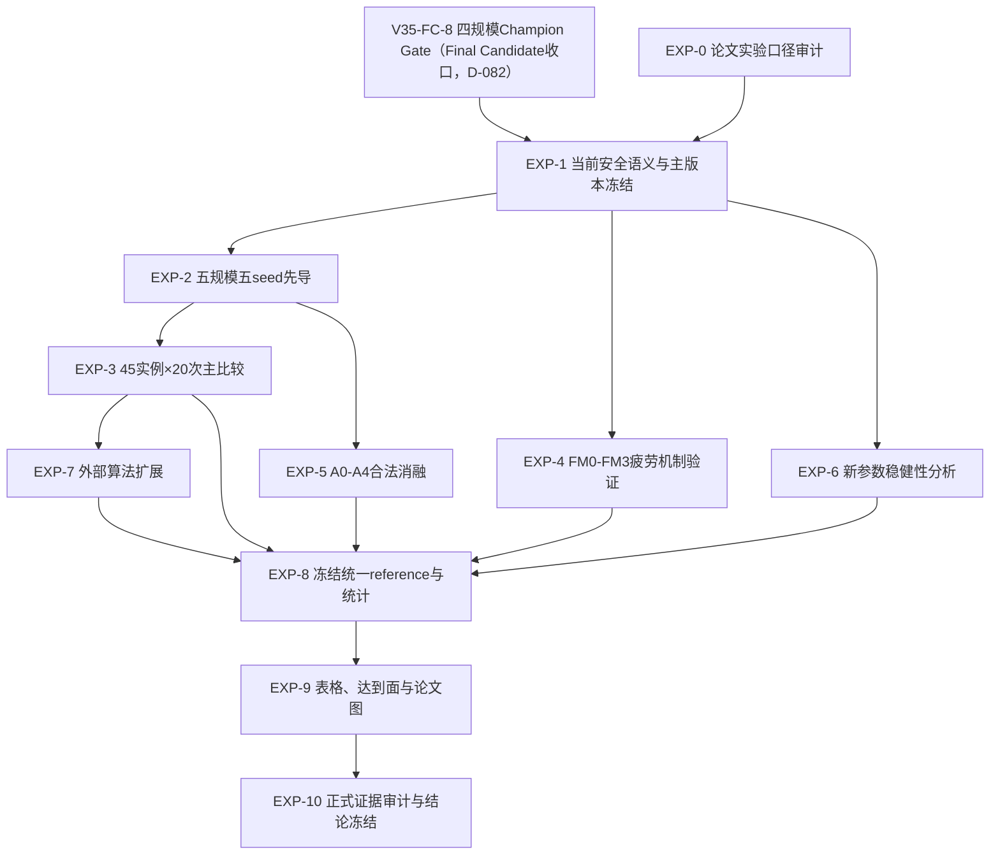

# v3.5 论文正式实验子路线图

> **D-110 当前执行覆盖（2026-08-30）**：本文件保留论文实验结构与历史Stage2记录，但旧4500条
> A0--A4矩阵不再是下一正式入口。当前必须先完成
> [`V35_COMPETITIVE_SUPERIORITY_EXECUTION_ROADMAP.md`](V35_COMPETITIVE_SUPERIORITY_EXECUTION_ROADMAP.md)
> 规定的 Gap Probe、单一repair family开发、DOE迁移、未污染Validation和Final Freeze。正式主消融改为
> leave-one-component-out优先；Formal Main先45实例×10seed，是否补到20seed由功效与稳定性规则决定。
> 任何旧manifest均不得自动恢复。

版本：`1.0`  
建立日期：`2026-08-15`  
父路线图：[`ROADMAP.md`](ROADMAP.md)  
来源论文：`E:\学习\eswa2026-最新李明哲第四.pdf`  
当前状态：`A4_NOT_PROMOTED；A2/A0 final-candidate confirmation pre-registered；formal_matrix_running=false`

## 1. 文档定位

本文件是 `docs/ROADMAP.md` 中 `V35-P25 → V35-P28` 的唯一实验子路线图，负责规定：

- 正式实例、算法、种子、初始种群和评价预算；
- 参数分析、机制消融、主算法比较和外部算法扩展；
- 统一参考前沿、指标、统计检验和结果冻结；
- 论文表格、达到面、甘特图、机制图和统计图的来源；
- 运行证据、失败保留、停止条件和论文结论边界。

本文件不授权启动实验。任何 `500000 FE`、多实例、多种子或正式统计运行仍须用户针对相应工作包单独批准。

> **D-103/D-104优先级覆盖（2026-08-25）**：本文件原有“DOE后进入A0--A4正式矩阵”的顺序已经被
> `docs/V35_A2_A4_MULTISCALE_CONFIRMATION_PROTOCOL.md`覆盖。任何Final freeze、preflight、吞吐重验和
> Master campaign之前，必须先完成其中预注册的A2/A4六实例、五seed确认，并按其通过/否决分支裁决。
> 旧A0--A4 roster仅是条件性执行候选，不能因历史manifest存在而自动恢复。D-104已否决A4；下一唯一
> 候选算法验证是预注册的[`V35_A2_FINAL_CANDIDATE_CONFIRMATION_PROTOCOL.md`](V35_A2_FINAL_CANDIDATE_CONFIRMATION_PROTOCOL.md)，
> 即A2与A0的新实例/新seed确认。A2通过前，不得启动任何Final Freeze、吞吐或正式矩阵。

旧 `docs/P9_FORMAL_EXPERIMENT_PLAN.md`、P8/P9移位实验和P25A旧压力语义结果只保留为历史记录，不得覆盖本路线图或进入当前正式参考前沿。

## 2. 学习论文的范围

### 2.1 保留的实验骨架

本路线学习ESWA第四章文章的以下结构：

1. 以工件数、阶段数和工厂数构成45实例规模矩阵；
2. 在独立开发实例上进行参数设计与主效应分析；
3. 先做机制消融，再做完整算法比较；
4. 统一报告 `HV/IGD/SP/C-metric`；
5. 用多次运行的共同非支配解构造经验参考前沿；
6. 对代表规模绘制50%经验达到面及三个二维投影；
7. 单独报告统计显著性和运行时间。

### 2.2 不直接照搬的内容

- 论文采用30次独立运行；本项目按用户决定固定为20次。
- 论文实例是从既有DHHFSP数据扩展出的研究实例，不得称为国际通用公开疲劳基准。
- 论文正文与Table 9对分组策略、部分交叉率存在冲突；本项目以Table 9和冻结运行时配置为准。
- 论文对Wilcoxon `rank-sum/signed-rank`的文字存在冲突；本项目使用同seed配对运行，因此使用Wilcoxon signed-rank。
- 论文表16中的 `h(alpha=0.5)` 不进入本项目；本项目统一使用 `alpha=0.05`。
- 不复制论文配色、数据、图形点位或结论，只学习图表承担的论证功能。

## 3. 当前正式科学语义

所有正式比较固定为：

```text
decoderMode = FM3
familyMode = DEGENERATE_SINGLE_FAMILY
setupMode = SEQUENCE_INDEPENDENT
shiftMode = NONE
objectives = [0,1,6] = [Cmax, TEC, TWC]
population = 100
MaxFEs = 500000
runs = 20
```

所有算法在同一个 `(instance, seed)` 下必须共享：

- 原始实例、实例SHA-256和实例扩展SHA-256；
- `SUT[job][stage]`；
- 疲劳参数清单和配置哈希；
- 产品族单族、零转移占位配置；
- FM3疲劳Decoder；
- `ShiftMode=NONE`；
- 初始四向量种群及其SHA-256；
- FE预算和三目标适配器；
- 被动评价档案和指标计算口径。

疲劳参数只能表述为构造具有个体差异的标准化实验场景的计算参数，不得表述为真实工人的精确生理参数。

P25B的压力分类held-out门未通过。当前安全正式语义固定为：

```text
pressureClassifier = diagnostic_only
actualBottleneck = BAL
strictPressureMask = false
enabledMacroNeighborhoods = N1,N2,N3,N4,N5
shadowAudit = false
```

`D-104`已使A4失去主版本候选资格；方向top-k教师池对应 `A5`，继续关闭。当前唯一主候选为 `A2`，但只有
`V35_A2_FINAL_CANDIDATE_CONFIRMATION_PROTOCOL.md`通过后才可写成论文主算法。

2026-08-17起，A4进入v3.5-Final Candidate收口流水线（`V35-FC-0..FC-9`，见[`V35_P26_FINAL_CANDIDATE_PLAN.md`](V35_P26_FINAL_CANDIDATE_PLAN.md)与`docs/ROADMAP.md` D-082）：局部搜索预算（β(u)动态local FE配额）与双Q冻结策略（贡献门控软冻结ρ）分别待FC-2/FC-4实验冻结；在此之前，当前A4-PREFINAL维持gb5+LS30存档语义。2026-08-18 D-083插入`FC-TIME`时间收口阶段（见`docs/V35_FC_TIME_PLAN.md`）。本子路线图的EXP-1（主版本冻结）以FC-8四规模Champion Gate通过为前置，**且 FC-8 前须过 TIME 时间门（同机 Final/QGS ≤8× 才允许启动正式对比矩阵；>10× 继续瘦身）**；EXP-3（45×20主比较）以FC-9启动门为前置。

## 4. 冻结的继承参数

正式HMOPSO-QGS继承参数采用Table 9及当前冻结运行时配置：

| 参数 | 正式值 |
|---|---:|
| Population | 100 |
| 三个边界子群 | 各20 |
| 平衡子群 | 40 |
| `r1/r2`上界 | 0.6 |
| FA/MA/WA交叉率 | 0.2 / 0.5 / 0.5 |
| FA/MA/WA变异率 | 0.08 / 0.15 / 0.25 |
| `Q_Times` | 50 |
| `LS_Times` | 30 |
| `gamma` | 0.8 |
| `epsilon` | 0.8 |
| `MaxFEs` | 500000 |

配置文件中的参数和实际Builder、Updater、外循环必须由同一个不可变配置对象驱动。仅写入配置文本但运行时未生效，属于阻断缺陷。

## 5. 正式实例矩阵与来源

### 5.1 45实例矩阵

正式规模沿用论文矩阵：

```text
jobs      = {20,50,100,150,200}
stages    = {2,5,8}
factories = {3,4,5}
instances = 5 × 3 × 3 = 45
```

实例名以项目中的实际文件名和哈希为准。任何缺失实例、重复实例或内容哈希漂移必须在运行前停止。

本数据的准确表述是：

> 基于李明哲EADHFSP基础实例构造的确定性标准化疲劳扩展测试集。

它不是公开统一的疲劳调度标准基准，也不包含真实工人的生理测量数据。

### 5.2 固定代表实例

| 用途 | 实例 |
|---|---|
| 参数与主效应分析 | `50_5_4` |
| 五规模达到面 | `20_2_5`、`50_2_5`、`100_2_5`、`150_2_5`、`200_2_5` |
| 机制消融代表集 | 每个工件规模的`2_3`、`5_4`、`8_5`三种结构，共15实例 |
| 工程讲解与甘特图 | I1：论文第四章10工件黄金实例 |
| 精确前沿交叉核验 | 已冻结的3工件和5工件实例，仅作工程证据 |

## 6. 算法集合与命名

### 6.1 必须首先完成的两算法公平比较

- `A0 / V35_BASELINE`：规范、确定性、无作者遗留缺陷的HMOPSO-QGS公平基线；与主算法共享FM3。
- `V35_MAIN`：经主版本门冻结的A2。当前仅允许写为“候选A2”，不得提前写成最终算法。

`A0_AUTHOR_DIAGNOSTIC`不得进入正式前沿、指标、统计或论文结论。

### 6.2 合法搜索消融链

```text
A0 规范HMOPSO-QGS基线
→ A1 + DSCR
→ A2 + CFVF
→ A3 + Qp及双Q协同
→ A4 + CA-TA-Lite
→ A5 + 方向top-k教师池（可选，不默认）
```

消融必须沿依赖链递进。禁止构造 `CA-TA-Lite=true && DSCR=false` 等会静默改变运行路径的非法删项组合。

### 6.3 外部算法扩展

只有A0与V35_MAIN的正式信号稳定后，才允许依次加入经FM3公平适配和独立验收的：

- NSGA-II-F；
- MOPSO-F；
- MOEA/D-F；
- SPEA2-F；
- 其他能够证明实际运行路径和FE闭合的论文算法。

不得为了模仿论文的八算法表格而把未经适配、未真实运行或共享错误Decoder的算法列入比较。

## 7. 实验工作包子图



## 8. 工作包定义

| ID | 工作包 | 状态 | 运行量上限 | 完成门 |
|---|---|---|---:|---|
| EXP-0 | 论文实验口径审计 | `completed` | 0 | 论文实例、参数、指标、图表及冲突完成登记 |
| EXP-1 | 安全语义与主版本冻结 | `blocked_by_FC-8` | 15次 | 前置：V35-FC-8四规模Champion Gate通过；新语义下A0/A4/A5五seed门；冻结最终主版本 |
| EXP-2 | 五规模先导 | `pending` | 50次 | 5实例×5seed×2算法；无预算或机制异常 |
| EXP-3 | 正式主比较 | `pending` | 1800次 | 前置：FC-9启动门；45实例×20seed×2算法全部完成 |
| EXP-4 | 疲劳机制验证 | `pending` | 1200次 | 15实例×20seed×FM0–FM3，并由FM3 oracle统一复评 |
| EXP-5 | 搜索机制消融 | `pending` | 1500次 | 15实例×20seed×A0–A4，合法依赖链闭合 |
| EXP-6 | 新参数稳健性 | `pending` | 320次 | `50_5_4`、L16设计×20seed；不使用最终测试集调参 |
| EXP-7 | 外部算法扩展 | `pending` | 单独批准 | 每个新增算法完成FM3、FE和初群公平验收 |
| EXP-8 | 统一reference与统计 | `pending` | 0 | 参与算法集合冻结后一次构造reference并完成统计 |
| EXP-9 | 论文表图生成 | `pending` | 0 | 全部表图只读取冻结母表，SVG/PDF/PNG一致 |
| EXP-10 | 最终证据与结论冻结 | `pending` | 0 | 哈希、统计、结论边界和可重算性全部通过 |

EXP-1至EXP-7的运行量是独立物理运行上限。完全相同机制向量只有在实例、seed、初始种群和全部配置哈希一致时才允许复用，并必须记录 `sourceRunId`。

## 9. 参数稳健性分析

继承自论文Table 9的参数不重新用最终测试集寻优。对新机制只做稳健性分析，推荐在 `50_5_4` 上采用四水平正交设计L16，候选因素为：

| 因素 | 四个水平 |
|---|---|
| 个人档案容量L | 4 / 6 / 8 / 10 |
| `tauQ` | 0.05 / 0.10 / 0.15 / 0.20 |
| 预热比例 | 0.05 / 0.10 / 0.15 / 0.20 |
| 双Q块长B | 3 / 5 / 7 / 10 |
| CA-TA-Lite探索率 | 0.05 / 0.10 / 0.15 / 0.20 |

若L16无法容纳最终批准的因素数，必须在运行前冻结正交表或改为L32，不得运行后删因素。压力阈值不进入该DOE：P25B held-out失败后它只作为诊断，不得继续用同一数据寻优。

参数图学习论文Fig. 9的主效应布局，同时报告HV与IGD；不得只展示有利指标。

## 10. 疲劳机制实验的公平口径

FM0–FM3改变了解码语义，不能只把各自搜索得到的HV直接当作同一问题上的算法优劣。必须同时执行：

1. 固定染色体逐级解码，说明累积、自然恢复、工时反馈和疲劳感知选工分别改变什么；
2. 各FM模式独立搜索；
3. 将各模式最终解统一送入FM3 oracle重新评价；
4. 在统一FM3目标和疲劳指标下比较鲁棒性。

疲劳指标只作机制和风险诊断，不增加第四目标。

## 11. Seed、初始种群和运行隔离

- 正式20个seed必须在首个正式运行前写入只读清单。
- 同一seed的全部算法必须从同一四向量种群哈希开始。
- 不同arm使用独立JVM、独立Problem、独立算法对象和独立输出目录。
- arm顺序应按seed轮换，避免固定先后造成系统性测量偏差。
- 计时使用固定CPU亲和性、相同JVM参数和相同训练机环境；计时不参与动作选择。
- 失败运行保留真实已消耗FE、异常和部分证据，只重跑失败的精确runId，不覆盖失败目录。

## 12. FE和机制硬门

每次运行必须满足：

```text
initial FE + global offspring FE + inherited local FE + CA-TA-Lite FE
= fullEvaluations
fullEvaluations <= MaxFEs
```

并要求：

- 每个新候选最多完整评价一次；
- 父代、PDDR、档案、DSCR、预测和内部比较不计FE；
- 非法解、异常repair、重复评价和来源丢失均为0；
- A0真实触发基线更新、原Qg、严格PDDR、工厂间搜索和O1–O9；
- V35_MAIN真实触发其配置声明的DSCR、CFVF、Qp、档案、双Q和CA-TA-Lite；
- DTUR必须为0；
- `ShiftMode`必须为`NONE`，FCLS/FCRS事件必须为0；
- 产品族始终为单族，族切换项必须为0。

## 13. 统一参考前沿和指标

### 13.1 参考前沿

对每个实例，在全部已批准参与算法、全部20次正式运行结束后一次性构造：

\[
PF_{ref}^{(i)}=
ND\left(\bigcup_a\bigcup_{s=1}^{20}PF_{i,a,s}\right)
\]

参考前沿生成前先冻结参与算法列表。禁止单个算法、单个seed或单次FULL/BASE union建立自己的正式reference。

### 13.2 归一化和HV参考点

- 每个实例使用同一组跨算法、跨运行归一化边界；
- 归一化退化范围使用 `1e-12`；
- HV固定使用归一化参考点 `(1.1,1.1,1.1)`；
- reference、边界和参考点写入独立文件并计算SHA-256；
- 后续增加新算法时，旧指标必须重新计算，不能把不同reference的数值放在同一表中。

### 13.3 指标集合

主质量指标：

- HV；
- IGD；
- SP；
- 双向C-metric；
- 最终非支配解数量；
- Cmax、TEC、TWC单目标极值和范围。

疲劳诊断指标：

- Fmax、Favg、FE、Var(Fw)；
- 高疲劳比例；
- 最长连续工作时长；
- 任务间自然恢复总时长；
- 工人负载不均衡。

效率指标：

- wall-clock和CPU time；
- Decoder基础耗时；
- 搜索控制耗时；
- CA-TA-Lite Test/Apply耗时及FE；
- 每FE平均耗时；
- 候选preview和确定性workUnits。

## 14. 统计检验

同seed、同初始种群构成配对设计：

- 两算法：Wilcoxon signed-rank；
- 多算法：Friedman检验；
- 多重比较：Holm校正；
- 显著性水平：`alpha=0.05`；
- 效应量：Vargha–Delaney `A12`或Cliff's delta；
- 描述统计：中位数、IQR、均值、标准差、胜/平/负。

不得只报告p-value。没有达到统计门时，只能写“工程信号”或“未形成稳定差异”，不能写“显著优于”。

## 15. 论文图表路线

### 15.1 方法与讲解图

| 图 | 内容 | 对应论文角色 |
|---|---|---|
| Fig-A | v3.5总体框架：FM3、DSCR、Qg/Qp、CFVF、CA-TA-Lite | 学习论文Fig.1 |
| Fig-B | 完整流程与FE边界 | 学习论文Fig.2 |
| Fig-C | I1四向量及工件身份逆映射 | 学习论文Fig.3 |
| Fig-D | I1机器/工人甘特图和疲劳曲线 | 扩展论文Fig.4 |
| Fig-E | Qg/Qp领导与CFVF动作 | 学习论文Fig.5–6 |
| Fig-F | 压力诊断、BAL回退、N1–N5和Test/Apply | 学习论文Fig.7–8 |

### 15.2 实验结果图

| 图 | 内容 | 数据来源 |
|---|---|---|
| Fig-G | HV/IGD参数主效应图 | EXP-6 |
| Fig-H | HV/IGD随FE的收敛曲线 | EXP-2/EXP-3检查点 |
| Fig-I | 20次HV/IGD箱线图或小提琴图 | EXP-3 |
| Fig-J1–J5 | 五规模50%经验达到面 | 20/50/100/150/200五代表实例 |
| Fig-K | 统一平均排名或critical-difference图 | EXP-8 |
| Fig-L | Decoder/搜索控制/CA-TA-Lite耗时堆叠图 | 运行计时母表 |
| Fig-M | Cmax/TEC/TWC与疲劳风险关系 | EXP-3/EXP-4 |
| Fig-N | DSCR教师生命周期和Cmax纪录利用链 | 审计事件母表 |

50%经验达到面必须由20次最终前沿计算，不得用单次前沿或简单union冒充。每个实例绘制：

1. 三维 `Cmax-TEC-TWC` 达到面；
2. `Cmax-TEC`投影；
3. `TEC-TWC`投影；
4. `Cmax-TWC`投影。

同一算法在所有图中使用同一颜色和标记。主算法使用重点色，A0使用中性灰；采用色盲友好配色。单实例图显示原始物理量，指标计算使用统一归一化。

### 15.3 输出纪律

- 所有图只读取冻结CSV/JSON母表；
- 同时输出SVG、PDF和PNG；
- 图中数值不得手工修改；
- 字体、字号、配色、线宽和算法顺序由统一样式文件控制；
- 图表脚本、输入哈希和输出哈希进入证据清单；
- 主文放汇总图和关键表，45实例逐行结果放附录或补充材料。

## 16. 证据目录

正式实验证据统一进入：

```text
docs/evidence/V35-FORMAL-EXPERIMENTS/
├── 00_protocol
├── 01_main_variant_gate
├── 02_five_scale_pilot
├── 03_main_45x20
├── 04_fatigue_validation
├── 05_ablation
├── 06_parameter_sensitivity
├── 07_external_algorithms
├── 08_reference_and_statistics
├── 09_figures
└── 10_final_audit
```

每次物理运行至少保存：

- canonical configuration及哈希；
- 实例、扩展、疲劳参数和源码哈希；
- seed及初始种群哈希；
- status、真实FE和停止原因；
- 最终前沿；
- 机制计数、Cmax生命周期和计时摘要；
- console日志；
- evidence SHA-256清单。

## 17. 停止条件

出现以下任一情况立即停止当前工作包：

- 同seed算法初始种群哈希不一致；
- 运行时配置与冻结配置不一致；
- FE超预算或出现重复完整评价；
- 非法解、异常repair或候选来源丢失非零；
- 正式路径出现Shift事件、多产品族或序列相关设置时间；
- DTUR非零或CA-TA-Lite声明开启但无真实事件；
- reference在参与算法未冻结前生成；
- 统计代码无法由原始front和母表重算；
- 需要根据正式测试结果修改算法、参数或seed；
- 用户尚未批准相应运行规模。

失败结果不得删除。算法或参数一旦因正式结果发生变化，必须提升语义版本、隔离旧结果并从相应前置门重新运行。

## 18. 当前状态与下一步

```text
experiment_protocol_documented=true
paper_figure_mapping_documented=true
formal_20_seed_list_frozen=false
formal_algorithm_set_frozen=false
formal_reference_frozen=false
formal_matrix_started=false
sampled_reproduction_accepted=false
full_reproduction_accepted=false
```

当前只完成实验协议文档。下一可申请工作包是 `EXP-1`：在BAL全开放、压力分类仅诊断、Shift关闭的当前安全语义下冻结主版本。未经用户明确批准，不启动EXP-1及任何500000 FE运行。

## 19. Stage2 后续人工批准覆盖（2026-08-23）

本节是后续用户对 V35 FINAL Stage2 的明确批准，覆盖本文件中“FC-8/FC-9/EXP-1 仍是启动前置”
的历史表述，但不删除历史路线及其证据。当前状态改为：

```text
FC-8 Champion Gate = SUPERSEDED_BY_FC6_AND_DOE1_EVIDENCE
FC-9 before formal experiment = SUPERSEDED_BY_FC6_AND_DOE1_EVIDENCE
FINAL_SEARCH_MIXTURE = [20,40,20,20]
FINAL_SOURCE_FREEZE = ACCEPTED
FORMAL_MANIFEST_FREEZE = ACCEPTED (45 instances, 20 seeds, 900 shared snapshots)
A0_A4_FINAL_SEMANTICS = ACCEPTED
```

Stage2 的唯一 Master roster 为 A0--A4；A0/A4 raw runs 同时作为主两算法比较输入，不能重复运行。
新的自动启动门不再是 FC-8/FC-9，而是 `FINAL_SOURCE_FREEZE`、`FORMAL_MANIFEST_FREEZE`、
`A0_A4_PRODUCTION_PREFLIGHT`、`FORMAL_MAX_PARALLEL` 与 A0--A4语义身份复核。

截至本文件更新时，生产预检仍 `BLOCKED`：冻结 A4 在非正式20k诊断中安全结束于
`actualFE=decoderCalls=15258`，不满足 Stage2 临时指定的 `requestedFE=actualFE`。在用户明确裁决
精确FE政策前，禁止启动500k或4500-run Master矩阵；不得修改算法/参数/Q/LS时序来跨越该门。见
`docs/evidence/V35-PRODUCTION-PREFLIGHT/FINAL_GATE3_EXACT_FE_REPORT.md`。
