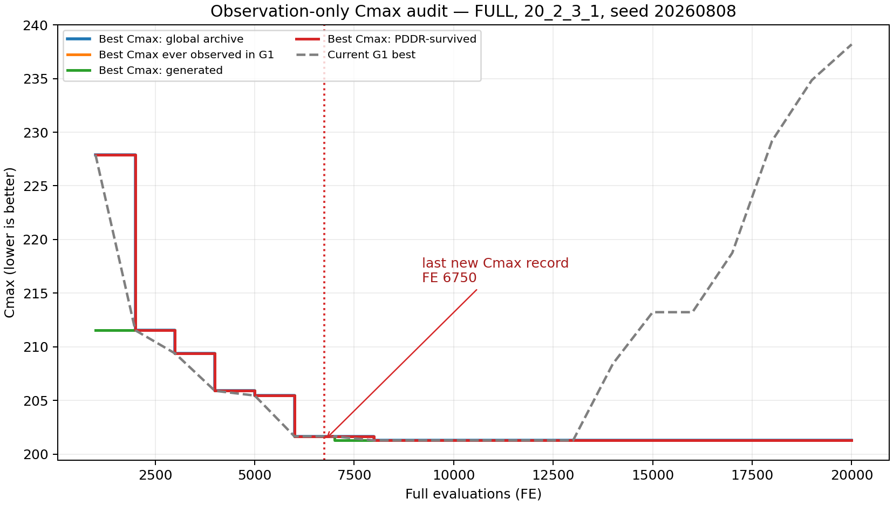
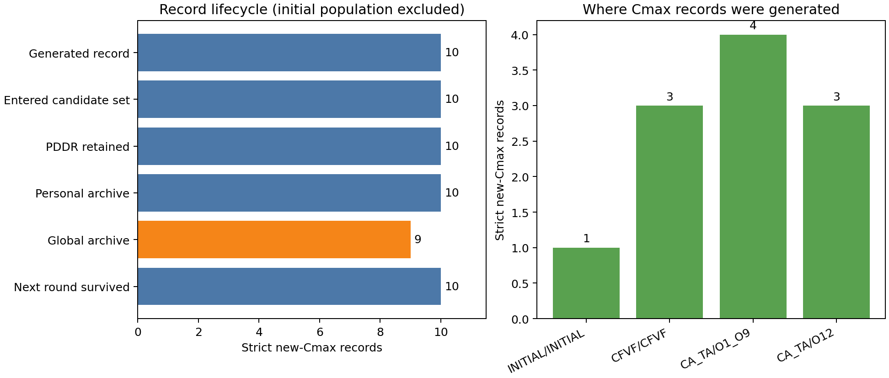

# Cmax Audit：FULL在20k FE内为何停止改善

## 结论

本次观测更支持“后期没有继续生成更低Cmax候选”，不支持“低Cmax候选一生成就被PDDR或档案错误淘汰”。

- 20,000 FE内出现11次严格的新Cmax纪录，其中1次来自初始种群，10次来自搜索。
- 搜索产生的10次纪录全部进入候选集、全部被PDDR保留、全部进入个人档案，并且下一轮全部仍存活；9次至少进入过一次全局非支配档案。
- 最后一次新纪录出现在`FE=6750`，Cmax为`201.278740141651`。此后13,250 FE没有生成更低Cmax。
- 当前G1的最优值从14k FE开始退化，20k FE时为`238.186842810042`；历史最好`201.278740141651`仍由全局档案保存。

因此当前应优先检查Cmax方向的候选生成和优秀全局纪录对G1的持续引导，而不是先修改PDDR保留门。G1后期不再携带历史最优是次级问题：它没有丢失全局档案中的解，但可能降低了围绕该解继续开发的能力。

## 实验设置

| 项目 | 设置 |
|---|---|
| 算法 | ZHANGBO-FULL |
| 实例 | `20_2_3_1` |
| seed | `20260808` |
| population | 100 |
| MaxFEs | 20,000 |
| decoder | FM3 + `LEFT_RIGHT` |
| shift semantics | `fatigue-shift-v2-common-gap` |
| checkpoint | 每1,000 FE |
| 审计版本 | `cmax-audit-v1` |
| 初始种群SHA-256 | `ffca83d43be7a67b8860ad5ccbd5e3d51c2a0f7880509879c59ecbeac0dc9ebe` |

审计器只读取已完成评价、PDDR、档案和种群更新事件，不生成随机数、不复制候选、不调用decoder，也不参与任何接受或领导决策。开启/关闭审计的固定种群测试验证了FE、最终前沿、Qg/Qp表和CA-TA事件一致。

## 四条主曲线

曲线含义：

- `BestCmaxGlobal`：截至检查点，全局非支配历史中的最小Cmax。
- `BestCmaxG1`：截至检查点，G1曾观察到的历史最小Cmax。
- `BestCmaxGenerated`：截至检查点，所有已完整评价候选中的历史最小Cmax。
- `BestCmaxSurvived`：截至检查点，至少被PDDR保留一次的新纪录中的最小Cmax。
- 灰色虚线`Current G1 best`是检查点当时仍在G1中的最小Cmax，用于识别“历史找到过”与“当前仍持有”的区别。

在1k FE和7k FE检查点，`Generated`短暂领先`Global/Survived`，原因是候选已经评价完成，但所在外层代尚未完成PDDR与档案提交；下一检查点即被保留。这是正常的一代内时序，不是长期筛除。

## 新纪录来源

| 来源 | 次数 | 说明 |
|---|---:|---|
| INITIAL | 1 | 初始种群纪录 |
| CFVF | 3 | 包括最终`FE=6750`的新纪录 |
| CA-TA调用O1–O9 | 4 | 本次最多的改进来源 |
| CA-TA调用O12 | 3 | 包括`FE=835`从226.268跃迁到211.542的最大单步改善 |
| O10/O11/O13 | 0 | 本次未产生严格新Cmax纪录 |
| inter-factory exchange/insertion | 0 | FULL路径本次没有严格新Cmax纪录 |

## 生命周期核验

以下统计排除初始种群，只看10次搜索产生的新纪录：

| 阶段 | 次数 |
|---|---:|
| 生成严格新纪录 | 10 |
| 进入候选集 | 10 |
| PDDR保留 | 10 |
| 进入个人档案 | 10 |
| 进入全局档案 | 9 |
| 下一轮仍存活 | 10 |

仅有一条纪录未进入全局非支配档案，是因为三目标联合关系，而不是Cmax单目标错误淘汰；它仍被PDDR保留、进入个人档案并存活到下一轮。

## 对两种假设的判定

### 假设A：算法能生成更低Cmax，但选择机制把它丢掉

本次证据不支持。10条搜索纪录全部通过PDDR且下一轮仍存活，`BestCmaxGenerated`与`BestCmaxSurvived/Global`的差距最多只持续到当前外层代结束。

### 假设B：算法后期根本没有继续生成更低Cmax

本次证据支持。`FE=6750`之后，所有新候选的Cmax均不低于`201.278740141651`，直到20,000 FE结束。后半程当前G1最优还从201.279逐步退化到238.187，说明搜索方向离Cmax极值区越来越远。

## 工程门与限制

- 运行完成：`fullEvaluations=20000`，前沿非空，`cfvfRepairs=0`。
- CFVF、Qg、Qp、谱系档案、PDDR和CA-TA均真实触发。
- 本次只做单实例、单seed、20k FE诊断，不能形成统计显著性或算法优越性结论。
- “下一轮仍存活”只验证紧邻下一次PDDR，不等于永久驻留；当前G1曲线已经证明优秀纪录后来会退出G1，但全局档案仍保存它。
- 20k已经能够区分主要故障类型，因此本轮没有自动扩大到100k。若下一步要改v3.2，应先围绕“全局Cmax纪录如何持续引导G1”和“后期Cmax候选生成率”设计单变量修复。

## 证据文件

- `cmax-curves.csv`：每1000 FE曲线及窗口最优。
- `cmax-record-lifecycle.csv`：每条新纪录的来源和完整生命周期。
- `mechanism-summary.txt`：机制触发、FE和行为哈希。
- `front.csv`：最终非支配前沿。
- `cmax-audit-curves.svg/png`、`cmax-audit-lifecycle.svg/png`：由CSV自动生成的图。
- `evidence-sha256.tsv`：证据文件校验清单。
